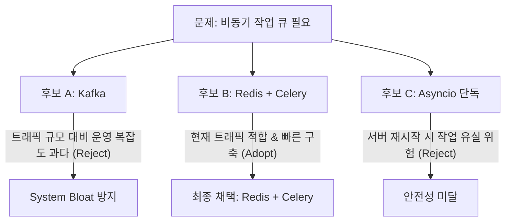

# 문제 중심 엔지니어링과 기술 선택의 트레이드오프

진정한 소프트웨어 엔지니어링의 본질은 **"최신 기술을 얼마나 많이 아는가"**가 아니라, **"어떤 문제를 해결하기 위해 어떤 제약과 트레이드오프를 고려하여 기술을 선택(또는 배제)했는가"**에 있다.

---

## 1. 문제 선행 프레임워크 (Problem-First vs Tool-First)

### Tool-First (하수 개발자 / 이력서용 나열)
```text
"FastAPI, PostgreSQL, Redis, Celery, Docker, Kafka를 사용해 프로젝트를 개발했습니다."
➔ 면접관의 의문: "그래서 무슨 문제를 해결했는가? 왜 굳이 그 기술이었는가?"
```

### Problem-First (엔지니어링 중심)
```text
"사용자가 대량 문서를 업로드할 때 동기식 처리로 인해 요청 타임아웃이 발생하는 병목이 있었습니다.
이를 해결하기 위해 1) 업로드 요청 수신과 2) 실제 분석 연산을 비동기로 격리했습니다.
이 과정에서 연산 시간이 길어 실패 시 재시도가 필요했기에 테스크 큐(Redis + Celery)를 도입했습니다."
➔ 면접관의 반응: "자연스러운 기술 검증 및 깊이 있는 디버깅 꼬리 질문으로 전환"
```

---

## 2. 네거티브 셀렉션: 사용하지 않은 기술(What NOT to Use)의 증명

엔지니어링의 성숙도는 **"무엇을 썼는가"**보다 **"무엇을 검토했으나 왜 버렸는가"**에서 명확히 드러난다.



- **카프카(Kafka)를 쓰지 않은 이유**: 현재 서비스 트래픽 규모에서 브로커 클러스터 유지보수 비용과 운영 복잡도가 실익을 압도한다고 판단 (System Bloat Defense).
- **단순 asyncio를 쓰지 않은 이유**: 서버 프로세스 다운 시 메모리 내 작업이 유실되므로 영속적인 재처리 큐가 필요.

---

## 3. 실전 장애(Debugging)는 최고의 기술 자산

오류가 없었던 프로젝트는 깊이가 없다. 발생한 장애를 규명하고 해결한 경험이야말로 진짜 역량이다.

| 흔한 장애 상황 | 표면적/초보적 대처 | 진짜 엔지니어링 분석 및 규명 |
| :--- | :--- | :--- |
| **API 응답 지연 급증** | 워커(Worker) 프로세스 무한 증설 | 비동기 이벤트 루프 내에서 동기 블로킹 라이브러리가 실행되고 있음을 프로파일링으로 규명 ➔ run_in_executor 또는 비동기 드라이버 전환 |
| **DB 타임아웃** | DB 인스턴스 스케일업 | 커넥션 풀(Connection Pool) 고갈 및 미반환 확인 ➔ 세션 라이프사이클 컨텍스트 매니저(`using`/`async with`) 강제 |
| **외부 API 병목** | 클라이언트 타임아웃 연장 | 외부 3개 엔드포인트의 독립성을 분석하여 순차 호출(3s)을 `asyncio.gather` 병렬 호출(1.5s)로 전환 |

---

## 4. 숫자로 검증하기 (Verification by Numbers)

> **"성능을 개선했다"는 주장은 증거가 아니다. 측정된 수치만이 증거다.**

- **지연 시간(Latency)**: 평균 3.2초 ➔ 1.4초 (P95: 4.8초 ➔ 1.9초 단축)
- **처리량(Throughput)**: 120 RPS ➔ 450 RPS 3.7배 증대
- **오류율(Error Rate)**: 대량 요청 시 504 Gateway Timeout 12% ➔ 0.05% 미만 안정화

---

## 5. Antigravity 시스템 거버넌스 연결

Antigravity의 헌법과 운영 루프는 이 원칙을 시스템 레벨로 구현한 것이다:
1. **문제 선행**: "영상 하나 봤다고 기능 추가하지 않는다." 실제 내 워크스페이스의 문제가 먼저다.
2. **네거티브 셀렉션**: 5-Gate 심사의 기본값은 **`⭐ NO CHANGE`**다. 불필요한 시스템 비대화를 막는 것이 가장 훌륭한 선택이다.
3. **9단계 장애 진단**: 장애 발생 시 모델 탓을 하지 않고 이벤트 루프, 인코딩, 환경, 경로 등 물리적 원인을 먼저 파헤친다.
4. **증거 기반 검증**: `Generated ≠ Verified`. 테스트 수치와 실측 결과가 있을 때만 `VERIFIED`를 선언한다.
