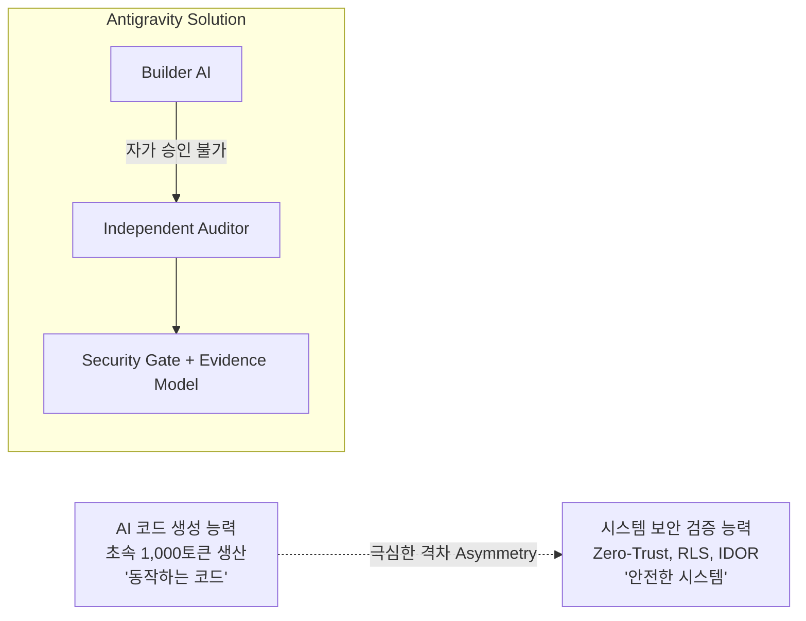

# 생성 능력과 검증 능력의 비대칭성 (Generation vs Verification Asymmetry)

## 1. 핵심 개념 (Concept Definition)
> **"AI는 코드를 몇 초 만에 생성할 수 있지만, 그 코드가 안전한 시스템인지를 스스로 증명할 수는 없다."**

바이브코딩과 에이전틱 코딩 환경에서 **코드 생성 속도(Generation Speed)**는 비약적으로 상승했으나, **보안·권한·무결성 검증 능력(Verification Capability)**은 여전히 높은 엔지니어링 지식을 요구합니다. 이 두 능력 사이의 극심한 격차를 **생성-검증 비대칭성(Asymmetry)**이라 정의합니다.

---

## 2. 발생 문제 및 안티패턴 (Problem & Anti-Patterns)
1. **작동성 = 안전성의 착각**:
   - `AI가 코드를 짰다 ➔ 브라우저에서 잘 돌아간다 ➔ 완성된 안전한 시스템이다 ❌`
   - 프론트엔드 버튼 숨김이나 UI 조건문만으로 보안이 완성되었다고 믿는 "가짜 보안(Security Theater)".
2. **AI의 자가 확신 편향 (Self-Assurance Bias)**:
   - 코드를 작성한 Builder 에이전트에게 "보안 점검해줘"라고 요청하면, 자신의 실수를 스스로 인지하지 못하고 "보안 확인 완료했습니다"라며 자가 승인(Self-Approval)을 내리는 현상.
3. **참사 사례 (Catastrophic Failure)**:
   - 의료 기관 직원이 코딩 에이전트로 환자 관리 시스템을 구축했으나, 클라이언트 단에만 가드가 있고 DB 권한(RLS)이 열려 있어 민감 진료 기록이 인터넷에 평문 노출된 인시던트.

---

## 3. 4대 파생 엔지니어링 원칙 (Derived Principles)

| 원칙 | 슬로건 | 실천 지침 |
| :--- | :--- | :--- |
| **원칙 1** | **Builder ≠ Auditor** | 코드를 생성한 AI는 결코 자신의 코드를 최종 승인(PASS)할 수 없다. 독립된 검증관이 적대적 가정을 전제로 검사한다. |
| **원칙 2** | **Created ≠ Verified** | 코드가 에러 없이 생성·실행되었다고 해서 안전한 것이 아니다. 물리적 증거가 없는 상태는 `NOT VERIFIED`로 공시한다. |
| **원칙 3** | **Evidence ≠ Conclusion** | "문제없음"이라는 단순 결론 보고를 금지한다. 무엇을 검사했는지(Evidence)와 무엇을 검사하지 못했는지(Limitations)를 분리한다. |
| **원칙 4** | **Keyword Match ≠ Actual Risk** | 단순 단어 매칭과 실제 위험을 분리한다. 컨텍스트 분류(Context Classification)를 통해 규칙 정의나 테스트의 자기 오염을 배제한다. |

---

## 4. 입증 근거 및 외부 사례 (Grounding & Evidence)
- **외부 사례 분석 노트**: [[바이브코딩_좋은사례_vs_보안참사_제로초_완전분석]] (ZeroCho TV 사례 분석)
- **SLA 품질보증 자동화 모범사례**: '덴마이 슬로우 KT' — 자신이 직접 겪는 고통을 로컬에서 해결하는 마이크로 단일 목적 툴.
- **의료 데이터 노출 사고**: LLM으로 만든 서비스에서 RLS 누락 및 클라이언트 측 권한 체크로 인한 개인정보 유출.

---

## 5. 시스템 적용 내역 (Applied To System)
이 개념은 Antigravity 시스템의 핵심 인프라로 영구 편입되었습니다:

1. **행동 헌법**: `C:/Users/ildoc/.gemini/config/rules/GEMINI.md` 및 `C:/전일도/GEMINI.md` **Protocol 33**
2. **검증 엔진**: `my_ai_workspace/core/security_gate.py` (5-State Gate Status & 5-Verdict Overall Decision)
3. **강제 집행 레이어**: `my_ai_workspace/core/trust_layer.py` (`verify_and_record` 루프 자동 결합, `BLOCKED` 시 완료 차단)
