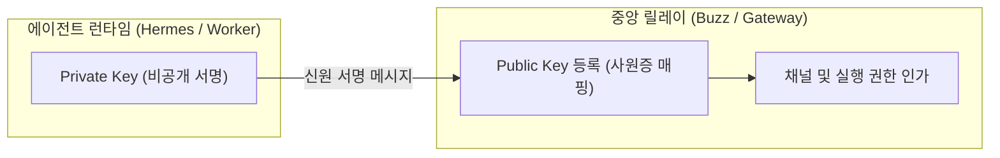

# 에이전트 신원과 비동기 메신저 아키텍처

AI 에이전트가 단발성 질의응답 챗봇에서 벗어나 지속적으로 업무를 수행하는 협업 주체로 진화할 때, 시스템이 갖추어야 할 핵심 구조는 **① 독립된 암호화 신원(Cryptographic Identity)**과 **② 통신 릴레이와 실행 런타임의 물리적 분리(Decoupling)**이다.

---

## 1. 에이전트 1등 시민 모델과 암호화 신원 증명

### 기존 챗봇 vs 에이전트 신원 모델
- **기존 챗봇/웹훅 모델**:
  - 시스템 관리자의 단일 API Key나 마스터 토큰 뒤에 숨어 동작함.
  - 누가, 어떤 권한으로, 무엇을 수정했는지 개별 에이전트 단위의 추적이 불가능함.
- **에이전트 1등 시민 모델 (Agent as First-Class Citizen)**:
  - 인간 작업자와 마찬가지로 고유한 **비대칭 키쌍(Public/Private Keypair)**을 발급받음.
  - 에이전트의 공개키(Public Key)가 시스템(릴레이)에 등록되는 순간 일종의 '디지털 사원증'으로 작동.
  - 모든 발화와 도구 실행 결과에 에이전트의 서명이 첨부되어 작업 이력(Audit Trail)과 권한(Channel Authorization)이 명확히 격리됨.

---

## 2. 릴레이(Relay)와 런타임(Runtime)의 디커플링

안정적인 24시간 에이전트 생태계를 유지하기 위해서는 통신 계층과 연산 계층을 동일한 프로세스나 컨테이너에 묶지 않아야 한다.

### 2-Tier 아키텍처 분리 원칙
1. **메시지 라우팅 계층 (Relay Layer)**:
   - 역할: 웹소켓/메시지 수신, 채널 분배, 읽기/쓰기 권한 검증, 메시지 영속화(PostgreSQL), 파일 핸들링.
   - 특성: 가볍고 안정적이며 다운타임이 없어야 함.
2. **작업 실행 계층 (Agent Runtime Layer)**:
   - 역할: LLM 추론, 도구(CLI/Browser/API) 실행, 메모리 접근, 코드 생성.
   - 특성: 모델 에러, 프로세스 비정상 종료, 재부팅이 잦을 수 있음.

> [!IMPORTANT]
> **격리의 이점**: 작업 에이전트(Runtime)가 메모리 초과나 모델 장애로 충돌하더라도, 통신 릴레이(Relay)는 살아있어 사용자에게 장애 상태를 알리고 재시작을 수행할 수 있다.

---

## 3. 상시 가동(24/7 VPS) vs 온디맨드 로컬의 트레이드오프

| 비교 항목 | 24/7 VPS 셀프호스팅 메신저 모델 | Antigravity 온디맨드 로컬 모델 |
| :--- | :--- | :--- |
| **인프라 비용** | 매월 고정 VPS 비용 + LLM 토큰비 | **$0 (순수 로컬 단독 완결)** |
| **복잡도** | 도커 컨테이너 다수 (Traefik, DB, Relay) | 단일 파이썬/CLI 하네스 |
| **데이터 주권** | 높음 (자체 서버 관리) | **완전 무결 (내 PC 내부 로컬 격리)** |
| **주 사용처** | 다자간 팀 협업, 외부 원격 상시 트리거 | 1인 파워 개발, 집중 페어 프로그래밍 |
| **System Bloat 위험** | 높음 (컨테이너/포트/네트워크 관리 부채) | **최소화 (NO CHANGE 원칙 유지)** |

---

## 4. Antigravity 시스템 교훈

- **도구 설치 배제**: Antigravity는 1인 개발 환경이므로 복잡한 메신저 도커 스택(Buzz)을 설치하지 않는다 (`NO CHANGE`).
- **아키텍처 철학 흡수**:
  - 서브에이전트가 작업을 수행할 때 어떤 에이전트가 무슨 권한으로 변경했는지 감사 기록(Audit Trail)을 명시하는 원칙을 계승한다.
  - 감독관(Orchestrator)과 작업자(Worker)의 상태 격리 원칙을 확고히 유지한다.
