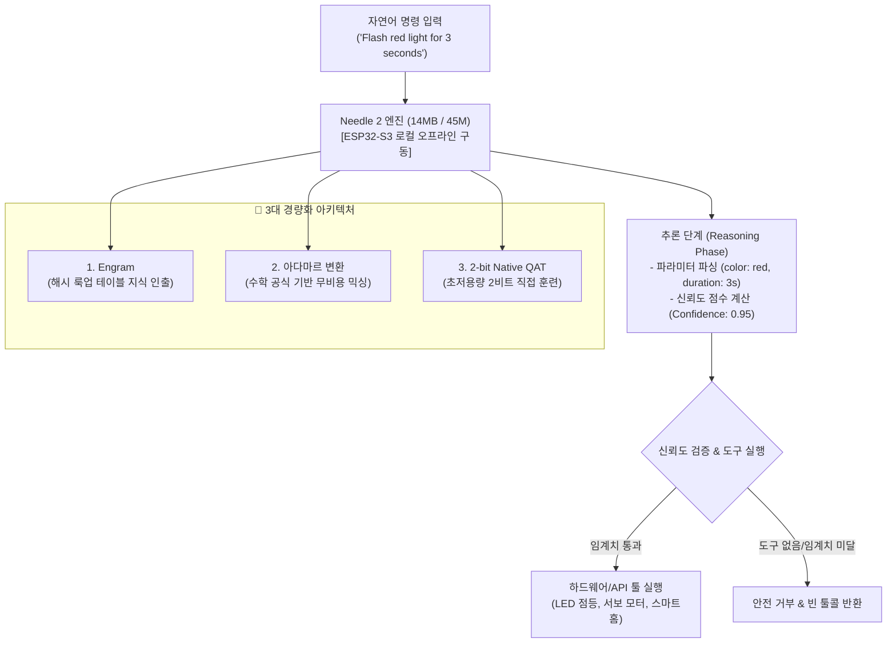

# 🎬 14MB 초경량 에이전틱 LLM Needle 2 및 온디바이스 툴콜링 완전 분석

> **📎 정보 아카이빙 3대 필수 메타데이터**
> - **원본 출처**: [Better Stack 유튜브 영상](https://youtu.be/M24yg6ZM7-I?si=p_7bAYGICNoMdMGV)
> - **원본 정보 발행일자**: 2026-08-18
> - **내 보관소 등록일자**: 2026-08-18

---

## 💡 핵심 3줄 요약

1. **Needle 2 모델 혁신**: Cactus Compute가 공개한 **14MB / 4500만(45M) 파라미터**의 Apache 2.0 오픈소스 초소형 에이전틱 LLM.
2. **3대 경량화 아키텍처**: ① 해시 테이블 기반 **Engram** 지식 인출, ② 학습 파라미터가 0인 **아다마르 변환(Hadamard Transform)** MLP 대체, ③ 처음부터 2비트로 훈련된 **2-bit QAT**.
3. **단 $10 ESP32-S3 온디바이스 완결**: 일반 챗봇이 아닌 **도구 호출 디스패처(Tool Call Dispatcher)**로 특화되어 98.3%의 높은 정확도와 자체 **신뢰도 점수(Confidence Score)** 기반 안전 실행 지원.

---

## 📌 주요 내용 및 핵심 기술 분석

### 1. Needle 2 모델 개요 및 포지셔닝

| 항목 | 내용 |
| :--- | :--- |
| **모델 크기 / 파라미터** | **14 MB** / 45M (45,000,000 파라미터) |
| **라이선스 / 개발사** | Apache 2.0 (오픈소스) / Cactus Compute |
| **최소 실행 하드웨어** | ESP32-S3 (8MB Flash/SRAM, No GPU), 라즈베리파이 5 (최대 500 TPS) |
| **핵심 목적** | **전용 도구 호출 디스패처 (Tool Call Dispatcher)** |
| **정확도 벤치마크** | Mobile Actions 벤치마크 98.3% 정확도 (5~7배 큰 16-bit 모델 상회) |

---

### 2. 14MB 극초소형화를 가능하게 한 3대 기술

1. **Engram (해시 룩업 테이블 메모리 인출)**:
   - 일반 LLM은 모든 지식을 행렬곱(MatMul) 가중치에 저장하여 매 토큰마다 막대한 연산을 수행함.
   - Needle 2는 지식의 상당 부분을 해시 룩업 테이블로 분리하여, 수학 연산 없이 메모리 주소 참조만으로 지식을 즉시 인출.
2. **아다마르 변환 (Hadamard Transform) MLP 대체**:
   - 기존 모델의 파라미터를 대량으로 소모하는 무거운 MLP 믹싱 레이어를 고정 수학 공식인 '아다마르 변환'으로 교체. 학습 파라미터를 0으로 유지하면서 피처 믹싱을 완벽하게 수행.
3. **2-bit Native Quantization-Aware Training (QAT)**:
   - 학습 후 사후에 2비트로 깎아내는 방식이 아니라, 모델 설계 초기부터 **가중치당 2비트(2-bit per weight)** 환경에 맞춰 직접 훈련하여 압축으로 인한 성능 붕괴(Degradation)를 원천 차단.

---

### 3. 실전 하드웨어(ESP32-S3) 테스트 및 신뢰도 점수

* **실측 성능**: ESP32-S3 단독 오프라인 구동 시 평균 **1.86 TPS**, 툴 콜 1회당 약 39초 소요. (라즈베리파이 5에서는 500 TPS 초고속 달성)
* **내장 신뢰도 점수 (Confidence Score)**:
  - 도구 생성 시 0.0 ~ 1.0 사이의 확신도를 함께 출력.
  - 예: `Flash red light` (높은 확신도 0.95), `Display yellow light` (모호한 표현 → 확신도 0.46).
  - 점수가 낮을 경우 재확인을 요청하거나 안전 모드로 전환할 수 있어 하드웨어 폭주 방지에 결정적.
* **똑똑한 예외 처리**:
  - 도구 목록에 없는 엉뚱한 요청(예: "프랑스의 수도는?") 시 도구가 없음을 정확히 인지하고 실행 가능한 빈 툴 콜(Empty Tool Call)을 반환.

---

## 🛠️ AI(나: Antigravity)에게 적용할 점

1. **계층형 툴 디스패처 (Hierarchical Tool Dispatcher) 아키텍처**:
   - 모든 도구 명세를 메인 초대형 LLM 컨텍스트에 무작정 때려넣지 않고, 경량 라우터 노드를 통해 필요한 도구만 선별 주입하여 토큰 낭비와 환각을 원천 차단.
2. **확신도 점수(Confidence Score) 기반 실행 가드레일**:
   - 위험하거나 파괴적인 작업 실행 시 도구 호출 신뢰도를 자체 평가하여, 모호성이 감지되면 즉시 사용자 승인 모드(Human Checkpoint)로 전환.
3. **엣지/IoT 하드웨어 오프라인 자동화 파이프라인 연계**:
   - 클라우드 API 없이도 단 14MB 모델로 ESP32/라즈베리파이 기반 오프라인 하드웨어 제어 및 센서 자동화 환경 구축 역량 확보.
