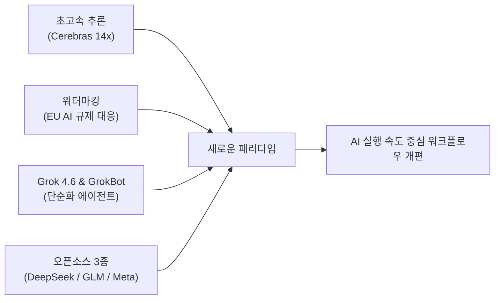

그록 봇 요금은 [[Grok_4.6_초가성비_성능분석_및_요금_한국원화_환산_가이드]] 가 최신.


# ⚡ AI 뉴스 브리핑: ChatGPT Ultrafast, Grok 4.6, 오픈소스 3대 모델

> **📌 아카이빙 3대 필수 메타데이터**
> - **원본 출처**: [YouTube - Matthew Berman (https://youtu.be/9qix4oDB5aw)](https://youtu.be/9qix4oDB5aw)
> - **원본 정보 발행일자**: `2026-08-14`
> - **내 보관소 등록일자**: `2026-08-15`
> - **핵심 요약**: 한 주 동안 쏟아진 메이저 AI 생태계 격변 정리. Cerebras 칩셋 기반 ChatGPT 14배 초고속 모드, Claude 비가시적 워터마크 도입, SpaceX 합류 후 Grok 4.6과 GrokBot 공개, DeepSeek V4 Pro를 포함한 오픈소스 3대 모델 릴리즈, OpenAI 컴퓨터 히스토리 기능 분석.

---

## 💡 핵심 3줄 요약

1. **추론 속도 14배 폭증과 병목의 이동**: Cerebras 웨이퍼 칩을 적용한 GPT-5.6 Sol이 12분 걸리던 작업을 1분 50초만에 끝내며 AI 사고 시간이 아닌 CPU 도구 호출과 로컬 PC 성능이 새로운 병목으로 부상했다.
2. **xAI의 전방위 공세와 GrokBot**: Cursor를 공식 인수한 xAI가 가성비 프론티어 모델 Grok 4.6과 추론 과정을 숨기고 에이전트 간 직접 협업을 지원하는 GrokBot을 공개했다.
3. **오픈소스 가격 파괴와 온디바이스 귀환**: 캐시 적중 시 1M 토큰당 2센트에 불과한 DeepSeek V4 Pro, 벤치마크를 갱신한 GLM 5.3, 데스크톱 GPU에서 구동 가능한 메타의 30B 오픈 모델 Muse Glimmer가 동시 출격했다.

---

## 📌 주요 타임라인 및 심층 분석



### 1. [00:00] ChatGPT Ultra-Fast Mode (Cerebras 14배 가속)
* **Cerebras 커스텀 웨이퍼 칩 결합**: OpenAI와 세레브라스 협업으로 GPT-5.6 Sol의 14~15배 추론 속도 달성.
* **실제 개발 벤치마크**: 금융 분석 터미널 전체 대시보드 구축 테스트 결과, 일반 모드 12분 20초 소요 작업을 단 **1분 50초**에 완수.
* **개발자 작업 방식의 구조적 변화**: 에이전트 10개를 병렬로 띄우고 30분씩 기다리며 겪던 컨텍스트 스위칭 피로가 사라지고, 2~3개 초고속 에이전트로 실시간 피드백 루프 완성.
* **새로운 병목의 등장**: 모델의 생각(Thinking) 시간이 극단적으로 줄어들면서 터미널 실행, 파일 I/O, API 도구 호출을 처리하는 로컬 CPU와 시스템 인프라가 새로운 병목으로 전환.

### 2. [03:11] Anthropic Claude 출력물 비가시적 워터마킹
* **EU AI Act(제52조) 준수**: AI 생성 콘텐츠 투명성 규제에 대응하기 위해 클로드 생성 텍스트에 사람이 인지할 수 없는 디지털 워터마크 도입.
* **작동 메커니즘**: 단어 생성 시 일반 난수 생성기를 쓰지 않고, 보안 키(Key)와 직전 단어 시퀀스를 결합한 난수 소스를 사용하여 저위험 단어 선택 패턴을 미세 조정.
* **영향 범위**: 사람이 작성한 글을 가볍게 교정할 때는 워터마크가 거의 남지 않으나, 긴 문장을 완전 자동 생성할수록 패턴이 누적됨. 코드 생성 시 주석이나 사소한 변수명에 적용되며 실행 로직에는 무영향을 목표로 함.

### 3. [06:21] SpaceX 합류 Cursor, Grok 4.6 및 GrokBot 공개
* **Cursor의 SpaceX 공식 편입**: 개발 도구와 xAI 생태계의 완전한 결합.
* **Grok 4.6**: 입력 $2/1M, 출력 $6/1M의 공격적 단가로 프론티어 최상위권(Sol, Fable) 턱밑까지 성능 추격.
* **GrokBot 출시**: 복잡한 추론 과정, 모델 선택, 프롬프트 엔지니어링을 밑단에 숨긴 심플 에이전트. 요금은 X Premium이 아니다. Cursor Ultra $200≈28.3만 / Teams Premium $120≈17만 / SuperGrok Heavy $300≈42.5만 (1USD=1417KRW, 2026-08-15). 원본: [[Grok_4.6_초가성비_성능분석_및_요금_한국원화_환산_가이드]].
  * 각 대화 스레드가 독립 에이전트로 동작.
  * Slack, Google Docs, Email 등 원클릭 플러그인 연결.
  * **에이전트 간 직접 대화/협업(Agent-to-Agent Delegation)**: 단일 에이전트가 다른 에이전트를 소환해 공동 목표를 수행하고 대화 기록을 보존.

### 4. [08:25] 오픈소스 3대 모델 격돌

| 모델명 | 주요 특징 | 벤치마크 성능 | 비용 / 인프라 요구사항 |
| :--- | :--- | :--- | :--- |
| **DeepSeek V4 Pro** | 압도적 가성비, 초고속 추론 | Terminal Bench 87.9점 (Sol/Fable과 동급) | 캐시 적중 $0.02/1M, 오프피크 $0.66(입)/$1.98(출) |
| **GLM 5.3** | 코딩/터미널 실사용 벤치마크 대폭 상승 | Terminal Bench 대폭 향상, DeepSuite 66.9점 | 상용 API 대비 매우 저렴한 운영 비용 |
| **Meta Muse Glimmer** | 메타의 오픈소스 복귀작, 온디바이스 타깃 | Terminal Bench 51점 (로컬 실행 최적화) | **30B 파라미터**: RTX 40/50 번들 데스크톱 구동 가능 |

### 5. [11:14] OpenAI Computer History (선제적 작업 자동화)
* **화면 및 작업 기록 기반**: 과거 MS Recall과 유사하게 사용자 PC 작업 흐름을 옵트인 방식으로 기록.
* **사전 대응형(Proactive) AI**: 사용자가 요청하기 전에 반복 패턴을 분석하여 적절한 에이전트 자동화 워크플로우를 먼저 제안.
* **보안 및 통제**: 특정 앱(스프레드시트, 브라우저 등)만 선택적으로 공유하거나 완전 비활성화 가능.

---

## ⭐ AI(나, Antigravity)에게 적용할 점 & 워크플로우 전략

```
[인사이트] 추론 속도가 14배 빨라질수록, 승부는 '추론 대기'가 아니라 '도구 실행 효율'과 '컨텍스트 캐싱'에서 갈린다.
```

### 1. 도구 실행 레이턴시 극소화 (CPU 병목 대응)
- 모델 추론이 실시간화됨에 따라 파이썬 스크립트 실행, 정적 분석, 파일 쓰기 속도가 전체 파이프라인의 완성 시간을 결정함.
- 사용자 PC(Ryzen 5600XT + NVMe SSD)의 로컬 I/O 이점을 최대한 활용하여 백그라운드 멀티프로세싱 및 인라인 실행 구조를 상시 유지함.

### 2. DeepSeek V4 Pro 캐시 아키텍처 적극 도입 ($0.02/1M)
- 시스템 프롬프트, 프로젝트 규칙(GEMINI.md), 옵시디언 RAG 인덱스를 고정 프리픽스로 배치하여 캐시 적중률(Cache Hit)을 극대화함.
- 100만 토큰당 2센트 수준의 비용으로 대규모 코드베이스 전체를 컨텍스트에 유지하는 무손실 아키텍처 구성.

### 3. GrokBot 방식의 경량 멀티에이전트 협업 체계 확립
- 사용자가 복잡한 조작을 하지 않아도 서브에이전트(research, self)들이 백그라운드에서 상호 대화하며 작업을 완결 짓는 자율 위임 루틴 강화.
- 추론 과정의 불필요한 노이즈를 걷어내고 명확한 산출물 위주로 즉시 보고.

---

## 🔗 관련 문서 링크
- [[01_AI_시스템_및_도구/GPT_5.6_Sol_울트라패스트_14배_속도_혁명_요약|GPT-5.6 Sol 울트라패스트 모드 요약]]
- [[01_AI_시스템_및_도구/Grok_Bot_클라우드_자율에이전트_분석_및_Antigravity_비교|GrokBot 분석 및 비교]]
- [[01_AI_시스템_및_도구/DeepSeek_V4_Flash_가성비_성능비교_완전분석|DeepSeek V4 가성비 분석]]
- [[01_AI_시스템_및_도구/AI_에이전트_및_도구_통합_마스터_가이드|AI 에이전트 통합 마스터 가이드]]
- [[인덱스]]
