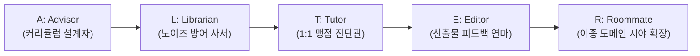

# 🎓 AI 독학 마스터 ALTER 프레임워크 및 퍼스널 유니버시티 학습법

> **출처**: [Sandeep Swadia - How To Become Dangerously Self-Educated With AI (for free)](https://youtu.be/lF8_DX2NxjI)  
> **발행일**: 2026년 8월  
> **등록일**: 2026-08-23  

---

## 💡 핵심 요약 (3줄)

1. 비싼 대학 학비($250,000) 없이도 AI를 통해 누구나 자신만의 **맞춤형 개인 대학(University in a Box)**을 구축할 수 있다.
2. AI를 단순한 텍스트 생성기가 아닌 **5가지 고유한 역할(ALTER: Advisor, Librarian, Tutor, Editor, Roommate)**로 분기하여 가동할 때 진짜 압도적인 지능과 실력이 축적된다.
3. 2-시그마 문제를 파괴하는 **1:1 튜터링(Teach me & Test me)**과 노이즈를 걸러내는 **사서 큐레이션(NotebookLM 앵커링)**이 독학 성공률 12%의 벽을 깬다.

---

## 🏛️ 1. 배경: '내 주머니 속의 수백만 달러짜리 대학'

- **트렌드의 역설**:
  - 아이비리그와 세계 최고 대학들이 무료 온라인 강의를 공개하고 있지만, 완강률은 **12%**(88% 중도 포기)에 불과함.
  - 많은 이들이 하루 30분 이상 인스타그램 등 알고리즘 피드에는 시간을 쓰지만, 역사상 가장 강력한 지능 엔진인 AI를 학습에 쓰는 비중은 낮음.
- **패러다임 전환**:
  - AI는 게으른 텍스트 생성기가 아니라, 개인화된 학습 여정을 설계하고 이끄는 **지능형 경로 구축기(Path Builder)**다.

---

## 🔑 2. 5대 핵심 역할: ALTER 프레임워크

### 1) A — Advisor (조언자 / 커리큘럼 설계자)
- **역할**: 비틀즈의 5번째 멤버 '조지 마틴'이나 알렉산더 대왕의 '아리스토텔레스'처럼 나에게 맞는 맞춤형 여정을 설계.
- **5대 핵심 결정 요소**:
  1. **Destination (목적지)**: 학습 완료 후 정확히 무엇을 알고 만들 수 있어야 하는가?
  2. **Baseline (현재 실력)**: 이 주제에 대한 나의 현재 수준은 어디인가?
  3. **Sequencing (학습 순서)**: 어떤 순서로 개념을 밟아가야 하는가?
  4. **Cut List (제거 목록)**: 지금 단계에서 과감히 무시해야 할 것은 무엇인가?
  5. **Milestones (마일스톤)**: 마스터했음을 증명할 구체적인 산출물은 무엇인가?
- **프롬프트 템플릿**:
  > *"나의 엘리트 학업 고문 역할을 해줘. [학습 주제]를 위한 6주 맞춤 커리큘럼을 짤 거야. 목적지, 순서, 버려야 할 것, 주차별 증명 과제를 만들 수 있도록 먼저 내 베이스라인과 약점을 파악하는 인터뷰를 한 번에 한 질문씩 진행해줘."*

---

### 2) L — Librarian (사서 / 정보 큐레이션 및 노이즈 방어)
- **역할**: 사용자를 붙잡아두려는 알고리즘 피드의 유혹에서 커리큘럼을 보호하고, 수천 개의 노이즈 중 가치 있는 3~4개의 신뢰할 수 있는 소스만 필터링.
- **Ground Truth 앵커링**:
  - Deep Research 등으로 진정한 핵심 도서/논문/명강의 선별.
  - NotebookLM 등에 소스를 적재하여 환각 없는 팩트 기반 질의응답 및 맞춤형 오디오 딥다이브(팟캐스트/대화형 질의) 생성.

---

### 3) T — Tutor (튜터 / 1:1 맹점 진단 및 2-시그마 돌파)
- **Teacher vs Tutor**:
  - **Teacher(교사)**: 지식을 일방적으로 설명함.
  - **Tutor(튜터)**: 학습자의 특정한 혼란과 오개념을 1:1로 진단하고 이해한 척 넘어가지 못하게 압박함.
- **2-시그마 문제(Benjamin Bloom)**:
  - 1:1 튜터링을 받은 학생은 일반 교실 학생 상위 98%를 능가. 역사상 가장 효과적이나 부유층의 전유물이었던 과외를 AI가 민주화.
- **실전 2대 명령어**:
  - `Teach me`: 개념의 본질을 명확히 설명.
  - `Test me`: 이해 여부를 점검하는 불시 질문 출제.
- **음성 모드 튜터링 프롬프트**:
  > *"[책/개념 이름]에 대해 나의 튜터가 되어줘. 강의하려 하지 말고 내 이해의 틈(Gap)을 찾아낼 수 있는 날카로운 질문을 한 번에 하나씩 던져줘."*

---

### 4) E — Editor (편집자 / 실시간 피드백 및 산출물 연마)
- **역할**: F1 레이싱 엔지니어들이 0.1초를 줄이기 위해 실시간 데이터를 분석하듯, 결과물의 완성도를 끌어올리는 피드백 제공.
- **연마 영역**:
  - 논리의 취약점(Weakness) 발견 및 반론 제기.
  - 군더더기 및 중복 표현 삭제, 구조 압축.
  - 추상적 문장을 구체적이고 정밀한 표현으로 교정.

---

### 5) R — Roommate (룸메이트 / 이종 도메인 시야 확장)
- **역할**: 같은 분야의 우물에 갇히지 않도록 완전히 다른 이종 분야의 렌즈(Stranger's Lens)를 제공.
- **픽사(Pixar)의 교육 철학**:
  - 애니메이터에게 조각을 가르치고, 회계사와 경비원에게 드로잉을 가르쳐 새로운 시각을 이식.
- **교차 발상 질문 예시**:
  - *"요리 기법과 기업 재무 관리의 공통 원리는 무엇인가?"*
  - *"재즈 뮤지션의 즉흥 연주 방식은 스타트업 팀 빌딩과 어떻게 연결되는가?"*

---

## 🛶 3. 결론: 가장 빠른 배는 노를 젓는 배다

- 강가에 수많은 형태의 배가 놓여 있을 때, 건너편에 가장 빨리 도달하는 배는 **"지금 바로 올라타서 노를 젓기 시작하는 배"**다.
- 도구와 프레임워크를 고민하는 데 머무르지 않고, 오늘 밤 즉시 프롬프트를 열고 시작하는 실행력이 전부다.

---

## 🛠️ 4. AI(Antigravity) 시스템 및 사용자 워크플로우 적용 전략

1. **ALTER 기반 5단계 자율 학습 엔진 가동**:
   - 사용자가 새로운 기술(Vision AI, 클라우드 아키텍처, 자격증, 신규 사업 기획)을 학습하고자 할 때, 단순 정보 나열 대신 **[1. 베이스라인 인터뷰 ➔ 2. Cut List(버릴 것) 확정 ➔ 3. 핵심 소스 앵커링 ➔ 4. Test me 문답 ➔ 5. 산출물 에디팅]** 파이프라인을 자율적으로 제시.
2. **'Cut List(제거 목록)' 선제 제시 원칙**:
   - 바이브 코딩 및 신규 기술 습득 시 입문자가 흔히 빠지는 오버엔지니어링(불필요한 보일러플레이트, 과도한 설정)을 사전에 명확히 제거하여 학습 피로도 극소화.
3. **'Test me' 소크라테스식 점검 모드**:
   - 방대한 지식을 일방적으로 쏟아내지 않고, 핵심 설명 후 사용자가 즉시 체득할 수 있도록 점검 질문 1개를 던져 피드백 루프 완성.
4. **Roommate 모드 교차 발상 지원**:
   - 시스템 아키텍처 설계나 비즈니스 모델 도출 시, 타 도메인의 성공 메커니즘을 유추 결합하는 크로스오버 아이디어 제안.
