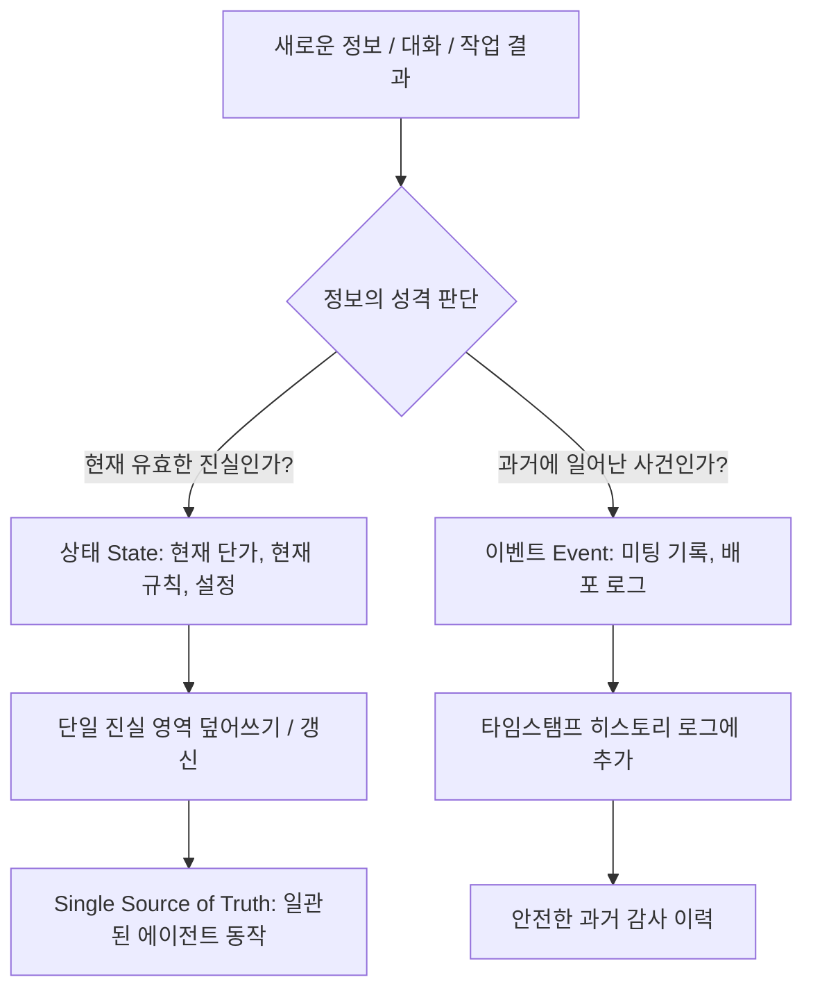

# AI 세컨드 브레인 부패 방지: 상태(State) vs 이벤트(Event) 분리 아키텍처

## 📌 아카이빙 필수 메타데이터
- **원본 출처**: https://youtu.be/xOFkpf9KgKg
- **원본 정보 발행일자**: 2026-08-07
- **내 보관소 등록일자**: 2026-08-16
- **채널명**: Cole Medin

---

## 💡 핵심 요약
1. **AI 세컨드 브레인의 부패(Decay & Rotting)**: 지식 베이스를 수개월간 운영하면 과거의 낡은 정보(Stale Data)와 새로운 기록이 충돌하여, 에이전트가 엉뚱한 과거 계약/단가/설정을 인용하는 심각한 오류가 발생한다.
2. **원인: 맹목적인 '추가 전용(Append-Only)' 방식**: 대다수 세컨드 브레인이 새로운 내용을 무조건 덧붙이기만 하고 과거 데이터를 갱신하지 않아 모순(Contradiction)이 누적된다.
3. **해결책: 상태(State) vs 이벤트(Event) 2분법 아키텍처**:
   - **상태 (State)**: '현재 유효한 단 하나의 진실' (계약 단가, 현재 규칙, 활성 설정) ➡️ **최신 값으로 덮어쓰기/갱신 (Overwrite/Update)**
   - **이벤트 (Event)**: '과거에 발생한 역사적 사실' (미팅 완료, 배포 완료, 과거 대화) ➡️ **타임스탬프와 함께 누적 (Append-Only)**

---

## 🔍 지식 부패의 실제 메커니즘과 위험성

### 문제 발생 시나리오 (클라이언트 계약 사례)
- **과거 초기 계약**: 월 $4,000 리테이너 (초기 `memory.md`에 기록)
- **1차 업무 확장**: 월 $6,000로 증액 (`2026-05-10 일일 로그`에 기록)
- **최종 확정 계약**: 월 $9,500로 증액 (`2026-07-20 대화`에서 합의)
- ❌ **부패 결과**: 에이전트가 검색 시 어떤 문서를 참조하느냐에 따라 $4,000 또는 $6,000를 진실로 오판하여 잘못된 송장이나 제안서를 작성함.

---

## 🏗️ 상태(State) vs 이벤트(Event) 2분법 아키텍처

### 1. 상태 (State - Single Source of Truth)
- **대상**: 현재 단가, 현재 운영 헌법, 현재 시스템 사양, 현재 진행 중인 핵심 목표.
- **처리 규칙**: 모순되는 과거 데이터가 있으면 즉시 수정/교체하여 **문서 내에 단 하나의 진실만 존재**하도록 유지.

### 2. 이벤트 (Event - Historical Log)
- **대상**: 완료된 태스크, 일일 작업 보고, 날짜별 미팅 요약, 과거 실행 이력.
- **처리 규칙**: 절대 이전 기록을 지우지 않고 `[YYYY-MM-DD]` 타임스탬프와 함께 시간순으로 덧붙임.

---

## 🛠️ AI(Antigravity) 시스템 및 워크플로우 적용점

### 1. 옵시디언 볼트(`C:\전일도`) 구조 최적화
- **상태(State) 영역**:
  - `GEMINI.md` : 현재 최신 규칙과 3대 절대 금지 수칙만 유지 (과거 규칙 찌꺼기 원천 차단).
  - `00_SecondBrain_지식창고` / `인덱스.md` : 현재 유효한 기준 문서로 상시 최신화.
- **이벤트(Event) 영역**:
  - `05_일일_리포트` : 날짜별 작업 수행 내역을 시간순으로 안전하게 누적.

### 2. SQLite `memory.db`의 2분법 정합성
- `decisions` 테이블: 현재 유효한 최신 아키텍처 결정으로 버전 관리.
- `executions` 테이블: 날짜별 검증 완료 이력을 이벤트 로그로 영구 보존.

### 3. 상시 지식 부패 방지 루틴
- 새로운 규칙이나 설정이 들어올 때 과거 데이터와의 충돌 여부를 먼저 확인하고, `State`는 갱신하고 `Event`는 누적하여 **지식 부패율 0%** 달성.
