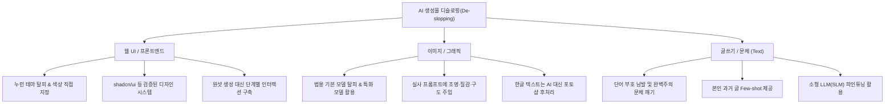

# 🧼 AI 슬롭(Slop) 탈피 및 AI 티(냄새) 제거 실전 가이드

> **📌 아카이빙 메타데이터**
> - **원본 출처**: [코딩애플 YouTube (https://youtu.be/p5FzBvDvt8A)](https://youtu.be/p5FzBvDvt8A)
> - **출처 정보 발행일자**: `2026-08-11`
> - **내 보관소 등록일자**: `2026-08-14`
> - **핵심 주제**: 웹 UI, 이미지, 텍스트 글쓰기 전반에서 흔히 풍기는 천편일률적 AI 불쾌감을 걷어내고 완성도 높은 결과물을 뽑아내는 실전 기법

---

## 🧐 1. 왜 사람들은 'AI 냄새'에 피로감을 느낄까?

거리 광고판이나 마트 배경음악처럼 스쳐 지나가는 생성물은 상관없지만 직접 읽고 검토해야 하는 순간부터 불쾌감이 싹틉니다.

* **미트 프록시(Meat Proxy) 현상**: 회사나 오픈소스 협업에서 AI가 뱉은 날것의 코드 수천 줄이나 장문의 글을 아무 정제 없이 상대방에게 "리뷰해 달라"며 던지는 행태
* **완성도와 개성의 부재**: 그럴싸해 보이지만 눌러도 아무 반응 없는 껍데기 버튼, 뻔한 폰트와 누런 테마, 현학적인 단어만 나열된 영혼 없는 문장
* **불쾌감의 본질**: AI 자체가 싫은 게 아니라 **개성 없는 템플릿 복제와 부족한 디테일**에서 오는 피로감인 셈입니다.

---

## 🎨 2. 영역별 AI 티 벗기기 실전 전략

---

### ① 웹 UI / 프론트엔드: 뻔한 클로드 누런 테마 벗기기

AI로 웹사이트를 만들면 십중팔구 **누런 배경에 똑같은 폰트, 맥락 없는 반짝이 이모지, 기능 없는 장식 버튼**이 나옵니다.

* **색상 팔레트 직접 통제**: AI에게 색상 배합을 전적으로 맡기지 말고 브랜드에 맞는 컬러 코드를 직접 쥐여줘야 합니다.
* **표준 컴포넌트 프레임워크 활용**: `shadcn/ui`, `Tailwind CSS`, `Radix` 같은 잘 다듬어진 UI 라이브러리를 베이스로 삼으면 기본 완성도가 보장됩니다.
* **'원샷(One-shot)' 환상 버리기**: 프롬프트 한 번으로 완성하려 하지 말고 껍데기 버튼에 기능을 달고 간격을 다듬으며 점진적으로 깎아나가는 과정이 필수입니다.
* **디자인 레퍼런스 주입**: 원하는 인터페이스 스크린샷이나 명확한 레이아웃 가이드를 먼저 주고 작업을 시작해야 클론 느낌을 피할 수 있습니다.

---

### ② 이미지 생성: 뻔한 AI 때깔 지우기

기본 GPT(DALL-E)나 제미나이의 기본 생성기는 특유의 매끄럽고 인위적인 디지털 질감이 묻어납니다.

* **실사(Photorealistic) 질감 강조**: 실사 스타일을 지향할 때는 조명 방향, 렌즈 화각, 피부/소재의 거친 질감, 카메라 앵글을 구체적으로 명시해야 인공미가 덜합니다.
* **스타일 특화 모델 선택**: 범용 생성기 대신 특정 아트 스타일이나 렌더링에 특화된 모델을 골라 쓰는 편이 훨씬 유리합니다.
* **한글 타이포그래피는 툴로 마무리**: AI는 영문 타이포그래피는 제법 소화하지만 한글 글자는 여전히 깨지거나 오타가 납니다. 배경과 인물 사진만 AI로 뽑고 텍스트는 포토샵이나 피그마에서 상용 폰트로 얹는 조합이 가장 깔끔합니다.

---

### ③ 글쓰기 및 문체: 영혼 없는 번역투 걷어내기

AI 문장의 전형적인 특징은 지나치게 어휘력이 풍부하고 문장 부호를 칼같이 지키며 뻔한 접속사로 문단을 잇는다는 점입니다.

* **본인 문체 Few-shot 학습**: 평소 본인이 즐겨 쓰는 어투와 문장 구조가 담긴 과거 글 예시를 프롬프트에 직접 포함해 스타일을 복제시킵니다.
* **페르소나 및 금지 규칙 사전 정의**: `~를 통해`, `~에 대해`, `또한/결론적으로` 같은 AI 단골 단어를 금지어로 묶고 문장 호흡을 다채롭게 조절하도록 못 박아둡니다.
* **소형 모델(SLM) 로컬 파인튜닝**: 본인만의 텍스트 데이터셋을 수백 개 준비해 `Unsloth` 등으로 파인튜닝하면 고유의 말맛을 자연스럽게 살려낼 수 있습니다.

---

## 🧠 3. 핵심 결론: 가장 큰 병목은 도구가 아니라 '사람의 안목'

> *"AI 그림을 잘 뽑으려면 그림 지식이 많아야 하고 코딩도 원래 코딩을 잘하던 사람이 시켜야 코드가 예쁘게 나온다."*

* AI 에이전트의 출력 품질이 떨어질 때 프롬프트 탓이나 도구 탓만 하기 쉽습니다.
* 하지만 정작 **무엇이 좋은 디자인이고 무엇이 깔끔한 아키텍처인지 짚어내지 못하는 사용자 본인의 지식 한계**가 가장 큰 병목일 때가 많습니다.
* AI는 지시자의 디테일만큼만 똑똑해지므로 최종 판단력과 감각을 갈고닦는 일이 무엇보다 중요합니다.

## 관련
- [[탈_AI_한국어_자연어_작문_가이드]]
- [[이선몰릭_듀얼브레인_AI시대생존법_더프롬프트_YTN_완전분석]]
