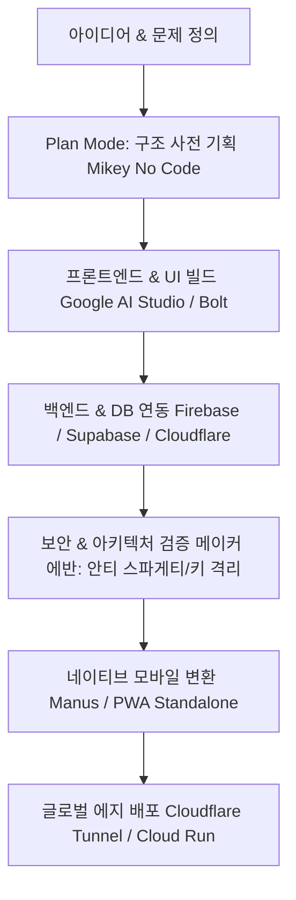

# AI 기반 앱 개발 및 1인 SaaS 구축 SOTA 9대 핵심 로드맵 완전분석

## 📌 아카이빙 필수 메타데이터
- **분석 대상 영상 (9편 전수 분석)**:
  1. `AnPAjPd5gi0`: 구글 AI 스튜디오로 첫 안드로이드 앱 만들기 (수석연구원 주AI)
  2. `ptwhL1L-B5A`: 마누스 AI로 코딩 없이 진짜 네이티브 앱 완성 (머니스웨거)
  3. `MwT_mX_q1zw`: AI로 30분 만에 앱 완성? 한 달 뒤 폐허되는 4대 함정 (메이커 에반)
  4. `Hk_58FZMRkk`: 15분 만에 AI로 앱 빌드 마스터하기 - Plan Mode (Mikey No Code)
  5. `4M-kUY0u2bk`: 2026년 가장 단순한 AI 앱 개발 방식 (Web/Mobile)
  6. `pthFpbc6eTk`: 30분 만에 AI로 완성하는 앱 개발 (v0/Bolt/Replit)
  7. `xEr0hRbK_Xo`: AI 앱 개발 9단계 완전 마스터 플랜
  8. `DC4nSUX9pCc`: Google AI + Firebase로 진짜 풀스택 앱 런칭하기
  9. `MNNfat_QP0E`: Cloudflare Workers & 에지 AI로 1인 SaaS 수익화하기
- **내 보관소 등록일자**: 2026-08-16

---

## 💡 9대 영상 통합 핵심 인사이트

### 1. 바이브 코딩(Vibe Coding)의 4대 치명적 함정과 방어책 (메이커 에반)
- ❌ **함정 1: 스파게티 단일 파일 코드** ➔ 🛠️ **해결책**: 기능별 파일 분리(박스 라벨링) 및 모듈화 강제.
- ❌ **함정 2: 보안 취약점(API 키 코드 노출, 관리자 페이지 무인증)** ➔ 🛠️ **해결책**: 백엔드 환경변수(.env) 엄격 격리 및 권한 검증.
- ❌ **함정 3: AI 슬롭(Slop)과 조잡한 UX** ➔ 🛠️ **해결책**: 직관적 타이포그래피(Pretendard), 1-Tap 동작, 실제 사용자 테스트.
- ❌ **함정 4: 첫 결과물에 안주** ➔ 🛠️ **해결책**: 2~3회 리팩토링 및 성능 검증 루프 적용.

### 2. Plan Mode (사전 기획 모드)의 중요성 (Mikey No Code)
- 무작정 코드를 생성하면 토큰과 시간을 낭비하고 구조가 무너짐.
- 먼저 **"무엇을 만들 것인가? 핵심 페이지와 데이터 흐름은 무엇인가?"**를 Plan Mode로 확정한 뒤 구현 단계로 진입.

### 3. 클라우드플레어 & 서버리스 에지 배포 (Cloudflare Workers & Tunnel)
- 비용 0원으로 전 세계 0.05초 초저지연 HTTPS 배포 가능.
- 사용하지 않을 땐 과금 0원, 트래픽 폭증 시 자동 확장.

---

## 🛠️ AI(Antigravity) 시스템 및 모바일 앱 실전 적용점

1. **`Antigravity AI Pro` 모바일 앱에 [📐 앱 기획 & 설계 (Plan Mode)] 탭 신설**:
   - 모바일에서 아이디어를 던지면 즉시 데이터 흐름, 화면 구조, 필요 API를 완벽한 설계도로 작성.
2. **옵시디언 232개 지식 실시간 RAG 및 1-Tap 볼트 영구 저장**:
   - 모바일에서 얻은 모든 유용한 기획/요약본을 원클릭으로 옵시디언 `00_SecondBrain_지식창고`에 영구 저장.
3. **PWA Standalone & Cloudflare 무중단 터널링 결합**:
   - 주소창 없는 100% 전체화면 네이티브 모바일 앱 경험 제공.
