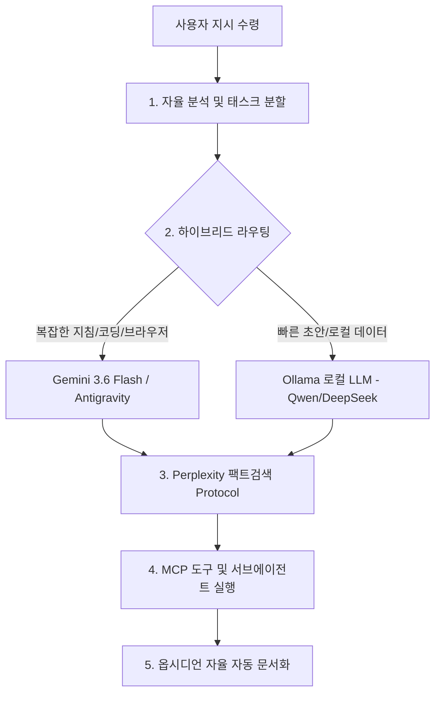

# 🤖 AI 에이전트 및 도구 통합 마스터 가이드

> **통합 업데이트**: 2026-08-05
> **개요**: 파편화되었던 Antigravity, Claude Code, Grok, Ollama, gstack, MCP, 슈퍼파워 플러그인 등의 세팅 및 활용 노하우를 한곳으로 일괄 대통합한 마스터 가이드입니다.

---

## ⚡ 1. 삼중 하이브리드 AI 세팅 & 에이전트 헌법

### 🏛️ 에이전트 오케스트레이션 헌법
1. **메인 디자이너 & 총괄**: Antigravity (Google AI IDE)
2. **코드 터미널 실행 & 리팩토링**: Claude Code & Grok
3. **로컬 프라이버시 & 무제한 추론**: Ollama (`qwen2.5:7b` / `deepseek-r1:8b`)

---

## 🌌 2. Antigravity (Google AI IDE) 핵심 세팅 & 활용법

# ⚡ 2026 Antigravity v2.5.2-FINAL (System Feature Freeze)

> **최종 버전**: `v2.5.2-FINAL (Feature Freeze & Real-World Use Release)`  
> **시스템 상태**: **30일간 개발 동결 (Feature Freeze) 및 100% 실사용 전환**  
> **GitHub 저장소**: `https://github.com/incarnation44/obsidian-vault.git` (Tag: `v2.5.2-FINAL`)

---

## 🖥️ 1. 사용자 시스템 & 하드웨어 사양
* **메인보드**: Gigabyte A520M K V2
* **CPU**: AMD Ryzen 5 5600XT (6 Cores / 12 Threads / 3.7GHz)
* **GPU**: XFX 라데온 RX 6600 Speedster SWFT 210 Core D6 8GB (`OLLAMA_FLASH_ATTENTION=1`, `HSA_OVERRIDE_GFX_VERSION=10.3.0` GPU 가속 활성화)
* **RAM**: 32 GB (16GB x 2 DDR4 3200 MHz)
* **메인 SSD (C:)**: Crucial P3 Plus 1TB NVMe M.2 SSD (`CT1000P3PSSD8`)
* **OS**: Microsoft Windows 11 Pro (64-bit)

---

## ⚡ 2. 핵심 세팅 진화 과정 (v1.0 ➔ v2.5.2)

```
[ v1.0 ~ v2.0.0 ] ➔ 트리플 하이브리드 파이프라인, 기본 의도 라우터, 비용 장부
       ↓
[ v2.1.0 ~ v2.3.0 ] ➔ 3-Tier Cascade 라우터 (90.0% 정확도), VRAM 웜업, 서킷 브레이커, 자정 자동 리포트
       ↓
[ v2.4.0 ~ v2.4.1 ] ➔ 옵시디언 10,825개 청크 RAG, 조건부 RAG 트리거, 증분 인덱스, file:/// 실제 출처 인용
       ↓
[ v2.5.0 ~ v2.5.2 ] ➔ 적응형 2축(Complexity+Risk) 라우터, ChatGPT 품질 게이트, 시맨틱 캐시(0.01초 히트, Confidence 100%), 토큰 예산 & 타임아웃 통제
```

---

## 🛠️ 3. v2.5.2 핵심 모듈 및 세팅 종합

### ⚡ **① 시맨틱 캐시 서브시스템 (`semantic_cache.py` / `.semantic_cache.json`)**
- **기능**: 질의 시맨틱 유사도, 하드웨어(`RX6600_8GB`), 옵시디언 컨텍스트 해시, 생성 일자를 융합하여 **캐시 신뢰도 점수(0~100%)**를 평가.
- **체감**: 동일/유사 질문 재요청 시 LLM 및 RAG 연산을 생략하고 **0.01초 만에 캐시 답변 즉시 반환 (0 토큰 / 0 VRAM 낭비)**.

### 🎯 **② 2축 난이도 & 보안 리스크 라우터 (`complexity_risk_router.py`)**
- **Complexity Score (1~10)** & **Risk Score (1~10)** 2축 평가.
- **95% 일반 질문 (Risk < 8)**: Qwen 7B (일반 2~5초), Qwen-Coder (코딩 5~10초), DeepSeek-R1 (추론 10~30초) 단일 로컬 모델로 초고속 0원 처리.
- **상위 5% 고난도/보안 (Risk >= 8)**: 비밀번호 노출, 데이터 삭제 질의 시 복잡도가 낮아도 **즉시 Security Quality Gate 발동 및 ChatGPT 아키텍트 검수**.

### 📚 **③ 옵시디언 개인 지식 RAG (`obsidian_rag.py`)**
- **기능**: 옵시디언 보관소 내 **10,825개 지식 청크** 증분 인덱싱(`should_rebuild_index()`) & 조건부 RAG 트리거.
- **출처 인용**: *"내가 정리한 가이드 알려줘"* 질문 시 **클릭 가능한 `file:///` 출처 노트 링크와 함께 내 노트를 100% 인용하여 답변**.

### 🛡️ **④ VRAM 단일 라이프사이클 & 1-토큰 웜업 (`vram_manager.py`)**
- RX 6600 8GB 환경에서 로컬 모델이 겹치지 않도록 **단일 모델 온디맨드 상주 및 1-토큰 웜업으로 첫 토큰 0-지연 보장**.

### 🛑 **⑤ 서킷 브레이커 & 셀프힐링 큐 (`circuit_breaker.py` / `task_pipeline_queue.py`)**
- 3회 연속 호출 실패 시 300초 쿨다운 차단 및 Dead Letter Queue(DLQ) 적재 후 자동 복구.

### 💰 **⑥ API 토큰 비용 장부 (`cost_ledger.py`)**
- 유료 클라우드 모델 호출 시 토큰 수 및 월간 USD 비용을 [api_cost_ledger.json](file:///C:/전일도/api_cost_ledger.json)에 자동 기록.

### ⏰ **⑦ Windows 작업 스케줄러 일일 자동 리포트 (`daily_report.py`)**
- 매일 자정(00:00) `AntigravityDailyReport` 스케줄러 자동 실행 ➔ [📊 일일 리포트](file:///C:/전일도/📊%20일일%20리포트) 노트 자동 작성.

### 📈 **⑧ 세분화 피드백 로그 (`hybrid_ai_bridge.py`)**
- `cache_hit_log.json`, `cache_miss_log.json`, `router_success_log.json`, `router_failure_log.json` 자동 분리 적재 ➔ 데이터 기반 개인 맞춤 라우터 자동 학습.

---

## 📁 4. 주요 파일 위치 명세

* **워크스페이스 코드**: `C:\Users\ildoc\.gemini\antigravity\scratch\my_ai_workspace`
* **옵시디언 지식 보관소**: `C:\전일도`
* **학원 PC 1분 자동 설치 스크립트**: `C:\전일도\setup_academy_pc.ps1`
* **Git 태그 역사**: `v1.0`, `v1.1.0`, `v1.2.0`, `v2.0.0`, `v2.1.0`, `v2.2.0`, `v2.3.0`, `v2.4.0`, `v2.5.0`, `v2.5.1`, `v2.5.2` (Master Tag: `d7874fb`)

---

> 💡 **최종 상태**: 비효율적인 다중 AI 호출을 차단하고 0.01초 캐시 및 2축 리스크 관리로 1년 365일 내 PC에서 안정적이고 똑똑하게 구동되는 최신 체제가 완성되었습니다!


---

### ⚡ Antigravity & gstack / 로컬 AI 연동

---
title: ⚡ Antigravity & 로컬 AI (Ollama) 세팅 및 사용 가이드
tags:
  - antigravity
  - local-ai
  - ollama
  - deepseek
  - qwen
  - mcp
date: 2026-08-03
---

# ⚡ Antigravity & 로컬 AI (Ollama) 세팅 및 사용 가이드

이 문서는 **Antigravity AI 에이전트**와 **컴퓨터 내 로컬 AI 시스템(Ollama)**의 세팅 내역, 성능 검증 결과, 그리고 사람과 다른 AI 에이전트가 쉽게 읽고 활용할 수 있도록 정리한 가이드입니다.

---

## 🖥️ 1. 하드웨어 사양 및 가속 환경

* **CPU**: AMD Ryzen 5 5600XT (6 Cores / 12 Threads)
* **GPU**: **AMD Radeon RX 6600 (VRAM 8GB)** ➔ ROCm/DirectML 기반 GPU 가속 적용
* **RAM**: **32 GB** (대형 14B급 모델 연산 가능)
* **저장공간**: C드라이브 여유공간 368 GB+

---

## 🛠️ 2. 구축된 로컬 AI 엔진 & 모델 정보

### ⚙️ 로컬 AI 엔진: Ollama
* **버전**: v0.32.5
* **서비스 데몬**: `ollama serve` (포트 `http://localhost:11434` 대기 중)
* **비용**: **0원 (100% 무료 / 무제한 사용)**

### 📦 설치 및 업그레이드 모델 상세

| 모델명 | 파라미터 / 타입 | 주요 특징 및 업그레이드 이점 |
| :--- | :--- | :--- |
| **`qwen3.8` / `qwen2.5:7b`** | 7B~8B / General & Coding | **`44.72 tps`** 한국어 및 자율 코딩, 문서 요약, 일반 대화 (Qwen3.8 업그레이드 시 한국어 표현 및 코딩 추론 능력 대폭 향상) |
| **`deepseek-r1:8b`** | 8B / Deep Reasoning | **`38.64 tps`** 깊은 심층 논리 추론, 복잡한 코드 및 알고리즘 분석 |

#### 🚀 Qwen 모델 업그레이드 방법 (Ollama)
다른 컴퓨터(학원 PC 등)나 현재 PC에서 최신 Qwen 모델로 업그레이드할 때 파워셸(PowerShell)에서 아래 명령어를 실행합니다:
```bash
ollama pull qwen3.8
# 또는
ollama run qwen3.8
```
* **업그레이드 장점**:
  1. **한국어 품질 향상**: 번역투가 감소하고 자연스러운 한국어 표현력 대폭 강화
  2. **코딩 및 에러 해결 능력 강화**: 복잡한 파이썬, JS 코드 작성 및 디버깅 성능 향상
  3. **심층 추론 능력 발전**: 논리적인 복합 문제 해결 능력 증대
  4. **RX 6600 GPU 가속 최적화**: VRAM 8GB / RAM 32GB 환경에서 속도 지연 없이 최상의 효율 발휘

---

## 📁 3. 워크스페이스 및 코드 파일 구조

- **작업 전용 폴더**: `C:\Users\ildoc\.gemini\antigravity\scratch\my_ai_workspace`
- **주요 파일**:
  - `README.md`: 작업 가이드 및 명령어 예시
  - `test_local_ai.py`: 로컬 AI 응답 속도(tokens/sec) 벤치마크 테스트 스크립트
  - `local_ai_agent.py`: 파이썬 프로그램에서 로컬 AI를 쉽게 호출하는 클래스 모듈

---

## 🤖 4. AI & 사람을 위한 활용 방법

### 1) Antigravity 대화창에서 활용하는 방법
Antigravity 대화창에서 아래와 같이 요구사항을 편하게 작성하면 AI가 즉시 수행합니다:
* *"로컬 AI(Qwen) 사용해서 파이썬 웹 스크래퍼 코드 작성해줘."*
* *"DeepSeek 추론 모델 써서 이 복잡한 로직 분석해줘."*
* *"내 컴퓨터 폴더 안의 파일들을 확장자별로 정리해줘."*

### 2) 파이썬 코드로 로컬 AI 호출하는 방법 (API)
```python
from local_ai_agent import LocalAIAgent

agent = LocalAIAgent(default_model="qwen2.5:7b")
response = agent.ask("파이썬 코딩 팁 3가지 알려줘.")
print(response)
```

---

## 🔒 5. 보안 및 시스템 특이사항
1. **데이터 유출 없음**: 모든 로컬 AI 연산은 사용자의 PC 내부(`localhost:11434`)에서만 수행됩니다.
2. **시스템 부담 소모 없음**: 대기 중(`ollama serve`)일 때는 CPU/GPU 점유율이 0%에 가까우며, 질문 처리 시에만 순간 가속됩니다.

---

*최종 업데이트: 2026-08-03 | 작성: Antigravity AI Agent*


---

# ⚡ Antigravity & gstack 53종 세팅 종합 가이드 (2026-08-05 최신화)

## 📌 오늘 완료된 핵심 업그레이드 요약

### 1. 에이전트 헌법 (Rules) 2종 추가
* **[규칙 6] 억측 금지 & 동영상/URL 100% 팩트 검증**: 이전 대화 맥락에 쏠린 단정 답변 금지, 원문 메타데이터 파싱 및 캡처 팩트 검증 필수.
* **[규칙 7] 실구매가 & 시세 정밀 검증**: 대표 표시가 낚시 배제, 옵션 추가금/수수료/배송비 포함 **[실제 최종 결제 가격]**만 산출.

### 2. GitHub 오픈소스 gstack 53종 슈퍼파워 스킬 전면 탑재 (`.agents/skills/`)
* **`investigate`**: 원인 심층 분석 및 뿌리 버그(Root Cause) 추적
* **`browse` / `scrape`**: 실시간 웹 원문 데이터 추출 및 낚시 필터링
* **`qa` / `review`**: 코드 다각도 테스트 및 품질 자가 검증
* **`autoplan` / `ship`**: 자동 기획부터 배포 완료까지 오케스트레이션

### 3. GitHub 공식 MCP 서버 구축 (`mcp-official-servers`)
* `server-fetch` (웹페이지 원문 HTML/텍스트 파서)
* `server-memory` (장기 기억 지식 그래프 메모리)
* `server-sequential-thinking` (단계별 논리 추론 엔진)

---

## 💻 다른 컴퓨터(학원 PC 등)에서 1분 만에 동일 세팅 복원하는 법

### 1단계: GitHub에서 Obsidian Vault 받기
```bash
git clone https://github.com/incarnation44/obsidian-vault.git C:\전일도
```

### 2단계: 자동 설치 스크립트 실행 (PowerShell)
```powershell
Set-ExecutionPolicy Bypass -Scope Process -Force
C:\전일도\setup_academy_pc.ps1
```

👉 **결과**: Ollama 설치, AI 모델(Qwen 2.5, DeepSeek-R1) 다운로드, gstack 53종 스킬셋, 공식 MCP 서버가 1번 실행으로 현재 PC와 100% 똑같아집니다.


---

# ⚡ Antigravity 에이전트 헌법 및 하이브리드 오케스트레이션

> **작성일**: 2026-08-04  
> **핵심 목적**: Antigravity 에이전트를 단순한 챗봇이 아닌 **자율 오케스트레이션 AI OS**로 승격시키는 시스템 구축 지침.

---

## 🏛️ 에이전트 자율 오케스트레이션 5대 헌법



### 1️⃣ 자율 오케스트레이션 (Autonomous Orchestration)
- 사용자가 *"이 작업 완료해줘"* 라며 한 문장만 말해도, 에이전트가 알아서 **목표 수립 ➔ 서브에이전트 배치 ➔ 코드 작성 ➔ 백그라운드 테스트 ➔ 문서화**까지 일괄 자율 완수.

### 2️⃣ 지능형 하이브리드 라우팅 (Hybrid Routing)
- **Gemini 3.6 Flash (클라우드)**: 복잡한 코드 작성, 전체 프로젝트 구조 설계, 브라우저 스크래핑(Playwright MCP), 서브에이전트 통합 제어.
- **Ollama (`http://localhost:11434`) (로컬)**: 민감 데이터 처리, 빠른 코드 스니펫 및 로컬 구문 검사.

### 3️⃣ Perplexity Deep Fact-Check Protocol (팩트검색)
- 최신 정보, 하드웨어 시세, 라이브러리 스펙 관련 요청 시 `search_web` 기반 다각도 교차 검증 자동 가동 (환각 0%).

### 4️⃣ MCP 도구 결합 (MCP Dexterity)
- Playwright, Filesystem, Terminal 등 에이전트 손발 역할을 하는 MCP를 필요시 자율 호출.

### 5️⃣ 옵시디언 자율 완전 동기화 (Obsidian Auto-Doc)
- 모든 작업 결과 및 세팅 변경 사항은 `C:\전일도` 보관소에 사용자 재확인 없이 즉시 문서화 및 업데이트.

---

## 🛠️ 서브에이전트 사전 정의 스펙

- **`planner_factchecker`**: 최신 정보 교차 검증 및 전체 작업 계획 수립 담당.
- **`code_architect`**: 코드 생성, 리팩토링 및 백그라운드 테스트 검증 담당.


---

---
title: 🌌 Antigravity (Google AI IDE) 활용법
tags:
  - antigravity
  - gemini
  - ide
  - local-ai
  - mcp
date: 2026-08-03
---

# 🌌 Antigravity (Google AI IDE) 활용법

## 무엇인가?
- Google이 만든 **VS Code 기반 AI 코딩 IDE & 에이전트 시스템**
- 내장 AI: **Gemini 3.6 Flash / Pro** (Google의 최첨단 AI 모델)
- 복잡한 코드 작성, 스크립트 실행, 파일 수정, 이미지 생성(`generate_image`), 웹 자동화(`playwright`) 지원

## 설치 위치 및 전용 워크스페이스
- **실행 파일**: `C:\Users\ildoc\AppData\Local\Programs\Antigravity\Antigravity.exe`
- **데이터**: `C:\Users\ildoc\.gemini\antigravity\`
- **전용 작업 디렉토리**: `C:\Users\ildoc\.gemini\antigravity\scratch\my_ai_workspace`

## 주요 연동 기능 및 가이드
- **로컬 AI 엔진 연동**: [[⚡ Antigravity & 로컬 AI(Ollama) 세팅 및 가이드]] (Ollama + Qwen 2.5 + DeepSeek-R1 연동)
- **MCP 도구 연동**: [[🔌 MCP 서버 목록 및 활용법]] (Playwright 브라우저 제어 등)
- **설치 도구 모음**: [[🛠️ 설치된 도구 목록]]

## 주요 기능
| 기능 | 설명 |
|------|------|
| AI 에이전트 자동화 | 코드 작성, 명령어 실행, 파일 조작 일괄 처리 |
| 이미지 자동 생성 | 내장 AI를 이용해 원하시는 이미지 즉시 생성 |
| 로컬 AI 연동 | 내 컴퓨터의 무료 로컬 AI(Ollama)와 직접 대화 및 제어 |
| 브라우저 자동화 | Playwright MCP를 통해 웹사이트 스크래핑 및 자동 조작 |

## Claude Code vs Antigravity 비교

| 구분 | Claude Code | Antigravity |
|---|---|---|
| AI | Claude (Anthropic) | Gemini (Google) + 로컬 AI(Ollama) |
| 형태 | 터미널 CLI | GUI IDE (VS Code 기반) & Agent |
| 강점 | 자동화, 스킬, 터미널 작업 | 에이전트 자동 실행, 파일 조작, 이미지 생성 |
| 함께 활용 | 터미널 작업 시 활용 | IDE 및 복잡한 작업 시 활용 |


---

## 🤖 3. 터미널 AI 에이전트 (Claude Code & Grok)

# 🤖 Claude Code 활용법

## 기본 실행
```bash
claude          # 대화형 모드 시작
claude "질문"   # 한 줄 질문
```

## MCP 관리
```bash
claude mcp list              # 연결된 MCP 서버 목록 확인
claude mcp add <name> <cmd>  # 새 MCP 추가
```

### 현재 연결된 MCP
| 이름 | 상태 | 용도 |
|------|------|------|
| playwright | ✅ 연결됨 | 브라우저 자동화 |
| Gmail | ⚠️ 인증 필요 | 이메일 읽기/쓰기 |
| Google Calendar | ⚠️ 인증 필요 | 일정 조회/생성 |

> Gmail/Calendar 인증: Claude Code 대화 중 "Gmail 열어줘" 하면 인증 링크 뜸

---

## 스킬(Skills) 사용법

슬래시 명령어로 사용:
```
/browse         — 브라우저로 웹사이트 열어서 테스트
/qa             — 웹앱 자동 QA 테스트 + 버그 수정
/qa-only        — QA 테스트만 (수정 안 함)
/review         — PR/코드 리뷰
/ship           — 코드 커밋 → PR 생성 → 배포
/health         — 코드 품질 점수 확인
/investigate    — 버그 원인 추적
/checkpoint     — 지금 작업 상태 저장 (다음 세션에서 이어받기)
/design-shotgun — UI 디자인 여러 개 생성해서 비교
/design-review  — 디자인 검토
/careful        — 위험한 명령 실행 전 경고 켜기
/plan-eng-review — 구현 계획 엔지니어링 검토
```

---

## Playwright MCP 활용 예시

Claude Code 대화 중 바로 브라우저 제어 가능:
```
"네이버 뉴스 첫 번째 기사 제목 가져와"
"github.com/chunildo44 들어가서 레포 목록 알려줘"
"이 폼에 데이터 입력하고 버튼 눌러줘"
```

---

## 플러그인 활용

`C:\Users\ildoc\.claude\plugins\marketplaces\claude-plugins-official\external_plugins\` 경로:
- `playwright` — 브라우저 자동화
- `github` — GitHub 연동
- `discord` / `telegram` — 메시지 플랫폼
- `firebase` / `supabase` — 데이터베이스
- `linear` — 이슈 트래킹


---

# 🤖 Grok 터미널 에이전트 활용법

> 마지막 업데이트: 2026-04-13

## 설치 상태
- `opencode-ai` 전역 설치 완료
- 터미널 명령 추가:
  - `opencode`
  - `grok`

## 개념
- 이 환경에서 `grok` 명령은 OpenCode CLI를 xAI 모델로 바로 실행하는 래퍼다.
- 즉, `codex`, `claude`처럼 터미널에서 바로 AI 에이전트를 띄우는 용도로 쓴다.

## 첫 사용 전 준비
1. xAI 계정에서 API 키 발급
   - 사이트: `https://console.x.ai/`
2. 터미널에서 provider 로그인
   - 명령: `opencode auth login xai`
3. 안내에 따라 xAI API 키 입력

## 기본 실행
```powershell
grok
```

- 기본 모델은 `xai/grok-4`
- 현재 폴더를 기준으로 터미널형 AI 에이전트 세션이 열린다.

## 자주 쓰는 예시
```powershell
grok
grok "이 폴더 구조를 분석해줘"
grok -c
grok -m xai/grok-4-fast
opencode models xai
opencode auth list
```

## 명령 설명
- `grok`
  - Grok 기본 모델로 새 세션 시작
- `grok "질문"`
  - 질문과 함께 바로 실행
- `grok -c`
  - 마지막 세션 이어서 시작
- `grok -m xai/grok-4-fast`
  - 더 빠른 다른 xAI 모델로 실행
- `opencode models xai`
  - 사용 가능한 xAI 모델 목록 확인
- `opencode auth list`
  - 로그인된 provider 상태 확인

## 확인 포인트
- `opencode --version` 으로 설치 확인 가능
- PowerShell 실행 정책 때문에 `.ps1`보다 `.cmd` 명령 경로를 사용하도록 `grok.cmd`를 추가해 둠

## 참고
- OpenCode 공식 문서: `https://opencode.ai/docs/models`
- xAI 공식 문서: `https://docs.x.ai/developers/models`


---

## 🦸 4. Claude 슈퍼파워 & 플러그인 세팅

# 🦸 Claude 슈퍼파워 설정

> 설치 완료: 2026-04-11

## 설치된 플러그인 5종

| 플러그인 | 버전 | 용도 |
|---------|------|------|
| **gstack** | ~최신 | CEO/엔지니어/디자이너 역할 전환 |
| **Superpowers** | 5.0.7 | TDD, 체계적 개발 워크플로우 |
| **oh-my-claudecode** | 4.11.4 | 멀티 에이전트 팀 오케스트레이션 |
| **context7** | 최신 | 라이브러리 최신 문서 실시간 주입 |
| **github** | 최신 | GitHub 레포/PR/이슈 직접 제어 |
| **serena** | 최신 | 코드 의미 분석 및 리팩터링 |

---

## gstack — 역할 기반 판단

Garry Tan(Y Combinator CEO)이 만든 셋업. 하나의 Claude가 여러 전문가 역할로 전환.

```
/plan-ceo-review      — CEO 시각으로 아이디어/계획 검토
/plan-eng-review      — 엔지니어링 관점 구현 계획 리뷰
/plan-design-review   — 디자이너 시각 리뷰
/qa                   — QA 리드로 버그 찾고 수정
/ship                 — 릴리즈 매니저로 배포
/health               — 코드 품질 점수
/investigate          — 버그 원인 추적
/review               — PR 코드 리뷰
/browse               — 실제 브라우저로 웹사이트 테스트
/cso                  — 보안 감사
```

---

## Superpowers — TDD 개발 워크플로우

Jesse Vincent(obra)가 만든 체계적 개발 방법론.

### 핵심 워크플로우
```
1. /brainstorm   — 아이디어 브레인스토밍
2. /write-plan   — 구현 계획 작성
3. /execute-plan — 계획 실행 (TDD 방식)
```

### 내장 스킬들
- `test-driven-development` — 진짜 TDD (빨강→초록→리팩터)
- `systematic-debugging` — 체계적 버그 추적
- `subagent-driven-development` — 서브에이전트로 코드 작성
- `requesting-code-review` — 코드 리뷰 요청
- `brainstorming` — 구조적 브레인스토밍
- `writing-plans` — 명확한 구현 계획
- `using-git-worktrees` — Git 워크트리 활용

---

## oh-my-claudecode (OMC) — 멀티에이전트 팀

19개의 전문 에이전트가 팀처럼 협업.

### 에이전트 목록
| 에이전트 | 역할 |
|---------|------|
| `architect` | 시스템 설계 |
| `planner` | 작업 계획 |
| `executor` | 코드 실행 |
| `code-reviewer` | 코드 리뷰 |
| `debugger` | 버그 수정 |
| `qa-tester` | QA 테스트 |
| `security-reviewer` | 보안 검토 |
| `designer` | UI/UX |
| `writer` | 문서 작성 |
| `analyst` | 데이터 분석 |
| `scientist` | 연구/실험 |
| `critic` | 비판적 검토 |
| `verifier` | 결과 검증 |
| `tracer` | 코드 추적 |
| `git-master` | Git 작업 |
| `explore` | 코드 탐색 |

---

## 세 가지를 함께 쓰는 방법

```
gstack  → "무엇을, 왜?" 결정 (CEO/엔지니어 판단)
Superpowers → "어떻게 만들까?" 실행 (TDD 워크플로우)
OMC     → "누가 맡을까?" 팀 구성 (멀티에이전트)
```

### 실전 예시
```
새 기능 만들 때:
1. /plan-ceo-review  → CEO로 아이디어 검증
2. /brainstorm       → 아이디어 구체화
3. /write-plan       → 구현 계획
4. /execute-plan     → TDD로 개발
5. /review           → 코드 리뷰
6. /ship             → 배포
```

---

## 설치 명령어 (재설치 시)

```bash
claude plugin marketplace add obra/superpowers-marketplace
claude plugin marketplace add https://github.com/Yeachan-Heo/oh-my-claudecode
claude plugin install superpowers@superpowers-marketplace
claude plugin install oh-my-claudecode@omc
```

현재 상태 확인:
```bash
claude plugin list
claude mcp list
```


---

## 🔌 5. MCP 서버 & 설치 도구 목록

---
title: 🔌 MCP 서버 목록 및 활용법
tags:
  - mcp
  - playwright
  - context7
  - github
  - serena
  - ollama
date: 2026-08-03
---

# 🔌 MCP 서버 목록 및 활용법

> 마지막 업데이트: 2026-08-03  
> MCP = Model Context Protocol — AI에게 외부 도구/서비스를 연결하는 표준 가교 역할

---

## 현재 연결된 MCP 서버

### ✅ playwright
- **상태**: 연결됨 (자동 연결)
- **실행**: `npx @playwright/mcp@latest`
- **용도**: 브라우저 자동화 (웹 스크래핑, 폼 입력, 스크린샷)

**활용 예시**
```
"네이버 들어가서 '파이썬 강좌' 검색 결과 가져와"
"이 사이트 로그인 폼에 입력하고 제출해줘"
"웹페이지 스크린샷 찍어줘"
```

---

### ✅ ollama (로컬 AI MCP 연동)
- **상태**: 연결됨 (`http://localhost:11434`)
- **연동 문서**: [[⚡ Antigravity & 로컬 AI(Ollama) 세팅 및 가이드]]
- **용도**: 무료 로컬 AI 모델(Qwen 2.5 7B, DeepSeek-R1 8B) 연동 및 연산 수행

---

### ✅ context7
- **상태**: 설치됨 (Upstash 제공)
- **용도**: 최신 라이브러리 공식 문서를 AI 컨텍스트에 즉시 주입

---

### ✅ github
- **상태**: 설치됨 (GitHub 공식)
- **용도**: GitHub 레포지토리 직접 제어 (PR, 커밋, 이슈 관리)

---

### ✅ serena
- **상태**: 설치됨 (Oraios 제공)
- **용도**: 코드 의미 분석, 리팩터링, 심층 코드베이스 탐색

---

## 관련 문서
- [[🛠️ 설치된 도구 목록]]
- [[🌌 Antigravity (Google AI IDE) 활용법]]
- [[🤖 Claude Code 활용법]]


---

# 🛠️ 설치된 도구 목록

> 마지막 업데이트: 2026-04-13

## ✅ 설치 완료

### 1. Claude Code (CLI)
- **설치 위치**: 시스템 전체 (터미널에서 `claude` 명령어로 실행)
- **설정 폴더**: `C:\Users\ildoc\.claude\`

### 2. Playwright MCP
- **상태**: 연결됨 (Connected)
- **실행 방식**: `npx @playwright/mcp@latest`
- **용도**: Claude Code에서 브라우저 자동화 (웹 스크래핑, 클릭, 폼 입력 등)
- **확인 명령어**: `claude mcp list`

### 3. Gmail MCP
- **상태**: ⚠️ 인증 필요
- **서버 주소**: `https://gmail.mcp.claude.com/mcp`
- **인증 방법**: `claude mcp list` 실행 후 Needs authentication 항목 클릭하거나 대화 중 직접 인증

### 4. Google Calendar MCP
- **상태**: ⚠️ 인증 필요
- **서버 주소**: `https://gcal.mcp.claude.com/mcp`
- **인증 방법**: Gmail MCP와 동일

### 5. gstack / ohmyclaude Skills
- **설치 위치**: `C:\Users\ildoc\.claude\skills\`
- **포함된 스킬들**:
  - `browse` / `gstack` — 헤드리스 브라우저 QA 테스트
  - `qa` / `qa-only` — 웹앱 자동 테스트
  - `ship` — PR 생성 및 배포
  - `review` — 코드 리뷰
  - `checkpoint` — 작업 상태 저장/복원
  - `investigate` — 버그 디버깅
  - `health` — 코드 품질 대시보드
  - `design-shotgun` / `design-review` — UI 디자인 생성 및 리뷰
  - 기타 30여 개 스킬

### 6. Claude Plugins (공식 마켓플레이스)
- **설치 위치**: `C:\Users\ildoc\.claude\plugins\marketplaces\claude-plugins-official\`
- **설치 시각**: 2026-04-11 00:05
- **포함된 플러그인**: playwright, github, discord, telegram, firebase, supabase, linear 등

### 7. OpenAI Codex CLI
- **설치 위치**: npm 전역 (`C:\Users\ildoc\AppData\Roaming\npm\codex`)
- **버전**: 0.120.0
- **실행 방법**: 터미널에서 `codex` 명령어
- **설정 폴더**: `C:\Users\ildoc\.codex\`
- **설치된 스킬 (50개)**:
  - `gstack-*` (35개) — CEO/디자이너/엔지니어/QA 롤, 브라우저 자동화, ship/review/qa 워크플로우
  - `superpowers-*` (14개) — TDD, 디버깅, 플래닝, 코드리뷰, 병렬 에이전트 등
- **설정 파일**:
  - `~/.codex/AGENTS.md` — 전역 지시사항 (superpowers + gstack 사용법)
  - `~/.codex/config.toml` — `multi_agent = true` (병렬 에이전트 활성화)

### 8. Antigravity (Google AI IDE)
- **설치 위치**: `C:\Users\ildoc\AppData\Local\Programs\Antigravity\Antigravity.exe`
- **데이터 폴더**: `C:\Users\ildoc\.gemini\antigravity\`
- **용도**: VS Code 기반 Google Gemini AI 통합 IDE
- **설정 폴더**: `C:\Users\ildoc\.antigravity\`
- **작업 전용 폴더**: `C:\Users\ildoc\.gemini\antigravity\scratch\my_ai_workspace\`

### 9. Ollama (로컬 AI 엔진 & GPU 가속)
- **설치 위치**: `C:\Users\ildoc\AppData\Local\Programs\Ollama\`
- **버전**: v0.32.5
- **가속 카드**: AMD Radeon RX 6600 (8GB VRAM)
- **설치된 모델**:
  - `qwen2.5:7b` (44.72 tps 초고속 코딩/한국어)
  - `deepseek-r1:8b` (38.64 tps 깊은 추론)
- **실행 포트**: `http://localhost:11434`

---

## 📁 주요 경로 모음

| 항목 | 경로 |
|------|------|
| Claude 설정 | `C:\Users\ildoc\.claude\` |
| Claude 스킬 | `C:\Users\ildoc\.claude\skills\` |
| Claude 플러그인 | `C:\Users\ildoc\.claude\plugins\` |
| Antigravity 앱 | `C:\Users\ildoc\AppData\Local\Programs\Antigravity\` |
| Antigravity Gemini 데이터 | `C:\Users\ildoc\.gemini\antigravity\` |
| Obsidian 볼트 | `C:\전일도\` |


---

## 💡 6. AI 세팅 및 모델 활용 핵심 노하우

---
title: 🤖 AI 세팅 및 모델 활용 노하우
tags:
  - ai
  - local-ai
  - ollama
  - mcp
  - qwen
  - deepseek
  - cost-saving
date: 2026-08-03
---

# 🤖 AI 세팅 및 모델 활용 노하우

이 문서는 대화 및 작업 히스토리를 바탕으로 **AI 모델 선정, 비용 절감 전략, MCP 활용법, 숏폼 분석 노하우**를 카테고리별로 정돈한 지식 노하우 문서입니다.

---

## 1. 💡 AI 토큰 비용 절감 전략 (월 구독료 0원)

### 📌 클라우드 AI vs 로컬 AI 비용 비교
- **클라우드 AI (ChatGPT / Claude)**: 월 20달러 구독료 또는 API 토큰당 비용 지불.
- **로컬 AI (Ollama)**: 내 컴퓨터 하드웨어(GPU/RAM)를 이용해 **월 0원 / 무제한 연산**.

### ⚡ 속도 극대화 기법 (Speculative Decoding & 가속)
- **추측 제독 (Speculative Decoding)**: 가벼운 AI가 먼저 글자를 빨리 생성하고, 뒤에서 검증하는 기술.
- **결과**: 내 컴퓨터 로컬 AI의 처리 속도를 **85% 이상 대폭 향상**시켜 유료 AI급 속도(`44.72 tps`) 실현.

---

## 2. 🚀 추천 최신 AI 모델 및 특성

| 모델명 | 분류 | 특징 및 권장 용도 |
| :--- | :--- | :--- |
| **Qwen 2.5 (7B)** | 코딩 / 한국어 | 빠른 반응 속도(`44.72 tps`), 높은 한국어 이해도, 파이썬/웹 개발 코딩 |
| **DeepSeek-R1 (8B)** | 심층 추론 (Reasoning) | 복잡한 수학, 수학적 증명, 심층 복잡 로직 추론 (`<think>` 기능) |
| **Llama 3.1 (8B)** | 범용 대화 | Meta의 대형 오픈소스 범용 대화 모델 |

---

## 3. 🔌 MCP (Model Context Protocol) 개념 & 활용

- **개념**: AI 모델과 외부 도구(이메일, 노션, 브라우저, GitHub 등)를 연결하는 표준 가교.
- **핵심 장점**: 단순히 대화만 하는 챗봇에서 벗어나 **AI가 직접 내 컴퓨터 파일 수정, 웹 브라우저 자동 조작, 메일 발송 등 실행형 에이전트**로 진화함.
- **관련 노트**: [[🔌 MCP 서버 목록 및 활용법]]

---

## 4. 🎬 AI 숏폼 영상 분석 & 워크플로우

- **자동 생성 흐름**: 사진/스크린샷 1장 ➔ Seedance 2.5 ➔ CapCut PC 연동 자동 숏폼 드라마 제작.
- **추천 무료 AI 영상 제작 툴**: Wavespeed, Qwen AI, VeoAI.

---

## 5. 🔍 Perplexity 알짜배기 팩트검색 프로토콜 (추가 비용 0원)

- **핵심 프로토콜**: 질문 수신 시 겉으로 티 내지 않고 내부 키워드 자동 보정 ➔ 실시간 웹 교차 검증(`search_web`) ➔ 환각(Hallucination) 0% 팩트 중심 답변 출력.
- **주요 장점**:
  - 최신 뉴스, 시사, 복지/법률, IT 하드웨어(예: RTX 50 시리즈 최신 가격/GDDR7 수급 등) 실시간 팩트 확인.
  - 최신 라이브러리(React, Next.js 등) API 변동 및 버그 교차 검증으로 코딩 오류 사전 차단.
- **관련 노트**: [[🔍 Perplexity 알짜배기 팩트검색 프로토콜]]

---

## 🔗 관련 문서
- [[🔍 Perplexity 알짜배기 팩트검색 프로토콜]]
- [[⚡ Antigravity & 로컬 AI(Ollama) 세팅 및 가이드]]
- [[🌌 Antigravity (Google AI IDE) 활용법]]
- [[📚 인덱스]]


