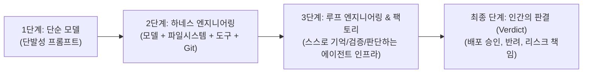

# 🏛️ Addy Osmani가 밝힌 미래 엔지니어의 본질과 소프트웨어 팩토리

> **📌 아카이빙 메타데이터**
> - **원본 출처**: [YouTube (https://youtu.be/wHePopfD6js)](https://youtu.be/wHePopfD6js)
> - **출처 정보 발행일자**: `2026-08-13`
> - **내 보관소 등록일자**: `2026-08-14`
> - **연사**: Addy Osmani (Google Chrome 엔지니어링 리드 / 소프트웨어 아키텍트)  
> - **핵심 주제**: AI 에이전트가 코드를 전부 짜는 시대, 엔지니어의 역할은 '단순 코딩'에서 **'무엇을 할지 선택하고 최종 판결(Verdict)을 내리는 최고 의사결정권자'**로 진화합니다.

---

## 📊 소프트웨어 개발의 3단계 진화 모델

---

## 💡 핵심 4대 인사이트

### 1. 미래 엔지니어의 새로운 정의: "선택(Choice)과 판결(Verdict)" ⭐
* 과거의 엔지니어: 코드를 한 줄 한 줄 직접 타이핑하는 기술자
* **미래의 엔지니어**: 
  * **"무엇이 만들 가치가 있는가(What is worth doing)"를 선택하는 사람**
  * 에이전트가 가져온 결과물과 증거(Evidence)를 보고 **"실제 배포(Ship)할지, 반려(Block)할지, 수정할지" 최종 책임(Verdict)을 지는 사람**

### 2. 하네스 엔지니어링 (Harness Engineering)
* 단순히 LLM 모델 혼자서는 아무것도 못 합니다.
* 모델 주변에 **컨텍스트, 터미널 도구(Tool), 파일 시스템, Git, 검증 테스트**라는 안전벨트(하네스)를 채워줄 때 비로소 믿고 일을 맡길 수 있는 '자율 에이전트'가 됩니다.

### 3. 루프 엔지니어링 (Loop Engineering) ➔ 소프트웨어 공장
* 사람이 매번 프롬프트를 쳐주는 게 아니라, **에이전트가 스스로 실행 ➔ 검증 ➔ 메모리 기억 ➔ 다음 단계 결정**을 무한 반복하는 루프 시스템을 구축하는 것이 진정한 에이전트 인프라입니다.

### 4. 5가지 엔지니어링 모드 지휘 (Boris Cherny 분류)
* **Prototype (시제품 제작)** ➔ **Build (본 개발)** ➔ **Sweep (코드 정리/리팩토링)** ➔ **Grow (기능 확장)** ➔ **Maintain (유지보수)**
* 모든 모드에서 AI가 코드를 작성하지만, **"지금 우리 제품에 어떤 모드가 필요한가?"를 진단하고 지휘하는 총감독 역할**은 오직 인간 엔지니어의 몫입니다.

---

## 🛠️ Antigravity & 전일도 시스템에 주는 시사점

현재 우리가 구축한 Antigravity 환경(계층형 메모리, AST 의존성 그래프, herdr 병렬 에이전트)은 바로 Addy Osmani가 말한 **'소프트웨어 팩토리'**의 실전 구현체입니다.
* 에이전트에게 구현을 자율 위임하고, 사용자는 **'최종 방향성 선택과 결과 승인'**에 집중하는 하이엔드 개발 방식이 완벽히 들어맞습니다.

---

## 🔗 관련 문서 링크
- [[01_AI_시스템_및_도구/토스_엔지니어의_바이브코딩_실전_로드맵|토스 엔지니어의 바이브코딩 실전 로드맵]]
- [[01_AI_시스템_및_도구/Anthropic_시스템프롬프트_80프로_삭제_컨텍스트_엔지니어링_6대_법칙|Anthropic 컨텍스트 엔지니어링 6대 법칙]]
- [[인덱스]]
