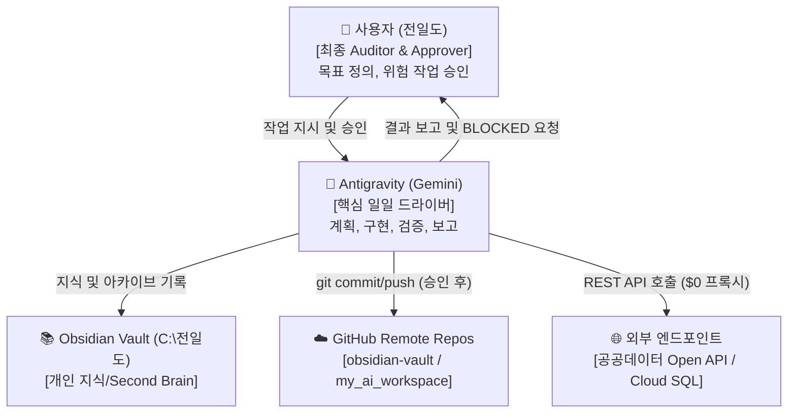
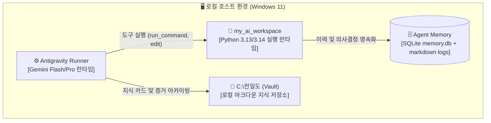
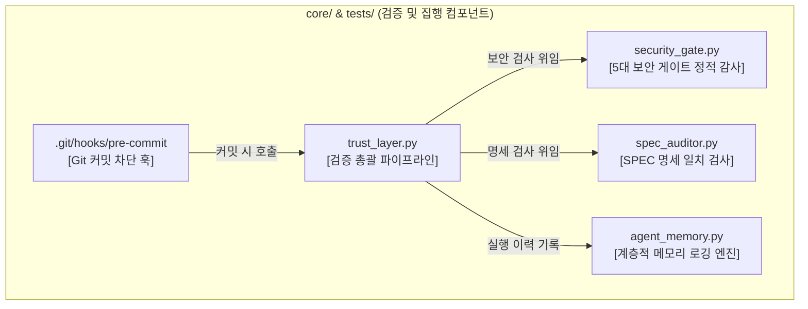
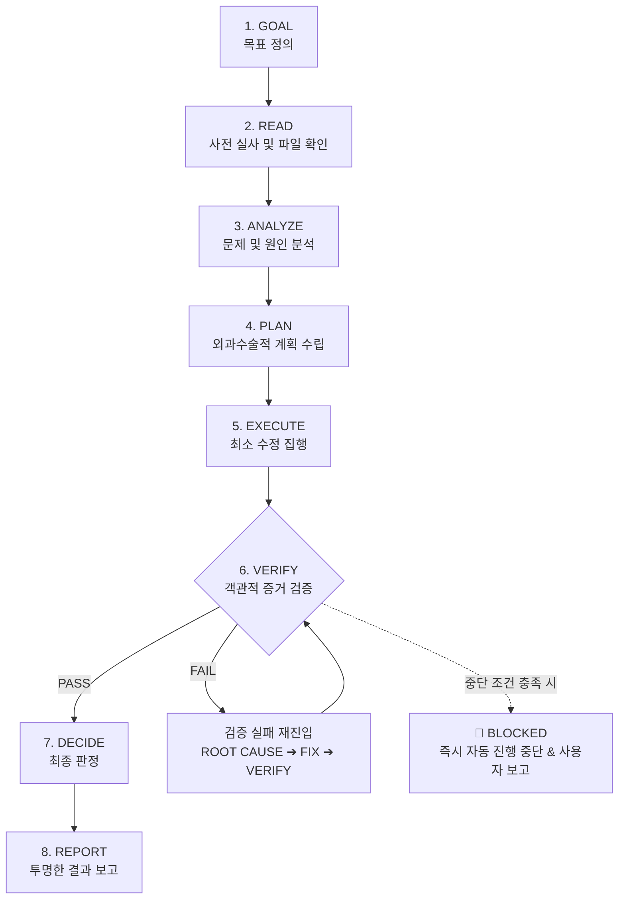

# 🗺️ Antigravity C4 아키텍처 및 집행 지도 (Architecture & Enforcement Map)

> **최종 갱신일**: 2026-09-06  
> **문서 성격**: Antigravity 전체 시스템의 C4 구조(Context, Container, Component)와 실제 물리적 강제 집행 현황을 증거 기반으로 기록한 기술 마스터 원본.  
> **SSOT 및 미러 관계 정의**:  
> 1. **1계층 (Ground Truth)**: 실제 물리적 코드, 파일, Git 저장소 구조 (`my_ai_workspace/`)  
> 2. **2계층 (Technical Master SSOT)**: `my_ai_workspace/ARCHITECTURE_MAP.md` (기술 문서 원본)  
> 3. **3계층 (Human Dashboard Mirror)**: `C:\전일도_AI_시스템_및_도구\Antigravity_아키텍처_및_집행_지도_대시보드.md` (사용자 열람용 미러)  
> ⚠️ **동기화 사실 명세**: 백그라운드 자동 데몬/훅은 존재하지 않으며, 변경 시 **파이썬 스크립트를 통한 명시적 복사 및 SHA-256 해시 대조 확인** 절차로만 단방향 동기화됨.

---

## 📊 0. 시스템 실체 판정 (System Reality Status)

과장과 수사를 배제한 현재 시스템의 실제 검증 수준:

| 판정 영역 | 판정 상태 | 실증 근거 및 한계 |
| :--- | :---: | :--- |
| **Core Trust Integration** | **VERIFIED** | `security_gate.py` 결함 탐지 및 `trust_layer.py` 차단 동작 실측 완료 |
| **Repository-wide Enforcement** | **PARTIALLY VERIFIED** | `my_ai_workspace` Git pre-commit 확인됨 / `--no-verify` 및 타 저장소는 미적용 |
| **Deployment-wide Enforcement** | **NOT VERIFIED** | CLI 직접 배포(`vercel`, `docker`, `push`) 인터셉트 경로 없음 |
| **Long-term Process Effectiveness** | **NOT YET VERIFIED** | 5-Gate, Loop Engineering, `NO CHANGE`의 실질적 효용은 실전 작업 관찰 필요 |

---

## 🏛️ 1. C4 Architecture (Level 1 ~ Level 3)

### Level 1: System Context (시스템 맥락 다이어그램)


### Level 2: Containers (런타임 컨테이너 구조)


### Level 3: Components (핵심 컴포넌트 구조)


---

## 🔄 2. Loop Engineering (폐쇄 루프 실행 및 가드레일)

모든 엔지니어링 작업은 기존 검증 체계를 보존한 채 다음 8단계 통합 폐쇄 루프로 처리합니다:



### BLOCKED 즉각 발동 조건 (가드레일)
1. 동일 원인으로 2회 이상 연속 실패 발생 시
2. 비가역적 위험 변경 (임의 삭제, 결제, 외부 전송 등) 발생 시
3. 보안 문제 감지 (API Key 노출, 취약점 발견 등)
4. 사람의 명시적 판단이나 방향성 승인이 필요한 상황

> [!CAUTION]
> **"변경 완료"와 "정상 동작"을 절대 동일하게 취급하지 않는다.**  
> 객관적인 실행 검증 증거가 없는 PASS 판정은 원천 금지한다.

---

## 👥 3. 5대 논리적 에이전트 역할 (Agent Role Separation)

단일 Antigravity/Gemini 실행 프로세스 내부에서 다음 5가지 논리적 역할을 엄격히 분리하여 자기 승인(Self-Approval) 안티패턴을 배제합니다:

1. **ORCHESTRATOR**: 전체 작업 분해, 실행 순서 통제, 하위 결과 취합.
2. **ANALYZER**: 코드/환경/경로 사전 실사 및 문제 원인 분석.
3. **WORKER**: 실제 코드 작성 및 외과수술적 수정 집행.
4. **TESTER**: 단위/회귀 테스트 실행 및 객관적 증거 수집.
5. **AUDITOR**: 독립적인 관점에서 변경점, 보안 결함, 미검증 한계 검토 및 판정.

*원칙*: 외부 프로세스나 별도 에이전트 도구를 설치하지 않으며, 단일 프로세스 내 단계적 논리 분리로만 운영함.

---

## ⚖️ 4. 신규 도구 도입 게이트 (New Tool Adoption Gate)

외부의 새로운 AI 도구, Agent, Harness, MCP, Dashboard를 발견하더라도 즉시 설치하지 않고 아래 8단계 파이프라인을 강제합니다:

```text
Problem (실제 문제인가?)
  ↓
Current Solution Check (현재 시스템 확인)
  ↓
Gap 확인 (기존 기능으로 해결 불가한 결손인가?)
  ↓
Candidate Tool (후보 도구 탐색)
  ↓
Isolated PoC (격리된 환경에서 최소 실험)
  ↓
Measurement (정량적 효과 실측)
  ↓
Compare (복잡성/의존성 비용과 대조)
  ↓
Adopt / Reject (최종 채택 또는 ⭐ NO CHANGE)
```

### [FREEZE] 현재 단계 설치 금지 목록
* ⏸ Herdr, Buzz, Claude/OpenClaude
* ⏸ 신규 Orchestrator 및 Multi-Agent Framework
* ⏸ 신규 Agent Dashboard 및 관제 서버
* ⏸ 신규 Memory Layer 및 신규 MCP 서버
* *규칙*: 실제 운영 환경에서 결함과 마찰이 반복 실측될 때만 별도 PoC 검토.

---

## 📜 5. 아키텍처 의사결정 기록 (ADR) 기준

* **작성 대상**: AI 모델 선택, Orchestrator 구조, Local/Cloud 역할, Git 전략, Multi-PC 동기화, RAG/Memory, Security, 핵심 자동화 등 중대한 기술 결정.
* **배제 대상**: 사소한 일상 변경이나 단순 스크립트 수정에는 ADR을 작성하지 않음.
* **9대 필수 항목**: `Context`, `Problem`, `Decision`, `Alternatives`, `Reasons`, `Trade-offs`, `Consequences`, `Status`, `Date`.
* **표준 서식**: `C:\전일도\_templates_기획하네스_ADR.md` 템플릿 준용.

---

## 🔍 6. 컴포넌트 실사 집행 감사표 (Component Enforcement Audit Matrix)

| 컴포넌트 | 물리적 파일 위치 | 엔트리 포인트 | 호출 주체 | 강제 집행 수준 | 실증 검증 상태 | 알려진 한계 및 우회 벡터 |
| :--- | :--- | :--- | :--- | :--- | :---: | :--- |
| **GEMINI.md (Constitution)** | `config/rules/GEMINI.md`<br/>`C:/전일도/GEMINI.md` | 시스템 프롬프트 | Antigravity 인퍼런스 | **Policy Mandatory** | **VERIFIED** (해시 일치) | LLM 프롬프트 준수 편향(Prompt Drift) |
| **Risk Classifier** | `core/security_gate.py` | `classify_project_risk()` | `security_gate.py` | **Conditional** | **VERIFIED** (스캔 검증) | `trust_layer` 미경유 직접 편집 시 우회 가능 |
| **Security Gate v3.0** | `core/security_gate.py` | `run_all_gates()` | `trust_layer.py`, CLI | **Automated Pipeline** | **VERIFIED** (결함 차단 실증) | 정적 분석 위주, 런타임 IDOR 미검증(`NOT VERIFIED`) |
| **Trust Layer** | `core/trust_layer.py` | `verify_and_record()` | `pre-commit`, CLI | **Automated in Git** | **VERIFIED** (단위/통합 8개 통과) | 툴 종료 전 직접 호출 누락 시 우회 가능 |
| **Spec Auditor** | `core/spec_auditor.py` | `run_loupe_audit()` | `trust_layer.py` | **Conditional** | **VERIFIED** (회귀 통과) | SPEC 인자 미제공 시 PASS |
| **Agent Memory** | `core/agent_memory.py` | `record_execution()` | `trust_layer.py` | **Automated** | **VERIFIED** (SQLite db 기록) | 로컬 `memory.db` 파일 격리에 의존 |
| **Git Pre-Commit Hook** | `.git/hooks/pre-commit` | Git Commit 시점 | `git commit` 바이너리 | **Hard Mandatory** | **VERIFIED** (커밋 차단 실증) | `--no-verify` 사용 시 우회 가능 |
| **Git Pre-Push Hook** | *미구현 (동결)* | 없음 | 없음 | **NOT IMPLEMENTED** | **NOT APPLICABLE** | `git push` 직접 실행 시 원격 누출 차단 불가 |
| **Deployment Gate** | *미구현 (동결)* | 없음 | 없음 | **NOT IMPLEMENTED** | **NOT APPLICABLE** | `vercel`, `docker` 등 직접 배포 무방비 |
