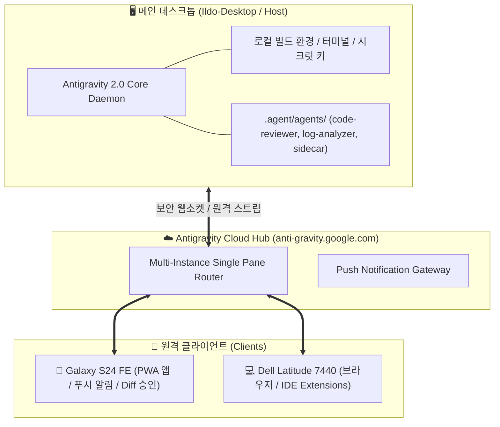

# 🚀 Google Antigravity 2.0 원격 제어 및 커스텀 에이전트 통합 가이드

> Google Antigravity 공식 4대 발표 영상(티저, 실전 워크스루, 심층 라이브)의 중복을 제거하고, 핵심 원격 제어(Remote Control) 아키텍처와 커스텀 서브에이전트, 실전 기기별(스마트폰/노트북) 설정법을 집대성한 마스터 가이드입니다.

---

## 📎 아카이빙 3대 메타데이터
- **원본 출처**: 
  - [Remote Control 공식 소개](https://youtu.be/-O5sq8TqP-g)
  - [Remote Control 실전 워크스루](https://youtu.be/8QGW7ePYepE)
  - [First Look: Remote Control](https://youtu.be/1RXEp3rUuck)
  - [공식 라이브 스트리밍: Remote Control & Custom Agents](https://www.youtube.com/live/VIybKGFS4Hw)
- **원본 정보 발행일자**: 2026-08-22 (Google Antigravity 공식 배포)
- **내 보관소 등록일자**: 2026-08-22

---

## 💡 핵심 3줄 요약 (중복 제거 & 통합)
1. **무인 워크스테이션 + 모바일/노트북 원격 하네스**: 무거운 빌드 환경과 시크릿 키는 메인 데스크톱에 고정하고, 스마트폰(PWA)과 서브 노트북에서 `anti-gravity.google.com`을 통해 단일 패널로 원격 제어 및 푸시 알림 수신.
2. **커스텀 에이전트 완벽 격리 (.agent/agents/)**: 로그 분석, 코드 리뷰 등 토큰 소모가 큰 작업을 독립 컨텍스트(`subagent: true`)로 격리하여 메인 대화창의 컨텍스트 팽창(Bloat) 차단.
3. **기획-실행 2단계 하네스 (/grill-me ➡️ /teamwork-preview)**: AI와의 역질문 인터뷰로 기술 스택/설계를 사전에 확정하고, 대형 프로젝트 시에만 3~4단계 계층형 다중 에이전트로 분기 실행.

---

## 🏗️ 4대 핵심 기술 계층 구조도

---

## 🛠️ 기기별 실전 설정 가이드 (스마트폰 & 노트북)

### 1. 🖥️ 메인 데스크톱 (호스트 PC) 사전 준비
1. Antigravity 실행 후 좌측 하단 **Settings(설정) ➡️ App(애플리케이션)** 진입.
2. **Remote Control (원격 제어)** 토글을 **ON**으로 활성화.
3. **Device Nickname (기기 별칭)** 설정: `Ildo-Desktop` 입력.
4. **Prevent sleep (절전 방지)** 체크 ➡️ 장시간 무인 빌드/코딩 시 PC가 꺼지지 않도록 유지.
5. **Keep in menu bar (시스템 트레이 상주)** 활성화.

---

### 2. 📱 스마트폰 (Galaxy S24 FE / Android) 1분 설정법
스마트폰에 전용 앱(PWA)을 설치하여 모바일 네이티브 환경으로 사용하는 방법입니다.

1. **브라우저 접속**: 스마트폰의 Chrome 브라우저를 열고 `https://anti-gravity.google.com` 에 접속 (구글 계정 로그인).
2. **인스턴스 연결**: 상단 목록에서 활성화된 `Ildo-Desktop` 을 선택하여 연결.
3. **PWA 앱 설치 (홈 화면 추가)**:
   - Chrome 우측 상단 **점 3개(⋮)** 메뉴 터치.
   - **'홈 화면에 추가'** 또는 **'앱 설치'** 선택.
   - 홈 화면에 `Antigravity` 전용 아이콘 생성 완료 (주소창 없는 단독 앱으로 구동).
4. **푸시 알림 허용**:
   - 접속 시 나타나는 "알림을 허용하시겠습니까?" 팝업에서 **[허용]** 클릭.
5. **모바일 실전 활용**:
   - **이동 중 Diff 승인**: 에이전트가 코드를 작성하고 승인을 대기할 때 스마트폰 푸시 알림 수신 ➡️ 알림 터치 후 모바일 바텀시트에서 변경 사항 검토 및 [Approve] 클릭.
   - **`/grill-me` 기획 응답**: 걸어가면서 에이전트가 던지는 아키텍처 역질문에 객관식 버튼으로 간편 응답.
   - **현장 데이터 업로드**: 스마트폰 카메라로 찍은 사진이나 CSV 파일을 모바일에서 바로 업로드하여 분석 지시.

---

### 3. 💻 서브 노트북 (Dell Latitude 7440) 최적 활용법
Dell Latitude 7440은 이동성이 뛰어나지만 Iris Xe 내장 그래픽 특성상 로컬 8B 모델 구동 시 배터리가 빨리 닳습니다. 데스크톱의 원격 허브를 활용하면 배터리 소모 0%로 최고 성능을 활용할 수 있습니다.

#### 방법 A: 초경량 브라우저/PWA 방식 (배터리 최우선)
1. 노트북 Chrome/Edge에서 `https://anti-gravity.google.com` 접속.
2. 주소창 우측의 **'앱 설치(Install App)'** 아이콘 클릭하여 단독 창으로 설치.
3. `Ildo-Desktop` 인스턴스 선택 ➡️ 메인 데스크톱의 모든 연산 파워와 로컬 파일 시스템을 그대로 활용.

#### 방법 B: IDE 확장판(Extension) 연동 방식 (전문 개발)
1. 노트북에 설치된 **VS Code**, **JetBrains(GoLand, Rider, PyCharm 등)**, 또는 **Zed** 실행.
2. Extensions 마켓플레이스에서 **`Google Antigravity`** 검색 및 설치.
3. 구글 계정 또는 Gemini Enterprise API Key로 로그인.
4. 로컬 에디터 안에서 Antigravity 에이전트의 실시간 디버깅 및 터미널 피드백 활용.

---

## 🧠 실전 바이브 코딩 오케스트레이션 원칙

| 작업 단계 | 실행 프로토콜 | 적용 도구 / 커맨드 | 목적 |
| :--- | :--- | :--- | :--- |
| **1. 기획 & 설계** | 역질문 인터뷰 (Grill-Me) | `/grill-me` | 기술 스택/전제조건을 객관식으로 사전 고정 (설계 병목 90% 해소) |
| **2. 다중 도메인 개발** | 계층형 멀티 에이전트 | `/teamwork-preview` | 디렉터-도메인전문가-리뷰어 3~4단계 팀 분기 (대형 프로젝트 전용) |
| **3. 단순 수정/디버깅** | 단일 패스 & 최소 수정 | `replace_file_content` | 불필요한 서브에이전트 남발 차단 및 토큰 다이어트 |
| **4. 대용량 로그 분석** | 컨텍스트 완벽 격리 | `.agent/agents/log-analyzer` | 수천 줄의 스택트레이스 노이즈 필터링 및 메인 윈도우 보호 |
| **5. 코드/보안 검수** | 격리 코드 리뷰어 | `.agent/agents/code-reviewer` | RLS, 시크릿 키, 문법 검증 후 초록불 통과 시 병합 |
| **6. 장기 작업 감시** | 동적 사이드카 크론 | `.agent/agents/system-sidecar` | 5분 주기 크론 보고로 대기 토큰 낭비 0% 달성 |
