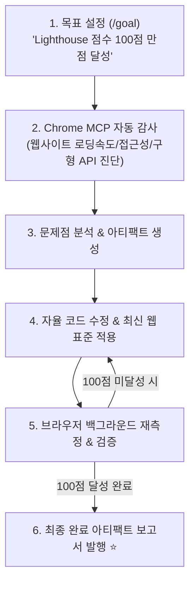

# 🚀 Google Antigravity 웹사이트 감사 & /goal 자율 루프 마스터 가이드

> **📌 아카이빙 메타데이터**
> - **원본 출처**: [YouTube (https://youtu.be/nPpvkQ3zxSA)](https://youtu.be/nPpvkQ3zxSA)
> - **출처 정보 발행일자**: `2026-08-13`
> - **내 보관소 등록일자**: `2026-08-14`
> - **개요**: Google Antigravity에 탑재된 **Gemini 3.7 Flash**와 내장 슬래시 커맨드 **`/goal`**을 활용하여 사람이 개입하지 않고도 웹사이트의 성능 감사부터 코드 리팩토링, Lighthouse 100점 만점 달성까지 자율 무한 루프로 해결하는 실전 워크플로우입니다.

---

## 📊 Antigravity 자율 최적화 루프 워크플로우



---

## 🔥 핵심 기능 3가지

### 1. `/goal` 커맨드의 자율 루프 실행 (Autonomous Goal Loop) ⭐
* 사용자가 목표(예: "Lighthouse 전 항목 100점 만들기")만 제시하면, 에이전트가 **목표 기준을 100% 달성할 때까지 멈추지 않고 스스로 수정 ➔ 검증 ➔ 재측정 루프**를 돕니다.
* 사용자가 중간에 계속 프롬프트를 쳐줄 필요 없이 밤새 자율적으로 완벽한 결과물을 만들어냅니다.

### 2. Chrome MCP 서버를 통한 실시간 브라우저 감사
* Antigravity 내장 Chrome MCP 서버를 통해 실제 브라우저 환경에서 페이지 로딩 속도, 레이아웃 이동(CLS), 접근성 결함을 정밀하게 측정합니다.

### 3. 풍부한 시각화 아티팩트 (Rich Artifacts)
* 진단 결과, 코드 수정 전후 비교(Diff), 성능 향상 그래프를 인터랙티브한 아티팩트 문서로 즉시 출력합니다.

---

## 🛠️ 실전 활용법 (명령어 예시)

Antigravity 프롬프트 창에 아래처럼 입력하면 즉시 자율 루프가 시작됩니다:

```text
/goal 내 웹사이트(index.html)를 감사하고, 모던 HTML5/CSS 표준을 적용하여 Lighthouse 성능/접근성/SEO 점수 100점을 달성할 때까지 자율적으로 코드를 개선해줘.
```

---

## 🔗 관련 문서 링크
- [[01_AI_시스템_및_도구/AI_에이전트_및_도구_통합_마스터_가이드|AI 에이전트 통합 마스터 가이드]]
- [[01_AI_시스템_및_도구/Addy_Osmani_미래_엔지니어의_선택과_소프트웨어_팩토리_가이드|Addy Osmani 소프트웨어 팩토리]]
- [[인덱스]]

## 관련
- [[Google_AntiGravity_멀티에이전트_실전_가동_가이드]]
- [[AI_에이전트_및_도구_통합_마스터_가이드]]
