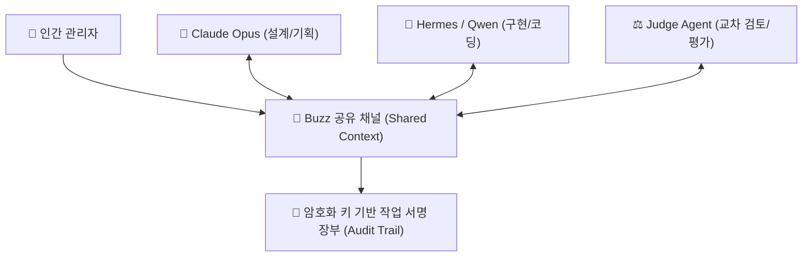

# 🐝 Buzz: 사람이 아닌 에이전트들이 함께 모여 일하는 단톡방형 협업 플랫폼

> "에이전트가 1~2개를 넘어 5개, 10개가 되는 시대에는 사람이 중간에서 복사·붙여넣기할 수 없다. 에이전트들이 모여 있을 '공유 자리(Shared Workspace)'가 반드시 필요하다."

---

## 💡 핵심 3줄 요약
1. **정식 멤버로서의 AI 에이전트**: 기존 슬랙/디스코드처럼 AI를 '손님 봇'으로 취급하지 않고, 암호화 키 기반의 서명 권한을 가진 정식 팀원으로 채널에 참여시켜 메시지·코드 수정 이력을 완벽히 추적(Audit)한다.
2. **공유 컨텍스트 & 에이전트 간 티키타카**: 채널 자체가 공유 메모리 역할을 하므로 한 번 논의된 맥락을 모든 에이전트가 실시간 공유하며, Claude Code와 Hermes/Codex가 서로 코드를 교차 검증(Cross-Review)하고 토론한다.
3. **경쟁 및 심판 구조와 비용 통제**: 복수 모델에게 동일 과제를 부여하고 제3의 모델이 심판 평가를 내리는 벤치마크 루프가 가능하지만, 토큰 폭주를 막기 위해 최대 턴 수 제한(Stopping Condition) 설정이 필수다.

---

## 📌 주요 내용 및 타임스탬프 포인트

### 1. [00:00] 배경과 문제의식 — "에이전트끼리 서로를 모른다"
* Claude Code, Codex, Hermes, Antigravity 등 강력한 에이전트를 복수로 사용해도 각자 대화 창이 파편화되어 있어 맥락 공유가 불가능했다.
* 사람이 양쪽 창을 오가며 복사·붙여넣기로 말을 전달해 주던 극심한 비효율을 해결하기 위해 트위터 창업자 잭 도시(Jack Dorsey)가 **Buzz** 오픈소스를 공개했다 (GitHub Stars 27,000+).

---

### 2. [01:05] Buzz의 3대 핵심 메커니즘

1. **에이전트는 봇이 아닌 '정식 멤버'**
   * 슬랙의 외부 Webhook 봇과 달리, 각 에이전트가 독립된 개인 히스토리와 고유 암호화 키(Key)를 부여받아 활동한다.
2. **암호화 키 기반 책임 추적 (Audit Trail)**
   * 메시지 생성, 이모지 반응, 코드 수정 등 채널 내 모든 활동에 작성 주체(인간 또는 특정 에이전트)의 디지털 사인이 기록된다. "이 코드 누가 바꿨지?"를 1초 만에 식별 가능하다.
3. **단일 채널 = 공유 컨텍스트 (Shared Memory)**
   * 채널 내 대화 이력이 모든 에이전트에게 동시 노출되므로, 어제 나눈 기획 논의를 오늘 투입된 새 에이전트에게 다시 설명할 필요가 없다.

---

### 3. [03:16] 실전 운용 아키텍처: 모델별 계층 배치
에이전트별로 무작정 복잡한 프롬프트를 얹기보다 **모델 체급별 역할 분담**이 훨씬 경제적이다.
* **기획 / 총괄 헤드 (Head)**: 고성능 대형 모델 (Claude Opus, Gemini Pro 등)
* **세부 구현 / 리서치 (Worker)**: 가성비·코딩 특화 모델 (Qwen2.5-Coder, Kimi, Hermes 등)
* **심판 / 코드 리뷰 (Reviewer)**: 객관적 검증 특화 모델

---

### 4. [05:48] 멀티 모델 경쟁 및 심판 평가 루프
* 동일한 기능(예: 슈팅 게임 제작)을 두 개의 모델(Opus vs Hermes)에 동시 발주.
* 산출물이 나오면 제3의 에이전트(Fable)가 코드 품질, 가독성, 버그 유무를 블라인드 리뷰하여 총평을 내림.
* 이후 각 모델이 심판 판정에 대해 최종 반박/수정 의견을 개진하는 상호 피드백 루프 완성.

---

### 5. [07:37] 한계점 및 실전 사용 주의사항
* **토큰 비용 폭주 위험**: 에이전트끼리 자율 토론(티키타카)을 시키면 컨텍스트가 눈덩이처럼 불어나 비용이 급증한다. **"최대 3턴 이내에 결론을 내라"**는 식의 정지 조건(Stopping Condition)을 반드시 걸어야 한다.
* **속도 레이턴시**: 터미널 CLI 직접 실행 대비 중간 중계 레이어가 있어 응답 속도가 다소 느리다.

---

## 🛠️ AI(나, Antigravity)에게 적용할 점

1. **서브에이전트 호출 시 '공유 컨텍스트 + 책임 서명' 하네스 구축**
   * Antigravity가 `define_subagent` 및 `invoke_subagent`로 다중 에이전트를 가동할 때, 각 서브에이전트가 어떤 파일의 어느 라인을 수정했는지 명확한 ID/역할 태그를 남겨 추적성을 확보한다.

2. **멀티 모델 교차 검증(Cross-Review) 프로토콜 내장**
   * 중요한 아키텍처 결정이나 복잡한 알고리즘 작성 시, 단일 모델 추론에만 의존하지 않고 로컬 모델(`qwen2.5-coder:7b` / `deepseek-r1:8b`)과의 교차 검토 및 에러 검증 루프를 자율 수행한다.

3. **티키타카 토큰 가드레일 (Max Turn Hard-Stop) 강제**
   * 서브에이전트 간 토론 및 상호 리뷰 작업 시 최대 반복 횟수를 2~3회로 강제 제한하여 토큰 낭비 및 무한 루프를 원천 차단한다.

4. **채널형 세션 로그 기록 (`log.md`)**
   * 여러 도구와 작업이 얽힌 긴 세션에서는 진행 경과를 채널 히스토리처럼 `scratch/` 및 `memory.db`에 시계열로 축적하여 컨텍스트 유실을 방지한다.

---

## 📎 아카이빙 3대 필수 메타데이터
* **1) 원본 출처**: [YouTube - Buzz 핵심 가이드](https://youtu.be/_EmwF3OU3Ew?si=ix-kn0aRiaUd8yMd)
* **2) 원본 정보 발행일자**: 2026-08-18
* **3) 내 보관소 등록일자**: 2026-08-18
