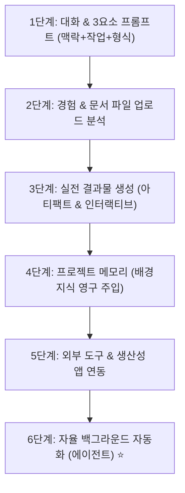

# 🤖 Claude AI 초보자 완벽 정복 6단계 마스터 가이드

> **📌 아카이빙 메타데이터**
> - **원본 출처**: [Metics Media YouTube (https://youtu.be/9oJySubZRSA)](https://youtu.be/9oJySubZRSA)
> - **출처 정보 발행일자**: `2026-08-10`
> - **내 보관소 등록일자**: `2026-08-14`

---

## 📋 Claude AI 마스터를 위한 6단계 로드맵

---

## 💡 6단계 핵심 실전 수칙

### 1단계: 3요소 프롬프트 공식 (Context + Task + Format) ⭐
* ❌ **나쁜 프롬프트**: "제품 설명서 써줘." (너무 일반적이고 뻔한 답변)
* ✅ **3요소 프롬프트**:
  * **맥락 (Context)**: 우리는 30대 직장인을 타겟으로 하는 천연 아로마 양초 브랜드다.
  * **작업 (Task)**: 피로 회복과 스트레스 완화에 좋은 라벤더 향초의 상세페이지 도입부 문구를 작성하라.
  * **형식 (Format)**: 감성적인 헤드라인 3개와 불릿 포인트 5개 목록으로 출력하라.

### 2단계: 문서 및 데이터 직접 먹이기 (File Upload)
* 복잡한 내용을 채팅창에 일일이 적지 말고, **PDF 기획서, 엑셀 재무제표, CSV 데이터**를 통째로 업로드하여 표나 차트로 재가공하도록 명령.

### 3단계: 완성형 산출물 제작 (Artifacts)
* 텍스트 답변에 그치지 않고, 클로드의 **Artifacts** 기능을 활용해 웹 UI 컴포넌트, HTML 대시보드, 인터랙티브 폼을 실시간으로 제작.

### 4단계: 프로젝트 기능으로 기억력 부여 (Project Memory)
* 새로운 대화마다 내 회사나 내 스타일을 설명할 필요 없이, **프로젝트(Projects)** 폴더에 회사 소개서와 가이드라인을 넣어두면 모든 대화에서 자동 기억.

### 5단계: 매일 쓰는 앱 연결 (Connect Apps)
* Google Drive, GitHub, Notion과 클로드를 직접 연동해 문서 검색과 코드 수정을 실시간으로 위임.

### 6단계: 자리를 비워도 일하는 자율 에이전트 (Autonomous Agent)
* 내가 컴퓨터 앞을 떠나 있어도 예약된 분석이나 코드 리팩토링 작업을 스스로 완수하고 보고서를 남겨두는 단계.

---

## 🔗 관련 문서 링크
- [[01_AI_시스템_및_도구/Claude_스킬_삭제와_프롬프트_다이어트_지능상승_원리|Claude 스킬 삭제와 지능상승 원리]]
- [[01_AI_시스템_및_도구/AI_에이전트_및_도구_통합_마스터_가이드|AI 에이전트 통합 마스터 가이드]]
- [[인덱스]]
