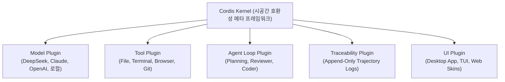

# 🐳 DeepSeek Harness Cordis 커널 및 완전 플러그인 에이전트 아키텍처 완전분석

> **출처**: [Better Stack - DeepSeek Harness Just Changed AI Forever](https://youtu.be/DTu4yvmc0Fc)  
> **발행일**: 2026년 8월  
> **등록일**: 2026-08-23  

---

## 💡 핵심 요약 (3줄)

1. DeepSeek가 Cordis 커널 기반의 MIT 라이선스 오픈소스 AI 코딩 하네스(**DeepSeek Harness**)를 공개하며 며칠 만에 GitHub 150,000 스타를 돌파했다.
2. **"Everything is a Plugin"** 아키텍처를 도입하여 LLM 모델, 툴, 스킬, 세션 로그, API 게이트웨이, 에이전트 루프까지 모든 구성요소를 설정 파일과 프롬프트로 손쉽게 교체·제거할 수 있다.
3. 시스템 프롬프트, 추론 토큰(CoT), 툴 호출을 시각화하는 **궤적(Trajectory) 뷰**와 프롬프트로 하네스 자체에 신규 플러그인을 자율 추가하는 **Creator Mode**를 지원한다.

---

## 🏗️ 1. Cordis 커널과 "Everything is a Plugin" 철학

- **Cordis 커널 기반 메타 프레임워크**:
  - 2022년부터 존재하던 오픈소스 플러그인 프레임워크인 Cordis 커널 위에 구축.
  - 에이전트의 모든 기능(모델, 툴, 스킬, 세션, 게이트웨이)이 독립 플러그인으로 조립되어 있어, 핵심 기능을 끄거나 교체해도 전체 런타임이 깨지지 않음.
- **완전한 모델 독립성**:
  - DeepSeek V4 Pro 외에도 Claude Sonnet 4.5, OpenAI GPT 계열, AWS Bedrock, 로컬 OpenAI 호환 엔드포인트(Ollama/vLLM)를 `config` 수정만으로 즉시 교체.
  - 특정 벤더에 종속되지 않는 진정한 오픈에이전트 인프라 구현.

---

## 🔍 2. 내장 추적성(Traceability) & Trajectory 뷰

- **Append-Only 로그 기반 투명성**:
  - 모델이 입력받은 시스템 프롬프트, 도구 호출 이력, 원시 추론 과정(Thinking Steps/CoT), 토큰 소모량을 빠짐없이 기록.
- **Trajectory 시각화**:
  - 대화의 특정 구간을 줌인하여 탐색하고, 키워드로 검색하며, 단계별 추론 토큰 비율(예: 전체 187 토큰 중 Reasoning 94 토큰)을 정밀 분석 가능.

---

## 🛠️ 3. 런타임 모드 & Creator Mode (자율 플러그인 확장)

- **Standard Mode**: 일상적인 소프트웨어 엔지니어링 및 코딩 작업용 풀 툴셋 제공.
- **Creator Mode**:
  - 하네스 내부에서 프롬프트만으로 신규 플러그인을 직접 기획·구현·설치하는 모드.
  - **실전 사례**: "우측 하단에 공룡 점프 게임 플러그인을 추가해줘"라는 프롬프트 한 줄로 즉석에서 UI 플러그인을 작성하고 인앱 렌더링 실행.
  - 에이전트가 자기 자신의 기능을 스스로 확장하는 **메타 프로그래밍 루프** 완성.

---

## 🌐 4. 폭발하는 오픈소스 생태계

- 출시 직후 커뮤니티 주도로 파생 프로젝트 급증:
  - **독립 데스크톱 앱 (11,000+ Stars)**: Electron 기반 네이티브 GUI.
  - **Claude Code 스타일 TUI**: 터미널 중심의 초경량 인터페이스.
  - **Web UI 스킨 패키지 및 Awesome List**.

---

## 🛠️ 5. AI(Antigravity) 시스템 및 사용자 워크플로우 적용 전략

1. **스킬/규칙의 플러그인식 모듈화 고도화**:
   - Antigravity의 `config/skills/` 및 `GEMINI.md` 프로토콜을 DeepSeek Harness의 플러그인 철학처럼 독립 모듈로 운영하여, 시스템 코어 수정 없이 신규 스킬(`SKILL.md` + `scripts/`)을 즉석 장착하는 확장성 유지.
2. **Creator Mode형 자율 스킬 자산화**:
   - 사용자가 새로운 워크플로우를 요구할 때, 일회성 대화로 끝내지 않고 `write_to_file`을 통해 즉시 `SKILL.md`와 검증 스크립트로 자산화하여 영구 등록.
3. **Trajectory급 투명성 보고**:
   - 복잡한 다단계 작업 수행 시, 원시 로그로 컨텍스트를 오염시키지 않으면서도 핵심 추론 단계, 실행된 도구, 결과를 정형 리포트로 명쾌하게 피드백.
4. **하이브리드 모델 분기 유지**:
   - 데스크톱(외장 GPU 가속 8B 로컬 LLM + Gemini 3.7 Flash)과 서브 노트북 환경에 따라 최적의 모델과 하네스를 유연하게 자동 분기.
