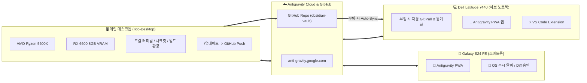

# 💻 Dell Latitude 7440 Antigravity 2.0 원클릭 원격 세팅 & 부팅 자동 동기화 가이드

> **대상 기기**: Dell Latitude 7440 (Intel Core i5-1345U, 32GB LPDDR5, Intel Iris Xe Graphics)  
> **핵심 전략**: 노트북 부팅/로그온 시 **데스크톱 및 GitHub 최신 상태와 100% 무인 자동 동기화**, 메인 데스크톱(`Ildo-Desktop`)을 원격 호스트로 연결하여 **노트북 발열/팬 소음 0, 배터리 소모 0%**로 데스크톱 파워 활용.

---

## ⚡ 1초 실행법 (노트북 최초 세팅 시)

노트북에서 옵시디언 볼트(`C:\전일도`)의 설정 파일을 1회 실행하면, **이후 부팅할 때마다 무인으로 자동 동기화**됩니다.

### 방법 1: 배치 파일 더블클릭 (가장 추천)
- `C:\전일도\setup_dell7440_laptop.bat` 더블클릭

### 방법 2: 파워셸(PowerShell) 1줄 실행
```powershell
powershell -ExecutionPolicy Bypass -File "C:\전일도\setup_dell7440_laptop.ps1"
```

---

## 🔄 부팅 시 무인 자동 동기화 메커니즘 (Boot Auto-Sync Engine)

최초 1회 세팅 후에는 노트북 전원을 켤 때마다 백그라운드에서 아래 작업이 자동으로 수행됩니다 (`C:\전일도\scripts\sync_laptop_on_boot.ps1`):

1. **인터넷 연결 자동 대기**: 와이파이 연결 시까지 최대 20초간 백그라운드 대기.
2. **GitHub 저장소 자동 Pull**: `git -C C:\전일도 pull origin master --rebase` 실행으로 데스크톱에서 작업한 최신 노트 및 코드 즉시 반영.
3. **전역 헌법 동기화**: `C:\전일도\GEMINI.md`를 `C:\Users\ildoc\.gemini\config\rules\GEMINI.md`로 복제.
4. **옵시디언 앱 연동**: `%APPDATA%\obsidian\obsidian.json`에 `C:\전일도` 자동 등록.
5. **일일 업데이트 델타 체크**: 당일 `05_일일_리포트\YYYY-MM-DD.md` 및 `지금_바뀐점.md` 확인 및 동기화 로그 기록 (`05_일일_리포트/laptop_sync_log.txt`).
6. **무소음 백그라운드 구동**: 검은색 CMD 창 없이 VBS 스크립트(`run_sync_laptop_silent.vbs`)로 무소음 실행.

---

## 🛠️ 스크립트 자동 실행 상세 내역

1. **하드웨어 감지**: Dell 7440 및 Iris Xe 내장 그래픽 식별.
2. **도구 점검/설치**: Git, GitHub CLI(`gh`), VS Code 자동 확인.
3. **PWA 단독 웹 앱 바로가기 생성**:
   - 바탕화면에 `🚀 Antigravity Remote Hub (ILDO-Desktop).lnk` 생성.
   - 브라우저 상단 주소창/탭 없이 단독 네이티브 앱 창으로 구동 (`--app=https://anti-gravity.google.com`).
4. **옵시디언 보관소 동기화**: `C:\전일도` 최신 커밋 자동 Pull.
5. **전역 헌법 동기화**: `GEMINI.md` 및 스킬 디렉터리 자동 배치.
6. **저전력 배터리 보호 로컬 AI**:
   - 외장 VRAM이 없으므로 배터리 급방전 방지를 위해 초경량 3B(`qwen2.5:3b`)만 비상용 탑재.
   - 평상시 모든 무거운 추론과 빌드는 데스크톱 원격 허브로 오프로딩.
7. **시작프로그램 & 작업 스케줄러 등록**: 부팅 시 무인 자동 동기화 엔진 영구 등록.

---

## 📱 & 💻 3각 디바이스 연결 아키텍처



---

## 💡 실전 활용 팁
- **데스크톱에서 작업 완료 후**: `/업데이트` 명령어로 GitHub에 최신 상태를 원클릭 푸시.
- **노트북을 켤 때**: 아무것도 건드릴 필요 없이 전원만 켜면 백그라운드에서 최신 상태로 100% 동기화 완료.
- **외출/카페에서 코딩 시**: 노트북에서 바탕화면의 `Antigravity Remote Hub`를 켜고 `Ildo-Desktop`에 접속하면, 데스크톱의 터미널과 파일 시스템을 로컬처럼 직접 제어.
- **배터리 수명 극대화**: 노트북 CPU/GPU를 쓰지 않고 데스크톱이 모든 연산을 처리하므로 완충 시 하루 종일 코딩 가능.
