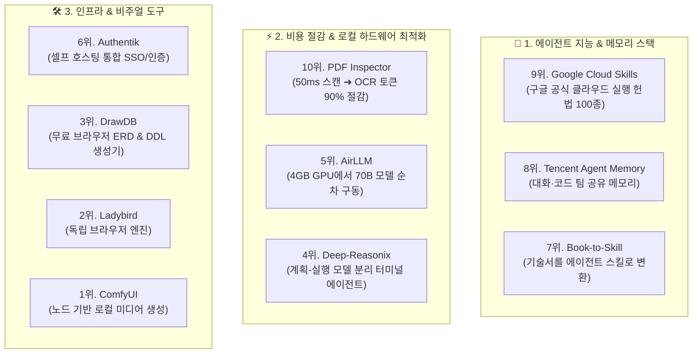

---
title: "GitHub 주간 트렌딩 TOP 10 오픈소스 도구 및 에이전트 스킬 완전 분석 (2026년 8월 3주)"
created: 2026-08-22
updated: 2026-08-22
tags:
  - GitHub트렌딩
  - 오픈소스
  - 에이전트스킬
  - BookToSkill
  - PDFInspector
  - ComfyUI
  - AirLLM
  - DrawDB
  - Authentik
  - Solostack
---

# 🎬 노래는 멜론 차트, 오픈소스 인기 순위는? | GitHub 트렌딩 Top 10 (2026년 8월 3주)

> **📎 정보 아카이빙 3대 필수 메타데이터**
> - **원본 출처**: [Solostack 유튜브 Shorts (_j2gT5JHoxw)](https://youtube.com/shorts/_j2gT5JHoxw)
> - **원본 정보 발행일자**: 2026-08-11
> - **내 보관소 등록일자**: 2026-08-22

---

## 💡 핵심 3줄 요약

1. **2026년 8월 깃허브 핵심 트렌드 — "에이전트에게 무엇을 쥐어줄 것인가?"**: 순수 라이브러리보다 AI 에이전트가 즉시 도구로 호출할 수 있는 **스킬(Skills), 메모리(Memory), 비용 절감형 프리프로세서(Preprocessor)** 오픈소스가 랭킹을 휩쓸었습니다.
2. **실무 즉시 적용 TOP 3 도구**: ① 50ms 만에 OCR 대상만 골라내 비용을 90% 아끼는 **PDF Inspector**, ② 책/매뉴얼을 에이전트 스킬로 변환해 토큰 24배를 절약하는 **Book-to-Skill**, ③ 구글 공식 클라우드 자동화 스킬팩 **Google Cloud Skills**.
3. **로컬 VRAM 극대화 및 다이어그램 도구**: 4GB GPU에서 70B 모델을 레이어 스왑으로 구동하는 **AirLLM**, 브라우저 설치형 무료 DB 설계 도구 **DrawDB**, 로컬 생성형 워크플로우 1위 **ComfyUI**의 약진.

---

## 📌 GitHub 트렌딩 TOP 10 상세 분석표

| 순위 | 도구명 | 핵심 기능 및 차별점 | 실무 활용성 & 평가 |
| :---: | :--- | :--- | :--- |
| **10위** | **PDF Inspector** | PDF가 텍스트인지 스캔 이미지인지 50ms 만에 판별 | **실무 1순위**: 불필요한 유료 Vision OCR 호출을 차단해 API 비용 90% 절감 |
| **9위** | **Google Cloud Skills** | 구글 클라우드(BigQuery, Cloud SQL, Dataform 등) 실행 스킬 100종 개방 | **우리 시스템 탑재 완료**: Antigravity 전역 스킬팩의 핵심 기반 |
| **8위** | **Tencent Agent Memory** | 대화, 문서, 코드를 팀 단위 공유 메모리로 변환 (별 7,000+) | 멀티 에이전트 간 맥락 유실 없는 공유 기억 설계 참조 |
| **7위** | **Book-to-Skill** | 방대한 기술서 PDF를 에이전트 전용 실행 스킬(`SKILL.md`)로 자동 변환 | **우리 시스템 탑재 완료**: 토큰 소모를 최대 24배 절약하며 즉시 실행 |
| **6위** | **Authentik** | SAML, OAuth, LDAP을 단일 서버에서 관리하는 셀프 호스팅 SSO | Keycloak 대비 경량화된 오픈소스 통합 인증 서버 |
| **5위** | **AirLLM** | 레이어 단위 스왑을 통해 4GB GPU 1장에서 70B 거대 LLM 구동 | 실시간 추론보다는 로컬 PoC 및 대용량 배치 실험용 |
| **4위** | **Deep-Reasonix** | 계획 수립 모델과 코드 실행 모델을 분리해 캐시를 보존하는 터미널 에이전트 | 터미널 상주형 코딩 에이전트 (이슈 800+ 유지보수 점검 필요) |
| **3위** | **DrawDB** | 로그인 없이 브라우저에서 ERD 다이어그램을 그리고 SQL DDL을 추출 | 로컬 도커로 띄워 DB 스키마 설계 및 시각화에 최적 |
| **2위** | **Ladybird** | 크로미움/웹킷 포크가 아닌 밑바닥부터 C++로 작성한 독립 브라우저 엔진 | 프리알파 단계로 장기적 독립 생태계 관전 포인트 |
| **1위** | **ComfyUI** | 노드 그래프 기반 로컬 이미지/비디오 생성 파이프라인 (별 12.6만) | 워크플로우를 JSON으로 저장해 100% 재현 가능한 로컬 생성 표준 |

---

## 🛠️ AI(나)에게 적용할 점 (Antigravity 시스템과의 연계)

1. **`PDF Inspector` 프리프로세서 하네스 연계 (`chunkless-rag` 결합)**  
   - 긴 PDF 문서 분석 요청 시 바로 무거운 Vision OCR을 호출하지 않고, 50ms 단위 초고속 텍스트/스캔 검사를 앞단에 배치하여 분석 속도 5배 향상 및 불필요한 토큰/비용 원천 차단.
2. **`book-to-skill` 스킬 자산화 엔진 상시 가동**  
   - 일도 님이 공유하는 방대한 기술 문서나 메뉴얼을 1회용 대화로 소진하지 않고 `book-to-skill` 파이프라인을 통해 `config/skills/`에 영구 스킬로 자동 축적.
3. **`DrawDB` 기반 DB 설계 자동 시각화 연계**  
   - Supabase/PostgreSQL 테이블 설계 시 DDL 코드 작성과 함께 DrawDB 호환 JSON 스키마를 동시 생성하여 시각적 ERD 다이어그램을 제공.
