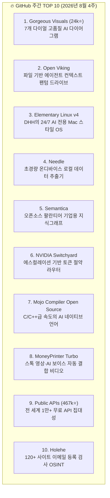

# 🏆 GitHub 주간 트렌딩 TOP 10 오픈소스 도구 및 에이전트 스킬 완전분석 (2026년 8월 4주)

> **출처**: [The Next New Thing - Top 10 GitHub: AI videos, gorgeous diagrams, token savings and more](https://youtu.be/SQrFue3LbwI)  
> **진행**: Andrew & Adam (Sponsored by Zapier)  
> **발행일**: 2026년 8월  
> **등록일**: 2026-08-23  

---

## 💡 핵심 요약 (3줄)

1. 고품질 다이어그램 생성기(**Gorgeous Visuals**, 24k Stars)와 파일 기반 컨텍스트 관리자(**Open Viking**)가 깃허브 트렌딩 상위를 석권했다.
2. NVIDIA의 에스컬레이션 기반 토큰 절약 라우터(**Switchyard**), 오픈소스 기업용 팔란티어 온톨로지(**Semantica**), AI 네이티브 고속 언어 **Mojo 컴파일러 오픈소스화**가 공개되었다.
3. 컨설턴트식 결론 우선 에이전트 작문 스킬(**Minto Pyramid Skill**), 다중 페르소나 이사회(**Board of Advisors**), 터미널 일괄 이미지 생성(**Imagine CLI**) 등 실전 에이전트 스킬팩이 급부상했다.

---

## 🏆 GitHub 주간 공식 TOP 10 레포지토리

| 순위 | 프로젝트 | 핵심 기능 및 차별점 | 우리 시스템 활용 방안 |
| :---: | :--- | :--- | :--- |
| **1** | **Gorgeous Visuals** (24k⭐) | Claude 기본 다이어그램 탈피, 7개 스타일(스케치, 터미널, 데이터페이퍼)과 에디토리얼 콜아웃 지원 | `diagram-design` 및 아티팩트 시각화 엔진 고도화 |
| **2** | **Open Viking** | 팬텀 드라이브(Phantom Drive) 방식으로 LLM 친화적 파일 읽기/쓰기 기반 컨텍스트 정리 | 로컬 RAG 및 에이전트 세션 메모리 아키텍처 연계 |
| **3** | **Elementary Linux v4** | DHH(Basecamp) 주도. Mac 친화적 UI, Wi-Fi QR 공유 등 24/7 미니 PC 상주 AI 에이전트 OS | 상시 가동 로컬 AI 에이전트 머신 최적 환경 |
| **4** | **Needle** | 14MB 초경량 온디바이스 모델. 엣지 디바이스 및 로컬 문서/데이터 추출 $0 완결 | `pdf-inspector` 및 경량 텍스트 파싱 연동 |
| **5** | **Semantica** | 기업 내부 비정형 데이터를 AI 에이전트 추론용 지식 그래프(Knowledge Graph)로 정제 | Protocol 20(팔란티어 온톨로지 규칙) 엔진 탑재 |
| **6** | **NVIDIA Switchyard** | **에스컬레이션 라우팅**: 무료 로컬 ➔ 경량 ➔ 고성능(Sonnet/Opus) 순차 판별로 토큰 90% 절약 | Protocol 30 및 서브에이전트 모델 디스패치 적용 |
| **7** | **Mojo Compiler** | Modular의 AI 네이티브 고성능 언어 컴파일러 완전 오픈소스화 (Python 문법 + C++ 성능) | 로컬 고성능 AI 연산 및 스크립트 벤치마킹 |
| **8** | **MoneyPrinter Turbo** | 키워드 입력만으로 스톡 비디오, AI 음성, 자막을 엮어 완성형 비디오 파이프라인 구축 | 유튜브 요약 쇼츠 및 콘텐츠 자동화 파이프라인 |
| **9** | **Public APIs** (467k⭐) | 날씨, 금융, 공공 등 전 세계 수만 개 무료 API 카탈로그 집대성 | Protocol 22(공공데이터 및 $0 풀스택 웹앱) 연계 |
| **10** | **Holehe** | 120개 이상 플랫폼에서 비밀번호 재설정·프로필 엔드포인트를 프로빙해 이메일 가입 여부 검사 | `blackbird-osint` 스킬 보완 및 보안 감사 |

---

## 🚀 주목할 커뮤니티 빌드 에이전트 스킬 & 도구

1. **Minto Pyramid Skill (컨설턴트식 작문 스킬)**:
   - **원칙**: 결론/답변 우선(Answer First) ➔ 핵심 이유(Reasons) ➔ 세부 근거(Evidence) 구조 강제.
   - 불필요한 장황한 서론을 배제하고 즉시 실행 가능한 결론을 도출.
2. **AI Persona Board of Advisors (5인 다중 페르소나 자문단)**:
   - 미래의 자신(Future Self), 스티브 잡스, 워렌 버핏, 제프 베조스, 호르모지 등 5인 전문가 페르소나에게 중요 비즈니스 결정을 교차 자문.
   - `ai-investor-debate` 스킬과 완벽 호환.
3. **Imagine CLI (터미널 일괄 이미지 생성)**:
   - 터미널에서 1분 만에 20장의 이미지를 병렬 일괄 생성하는 초고속 워크플로우.
4. **TLDR to Audio**:
   - 뉴스레터 텍스트를 출퇴근 및 산책용 팟캐스트 오디오로 자동 변환.
5. **Shockwave**:
   - 로컬 마크다운 노트를 에이전트가 직접 수정하고 클라우드로 동기화하는 로컬 퍼스트 도구.

---

## 🛠️ AI(Antigravity) 시스템 및 사용자 워크플로우 적용 전략

1. **Minto Pyramid(민토 피라미드) 작문 원칙 기본화**:
   - 사용자 질문 응답 시 두괄식 결론과 Action Item을 최우선 배치하고, 이후 기술적 근거와 세부 내용을 전개하여 가독성 극대화.
2. **NVIDIA Switchyard형 에스컬레이션 라우팅**:
   - 단순 파싱/정리는 무료 로컬/경량 모델(`flash`, `flash_lite`)로 1차 처리하고, 고난도 추론 시에만 상위 모델로 단계적 승격하여 토큰 비용 최소화.
3. **Zapier SDK & Public APIs 연계 강화**:
   - 웹 서비스 및 비즈니스 자동화 구축 시 무료 공공 API 및 Zapier 표준 인터페이스를 활용한 $0 풀스택 파이프라인 신속 구축.
