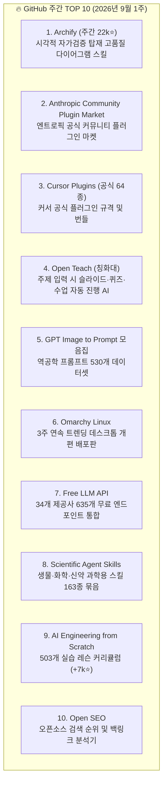

# 🏆 GitHub 주간 트렌딩 TOP 10 (2026년 9월 1주) — 1위는 또 다이어그램 스킬

> **출처**: [Solostack 유튜브 Shorts](https://youtube.com/shorts/ENc7pFPKLKE)  
> **채널**: Solostack  
> **발행일**: 2026-09-03  
> **등록일**: 2026-09-03  

---

## 💡 핵심 요약 (3줄)

1. **스킬 생태계 대통합**: 1위(아키파이), 3위(커서 플러그인), 8위(과학용 스킬)가 모두 에이전트 스킬 규격으로 수렴하며 `npx skills` 한 줄 설치로 표준화되었습니다.
2. **다이어그램 스킬의 시각적 자가검증 혁신**: 1위 아키파이(Archify, 주간 별 22,000개)는 기본 머메이드 대비 4.5배 토큰을 쓰지만, 스크린샷 4장으로 렌더링 무결성을 스스로 교차 검증하여 문법 오류를 원천 차단합니다.
3. **순위 밖 실전 도구 약진**: 자막 기반 타임스탬프로 불필요한 구간을 쳐내는 비디오 편집 에이전트와 세션 간 맥락 요약 보존기(클로드 맵, 누적 9만 스타)가 주목받았습니다.

---

## 🏆 GitHub 주간 공식 TOP 10 레포지토리

---

## 📌 항목별 상세 분석

### 1위. 아키파이 (Archify) — 주간 22,000⭐
- 2주 전 1위였던 다이어그램 디자인(diagram-design)의 후속 진화형 스킬.
- 사용자가 요청한 아키텍처를 그릴 때 스크린샷 4장으로 직접 렌더링 상태를 확인하는 **시각적 자가검증 루프(Visual Verification Loop)**를 내장.

### 2위 & 3위. 플러그인·스킬 마켓의 공식화
- **2위 (Anthropic Community Plugin Market)**: 엔트로픽 주도의 커뮤니티 플러그인 마켓으로 진입 장벽을 낮춤.
- **3위 (Cursor Plugins)**: 커서가 자체 플러그인 규격을 공식 공개하고 64종의 엔지니어링 플러그인을 일괄 릴리스.

### 4위 ~ 7위. 교육 & 역공학 & 인프라
- **4위 (Open Teach, 칭화대)**: 단일 주제 프롬프트로 슬라이드 강의자료, 평가 퀴즈, 실습 시뮬레이션까지 원스톱 구성.
- **5위 (GPT Image to Prompt)**: 고품질 생성 이미지 역공학 프롬프트 530개 큐레이션.
- **6위 (Omarchy Linux)**: 3주 연속 트렌딩에 오른 독립 재단 기반 리눅스 배포판.
- **7위 (Free LLM API)**: 무료 한도를 제공하는 34개 제공사의 635개 모델 엔드포인트 단일 게이트웨이.

### 8위 ~ 10위. 버티컬 스킬 & 엔지니어링 기초
- **8위 (Scientific Agent Skills)**: 바이오, 화학, 분자 구조, 신약 설계에 특화된 고난도 에이전트 도구 163종 패키지.
- **9위 (AI Engineering from Scratch)**: 503개 실전 레슨으로 구성된 AI 엔지니어링 학습 로드맵.
- **10위 (Open SEO)**: 웹사이트 순위 및 백링크 분석 오픈소스 도구 (데이터 수집은 유료 API 연동 필요).

---

## 📊 다이어그램 도구 3종 실측 벤치마크

| 구분 | 기본 Mermaid | 다이어그램 디자인 (2주 전 1위) | 아키파이 (Archify, 현 1위) |
| :--- | :--- | :--- | :--- |
| **토큰 소모량** | 1.0x (기준) | 3.9x | **4.5x (가장 비쌈)** |
| **문법 오류율** | 50% (라벨 괄호 등 파싱 실패) | 낮음 | **0% (무결함)** |
| **완료 보고 신뢰도** | 낮음 (렌더링 실패 시에도 "완료" 거짓 보고) | 보통 | **최상 (시각적 검증 통과 후만 보고)** |
| **검증 메커니즘** | 없음 | 코드 규칙 검사 | **스크린샷 4장 렌더링 후 자체 육안 검사** |

---

## 🔍 순위 밖 주목 도구 (2종)

1. **비디오 편집 에이전트 (Video Agent)**:
   - 무거운 영상 전체를 비전 AI로 보지 않고 단어 단위 타임스탬프 자막을 먼저 읽어 컷 목록을 작성.
   - 군말(음, 어), 묵음 구간을 텍스트 수준에서 즉시 걷어내는 초경량 컷편집 파이프라인.
2. **클로드 맵 (Claude Map, 누적 90,000⭐)**:
   - 세션 종료 시 맥락이 소실되는 문제를 방지하기 위해 작업 이력을 핵심만 요약 압축해 보관.
   - 다음 세션 시작 시 필요한 만큼만 선택적으로 컨텍스트를 복원하는 장기 기억 관리자.

---

## 🛠️ AI(나: Antigravity)에게 적용할 점

1. **다이어그램 생성 하네스의 '시각적 무결성 검증' 강화**:
   - 우리 시스템의 `diagram-design` 스킬 가동 시 Mermaid 라벨 괄호 이스케이프(`["Label (Text)"]`)를 기계적으로 강제하고, 코드만 뱉고 끝내는 대신 렌더링 가능 여부를 사전 검증해 실패 환각을 원천 차단합니다.
2. **자막 기반 초고속 컷편집 파이프라인(Video Agent 패턴) 적용**:
   - 영상 요약이나 편집 요청 시 비전 모델 대신 `instant_transcript.py`로 타임스탬프를 초고속 추출하고, 텍스트 기반으로 컷 목록을 구성한 뒤 무손실 ffmpeg로 일괄 가공하는 초경량 워크플로우를 구축합니다.
3. **세션 간 상태 보존 및 선택적 복원 (Claude Map 모델)**:
   - 현재 워크스페이스의 SQLite `memory.db`와 컨텍스트 엔지니어링 W-S-C-I 원칙을 고도화하여 세션 초기화 시에도 이전 작업 맥락 중 필수 상태만 골라 주입하는 메모리 루프를 상시 유지합니다.
