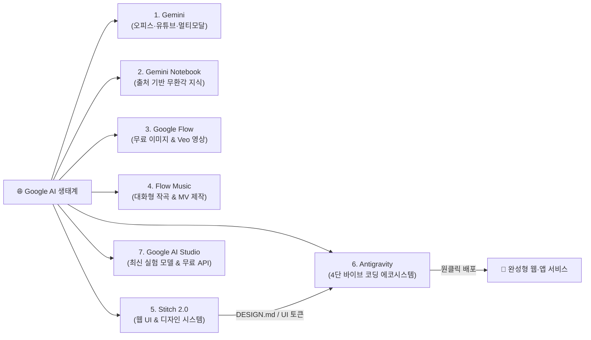

# 🎬 안 쓰면 손해 보는 구글의 7가지 무료 AI 생태계 완전정복

> **📎 정보 아카이빙 3대 필수 메타데이터**
> - **원본 출처**: [찍봇 (@ZZIKBOT) - 안 쓰면 손해 보는 '구글의 7가지 무료 AI'](https://youtu.be/eLSsDD4gTDo)
> - **원본 정보 발행일자**: 2026-08-23
> - **내 보관소 등록일자**: 2026-08-24

---

## 💡 핵심 3줄 요약

1. **글로벌 최대 무료 혜택의 구글 AI 풀스택**: 텍스트·오피스(Gemini), 출처 기반 리서치(Gemini Notebook), 이미지·영상(Google Flow), 음악 작곡(Flow Music), 웹 디자인(Stitch), 바이브 코딩(Antigravity), 최신 실험실(Google AI Studio) 등 7개 핵심 도구의 무료 티어를 완벽히 연계할 수 있습니다.
2. **비개발자 친화형 멀티모달 & 원클릭 전환**: 유튜브 복수 링크 분석 후 PPT/워드 즉시 변환, 엑셀 서식 자동 수정, 이미지 생성 후 영상 및 어울리는 배경음악 변환까지 단일 대화창과 젬스(Gems) 자동화로 완결됩니다.
3. **Stitch ➔ Antigravity ➔ 배포로 이어지는 무인 제작 파이프라인**: 스티치(Stitch)로 URL이나 프롬프트 기반 반응형 UI와 `DESIGN.md` 디자인 시스템을 뽑고, 안티그래비티(Antigravity 2.0 / CLI / IDE)로 기능 구현 및 백엔드 연동을 끝낸 뒤 즉시 웹에 배포하는 원스톱 개발이 가능합니다.

---

## 🛠️ 구글 7대 무료 AI 핵심 도구별 기능 및 활용법

---

### 1. Gemini (제미나이) — 오피스 연동 & 올인원 멀티모달 허브
- **추론 모델 분기**: 일상 작업은 기본 모델, 복잡한 문제 해결은 하단 '확장된 사고(Thinking)' 모드로 심층 논리 추론 실행.
- **유튜브 & 구글 앱 연동**: Gmail, 드라이브 연동은 물론 여러 개의 유튜브 영상 링크를 동시에 입력해 비교 분석 가능.
- **오피스 자동 생성**:
  - 분석 내용을 기반으로 워드(.docx) 문서 즉시 생성.
  - 유튜브 썸네일 컨셉과 레이아웃 스타일을 추출해 맞춤형 PPT 프레젠테이션 변환.
  - 엑셀 파일 업로드 후 자연어 프롬프트만으로 복잡한 수식 분석 및 세련된 디자인 서식 일괄 자동 수정.
- **단일 창 멀티모달 체인**: 대화창 하나에서 이미지 생성 ➔ 생성 이미지의 영상화 ➔ 영상 맞춤형 배경음악 작곡까지 연속 처리.
- **젬스(Gems) 자동화**: 블로그 글 작성뿐 아니라 이미지·영상·음악 콘텐츠 제작 파이프라인을 커스텀 봇으로 자율화.

---

### 2. Gemini Notebook (구 NotebookLM) — 할루시네이션 제로 지식 엔진
- **소스(Ground Truth) 기반 답변**: 사용자가 직접 지정한 PDF, 웹사이트 URL, 유튜브 링크를 바탕으로만 답변을 생성하여 정보 왜곡 및 환각 차단.
- **완벽한 출처 표기**: 모든 생성 답변에 기반 소스 각주를 명시.
- **다양한 지식 산출물**:
  - 이동 중 들을 수 있는 오디오 라디오/팟캐스트 오디오 생성.
  - 발표용 슬라이드 덱 및 학습용 요약 비디오 자동 제작.
- **사이드 탭 연동**: 제미나이 사이드 탭에서 저장된 소스 노트북을 즉시 호출해 실무 문서 작성 시 검증된 팩트만 주입.

---

### 3. Google Flow (구글 플로우) — 이미지 & 영상 제작 엔진
- **초고속 이미지 생성**: Imagen 3 및 Nano Banana 모델 탑재. 뛰어난 퀄리티의 이미지를 현존 AI 중 가장 빠른 속도로 생성하며, 4장 동시 생성 시에도 크레딧 소모 없음(무료).
- **Veo 3.1 Lite 비디오 제작**: 무료 사용자에게 매일 50 크레딧 제공 (Veo 3.1 Lite 1회 생성당 10 크레딧 소모, 매일 5편의 고화질 비디오 무료 제작 가능).
- **캐릭터 일관성 & 바이브 코딩**: 인물 캐릭터 고정 등록 기능 및 이미지/비디오를 기반으로 한 프롬프트 코딩 도구 지원.

---

### 4. Flow Music (플로우 뮤직) — 대화형 음악 작곡 플랫폼
- **자연어 대화형 작곡**: 화성학, 악기 배치, 장르 지식이 없어도 AI와 실시간 대화를 나누며 원하는 분위기의 음원 생성 (유료화된 Suno AI 훌륭한 대안).
- **정밀 편집(Detailer & Remix)**: 점 3개 메뉴의 리믹스로 편곡을 변경하거나, 디테일러에서 가사 핀셋 수정 가능.
- **멀티미디어 다운로드**: 가사 포함 고음질 음원 다운로드 및 비주얼 뮤직비디오 자동 렌더링.
- **스페이스(Space)**: 음악을 활용한 바이브 코딩 도구 제작 및 커뮤니티 템플릿 공유.

---

### 5. Stitch 2.0 (스티치) — 프롬프트 기반 웹 UI 디자인 에이전트
- **원클릭 웹 화면 빌드**: 만들고자 하는 사이트 아이디어만 텍스트로 넣으면 반응형 HTML/CSS 레이아웃 자동 생성.
- **실제 이미지 합성 & 변형 비교**: 업로드한 이미지를 레이아웃에 자연스럽게 배치하며, 'Generate Variations'로 여러 스타일 시안을 즉각 비교.
- **URL 역공학 디자인 시스템 추출**: 벤치마킹할 웹사이트 URL을 입력하면 색상 팔레트, 타이포그래피, 레이아웃 규격을 분석해 표준 디자인 시스템 구축.
- **`DESIGN.md` 연동**: 추출된 디자인 시스템을 마크다운 파일로 내보내어 Antigravity 등 코딩 에이전트에 그대로 주입 가능.

---

### 6. Google Antigravity (안티그래비티) — 차세대 4단 바이브 코딩 환경
- **한국어 자연어 지시 기반 개발**: 복잡한 코드 문법을 몰라도 대화형 지시만으로 웹 서비스, 대시보드, 자동화 프로그램을 구축.
- **목적별 4가지 실행 모드**:
  1. **Antigravity 2.0**: 비개발자를 위한 순수 대화형 채팅 기반 제작 모드.
  2. **CLI**: 터미널 기반 초경량 에이전트 제어.
  3. **IDE**: VS Code 스타일의 통합 개발 환경 (파일 탐색기, 코드 에디터, 터미널, 실시간 프리뷰 통합).
  4. **SDK**: 개발자 맞춤형 API 및 프로그래밍 연동 인터페이스.
- **Stitch 연계 배포**: 스티치에서 설계한 프론트엔드 UI를 넘겨받아 로그인, 결제 연동, 데이터베이스 구축 및 웹 배포까지 원스톱 완결.

---

### 7. Google AI Studio (구글 AI 스튜디오) — 최신 모델 실험실 & 무료 API 허브
- **최신 실험 모델 0순위 제공**: 구글의 가장 진보된 최신 AI 모델이 상용화되기 전 가장 먼저 공개되는 테스트베드.
- **무료 음성 합성(TTS)**: 일반 제미나이 웹에서 지원하지 않는 고음질 오디오 생성 및 음성 TTS 무료 테스트.
- **무료 Gemini API 발급**: 클릭 한 번으로 API 키를 발급받아 나만의 외부 프로그램 및 로컬 에이전트에 연동.
- **구글 API 라이브러리 허브**: 수백 개에 달하는 구글 클라우드 및 AI API를 한곳에서 검색하고 즉시 활용.

---

## 📌 주요 타임라인 포인트

| 타임라인 | 주요 내용 |
| :--- | :--- |
| **00:00** | 인트로: 방대한 구글 무료 AI 생태계 개요 및 영상 목적 소개 |
| **00:32** | 1. **Gemini**: 모델 설정(확장 사고), 유튜브 다중 분석, PPT/워드/엑셀 변환, 젬스 자동화 |
| **02:15** | 2. **Gemini Notebook**: 출처 기반 무환각 지식 엔진, 라디오/슬라이드/학습 비디오 제작 |
| **03:05** | 3. **Google Flow**: Imagen 3 무제한급 생성, Veo 3.1 Lite 매일 5편 무료 비디오 제작 |
| **04:05** | 4. **Flow Music**: 대화형 작곡, 가사 디테일러, 뮤직비디오 생성, 스페이스 기능 |
| **04:53** | 5. **Stitch 2.0**: 프롬프트 웹 UI 디자인, URL 기반 디자인 시스템 및 DESIGN.md 추출 |
| **05:34** | 6. **Antigravity**: 안티그래비티 2.0 / CLI / IDE / SDK 4대 환경 및 UI 연계 배포 |
| **06:18** | 7. **Google AI Studio**: 최신 미공개 모델 체험, 고음질 TTS, 무료 API 키 발급 |
| **06:48** | 마무리: 무료 크레딧 활용 팁 및 종합 안내 |

---

## 🔗 관련 노트
- [[Google_Stitch_AI_디자인시스템_및_DESIGN_md_MCP연동_완전분석]]
- [[Google_AntiGravity_멀티에이전트_실전_가동_가이드]]
- [[Google_Antigravity_공식_라이브_업데이트_완전분석]]
- [[AI_에이전트_및_도구_통합_마스터_가이드]]
