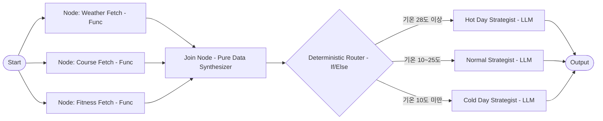

# Google Cloud Tech — ADK 2 기반 그래프 엔지니어링(Graph Engineering) 완전정복

## 📌 아카이빙 필수 메타데이터
- **원본 출처**: https://youtu.be/Mzr7byMFy_4
- **원본 정보 발행일자**: 2026-09-10
- **내 보관소 등록일자**: 2026-09-12
- **채널명**: Google Cloud Tech (발표: Annie)

---

## 💡 핵심 요약 (Level 0)
1. **단일 거대 프롬프트의 환각 질병 극복**: 하나의 프롬프트에 날씨 수집, 코스 분석, 체력 측정, 전략 수립을 모두 몰아넣으면 API 연동 없이 매우 구체적이지만 100% 허구인 숫자를 지어내는 환각에 빠지며, 해결책은 더 좋은 프롬프트가 아닌 **구조적 그래프(Structure & Graph)**다.
2. **AI 엔지니어링 4단계 진화와 대원칙**: `프롬프트 엔지니어링(무엇을 말할까)` ➔ `컨텍스트 엔지니어링(주변에 무엇을 둘까)` ➔ `루프 엔지니어링(Plan-Act-Check 반복)` ➔ `그래프 엔지니어링(노드와 엣지 배선)`. **"예측 가능한 작업은 함수(Function)에, 추론은 모델(LLM)에 맡긴다"**는 절대 원칙을 확립했다.
3. **ADK 2의 3대 핵심 아키텍처 패턴 실증**: 병렬 독립 데이터 수집(`Fan-Out`), LLM 없이 순수 자료구조로 취합하는 동기화 노드(`Join`), 닫힌 데이터에서는 조건문(if)으로 토큰과 오분류를 0으로 만드는 `결정론적 라우터(Deterministic Router)`를 통해 5단계 복합 파이프라인을 단 1회의 LLM 호출로 무결점 완결한다.

---

## 📜 상세 분석 및 타임스탬프 근거 (Level 1 Claims)

### 1. 단일 프롬프트의 한계와 그래프 엔지니어링의 정의 [00:00~01:43]
- **마라톤 레이스 전략 사례**:
  - 사용자 질문: "이번 마라톤 어떻게 뛰어야 할까?"
  - **시도 1 (거대 프롬프트)**: 날씨 조회, 코스 고저차 분석, 체력 체크, 페이스 배분을 단일 LLM 호출에 지시.
  - **결과**: 매우 확신에 찬 어조로 구체적인 페이스 수치를 쏟아내지만, 날씨 API도 코스 데이터도 없으므로 **모든 숫자가 100% 날조(Hallucination)**됨.
  - **진단**: 모든 단계가 단일 모델 호출 안에 갇혀 있으면 아무것도 가져올 수 없고(Unfetchable), 테스트할 수 없으며(Untestable), 신뢰할 수 없다(Untrusted).
- **AI 엔지니어링의 4단계 진화 스택**:
  1. `Prompt Engineering`: 모델에게 무엇을 말할 것인가.
  2. `Context Engineering`: 모델 주변에 어떤 문맥을 배치할 것인가.
  3. `Loop Engineering`: 에이전트가 Plan ➔ Act ➔ Check 순환을 돌게 할 것인가.
  4. `Graph Engineering`: 여러 세부 작업을 노드(Node)와 엣지(Edge)로 정밀 배선(Wire)하는 상위 체계.

### 2. 최소 단위 그래프와 대원칙 [01:43~02:45]
- **최소 그래프 구조**:
  - `Node 1 (순수 파이썬 함수)`: 실제 날씨/레이스 환경 API 데이터 수집 ➔ **LLM 호출 0회, 비용 $0, 100% 팩트 그라운딩**.
  - `Node 2 (LLM 에이전트)`: 수집된 실제 데이터를 읽고 맞춤형 전략 작성 ➔ **정확히 1회의 LLM 호출**.
- **핵심 불변 원칙**:
  > **"Predictable work goes in functions, and reasoning goes in the model."**  
  > (결과가 뻔한 작업은 일반 코드 함수에 넣고, 유연한 사고가 필요한 영역만 모델에 넘겨라.)

### 3. ADK 2의 3대 핵심 그래프 패턴 [02:45~05:00]

1. **팬아웃 (Fan-Out) — 병렬 처리**:
   - 날씨, 코스, 체력 데이터는 상호 의존성이 없으므로 순차 실행할 이유가 없음.
   - Start 노드에서 3개 엣지를 동시에 뻗어 병렬로 즉시 인출.
   - *동적 팬아웃(Dynamic Fan-Out)*: 런타임에 몇 개의 작업이 병렬로 실행될지 알 수 없을 때(예: 검색 결과 N개 분석) ADK 2의 동적 워크플로우로 동적 확장 가능.
2. **조인 (Join Node) — 무비용 합성기**:
   - 병렬로 실행된 3개 브랜치 중 가장 느린 프로세스가 끝날 때까지 대기 후, 노드 이름을 키(Key)로 하는 단일 딕셔너리로 결합.
   - **LLM 호출 불필요**: 별도의 취합 에이전트(Aggregator Agent)를 LLM으로 짤 필요 없이, 그래프 레벨에서 데이터 합성 완결.
3. **라우터 (Router Pattern) — 결정론적 vs LLM**:
   - 폭염(Hot), 적정(Normal), 한파(Cold) 3명의 전문 전략 에이전트 중 1명을 선택해야 함.
   - *LLM 라우터*: 자유 텍스트나 비정형 입력(Open Set)에서 조건문 분기가 불가능할 때 사용. 단, 토큰 비용이 발생하고 비결정론적 오분류 위험이 있음.
   - *결정론적 라우터(Deterministic Router)*: 수집된 데이터에 명확한 수치 신호(예: 기온 28도 이상)가 존재하는 닫힌 세트(Closed Set)에서는 파이썬 `if` 조건문이 압도적으로 우수함 (토큰 $0, 100% 정확도).
- **비용 집계**: 3개 병렬 수집(함수) + 1개 조인(데이터) + 1개 라우터(조건문) + 1개 전문 에이전트(LLM) ➔ **전체 파이프라인에서 LLM 호출은 오직 1회!**

### 4. 언제 그래프 워크플로우를 써야 하는가? [05:00~06:05]
- **질문 1**: *"입력이 들어오기 전에 워크플로우 다이어그램을 손으로 그릴 수 있는가?"*
  - **YES**: 무조건 **정적 그래프 워크플로우(Graph Workflow)**를 구성하라.
- **질문 2**: *"워크플로우의 형태 자체가 입력 데이터에 따라 런타임에 동적으로 바뀌는가?" (예: Deep Research)*
  - **YES**: ADK 2의 **동적 워크플로우(Dynamic Workflow)**를 활용하여 코드가 런타임에 그래프 형상을 결정하도록 하라.

---

## 🛠️ AI(나) 및 Antigravity 시스템 적용점 (Level 2 System Actions)

1. **`graph-orchestrator` 스킬과의 완벽한 아키텍처 정렬**:
   - Antigravity에 탑재된 `graph-orchestrator` 스킬의 철학("단일 에이전트 비대화 방지, Router-Worker-Reviewer 분리")이 구글 공식 ADK 2 표준 패턴과 100% 일치함을 확인.
2. **결정론적 라우터 우선 헌법 집행**:
   - 도구 선택 및 분기 시 불필요하게 상위 LLM에게 "어떤 도구를 쓸까요?" 물어보는 라우팅 프롬프트를 배제하고, 규칙 기반 정규식/파일 확장자/환경변수 기반의 `Deterministic Router`를 우선 적용하여 토큰 낭비와 비결정론적 실패를 원천 차단.
3. **Join Node의 순수 데이터 취합 원칙**:
   - 서브에이전트 취합 시 별도의 '총괄 요약 LLM'을 남발하지 않고, 딕셔너리 키 기반 병합 및 정형 마크다운 합성을 우선 적용하여 비용과 속도를 최적화.

---

## 🔗 관련 링크 및 지식 네트워크 (Level 3 Knowledge Links)
- [[02_AI_기술_위키/그래프_엔지니어링_Graph_Engineering_및_ADK2_3대_패턴]]
- [[GEMINI.md]]
- [[01_AI_시스템_및_도구/Addy_Osmani_미래_엔지니어의_선택과_소프트웨어_팩토리_가이드]]
