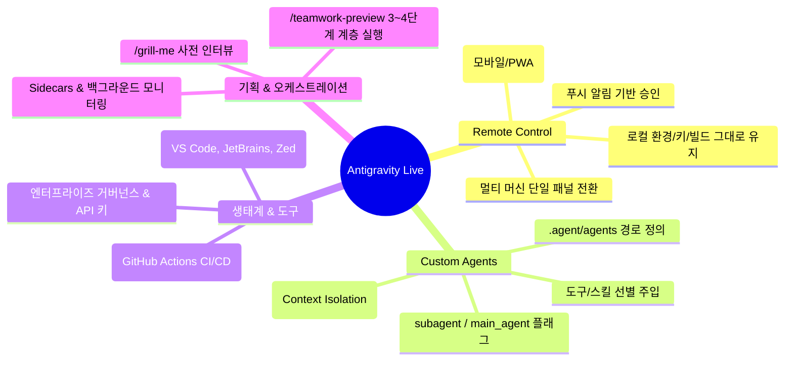

# 🎬 Google Antigravity Livestream: Remote Control and Custom Agents

> Google Antigravity 공식 개발팀(Noi & Rudy)이 진행한 라이브 방송으로, **리모트 컨트롤(원격 제어), 커스텀 에이전트/서브에이전트 아키텍처, 전용 IDE 익스텐션, 실전 바이브 코딩 및 오케스트레이션 노하우**를 종합 공개한 핵심 발표입니다.

---

## 📎 아카이빙 3대 메타데이터
- **원본 출처**: [https://www.youtube.com/watch?v=VIybKGFS4Hw](https://www.youtube.com/watch?v=VIybKGFS4Hw)
- **원본 정보 발행일자**: 2026-08-22 (Google Antigravity 공식 라이브 방송)
- **내 보관소 등록일자**: 2026-08-22

---

## 💡 핵심 3줄 요약
1. **Antigravity Remote Control & PWA 출시**: 메인 워크스테이션 환경(빌드 환경, 로컬 컨텍스트, 시크릿 키)을 유지한 채 스마트폰/브라우저로 여러 머신을 단일 패널에서 원격 제어 및 푸시 알림 수신.
2. **커스텀 에이전트 & 서브에이전트 아키텍처**: `.agent/agents/<name>/agent.md` 기반으로 컨텍스트를 완벽 격리하고, 전문 도구/스킬을 제한 주입하여 컨텍스트 팽창(Bloat) 차단.
3. **생태계 확장 및 실전 하네스**: VS Code/JetBrains/Zed용 IDE 확장판 배포, Antigravity SDK 기반 CI/CD 자동화, `/grill-me`(인터뷰 기획) 및 `/teamwork-preview`(계층형 다중 에이전트) 최적 활용법 공개.

---

## 📌 주요 세션별 핵심 발표 내용

---

### 1. 📱 Antigravity Remote Control (어디서나 원격 제어)
- **핵심 철학**: 무거운 빌드 환경이나 민감한 자격 증명(API 키/인증)을 모바일 기기로 복사할 필요 없이, **본체 워크스테이션에 그대로 두고 제어권만 모바일/브라우저로 연결**.
- **주요 기능**:
  - **멀티 인스턴스 단일 패널(Single Pane)**: 집 데스크톱, 서브 노트북, 클라우드 서버 등 연결된 여러 기기를 드롭다운 하나로 전환하며 모니터링.
  - **PWA(Progressive Web App) 지원**: iOS/Android 홈 화면에 설치하여 앱처럼 구동, 긴 작업 완료 시 푸시 알림 수신 및 원격 Diff 승인.
  - **설정 옵션**: `Prevent laptop from sleeping`(절전 방지), `Keep in menu bar`, `Enable remote control` 및 QR 코드 원클릭 페어링.

---

### 2. 🤖 커스텀 에이전트 & 서브에이전트 (Custom Agents)
- **컨텍스트 격리(Context Isolation)**:
  - 대량의 서버 로그 분석, 정적 코드 분석 등 토큰을 대량 소비하는 작업을 서브에이전트에 격리 위임하여 메인 대화창의 컨텍스트 오염 및 팽창 방지.
- **설정 구조**:
  - 위치: `.agent/agents/<에이전트명>/agent.md`
  - 플래그: `subagent: true`(위임 전용 서브에이전트), `main_agent: true`(최상위 메인 채팅 진입 허용)
  - 도구 주입: 허용할 `tools` 및 `skills`를 정확한 명칭으로 엄격하게 선별 주입.

---

### 3. 🔌 IDE 확장판 & 엔터프라이즈/SDK 생태계
- **공식 IDE Extensions**: VS Code뿐만 아니라 CLion/GoLand/Rider 등 JetBrains 계열 및 초경량 에디터 Zed 공식 지원.
- **Antigravity SDK & CI/CD**: Gemini CLI의 단순 커맨드라인을 넘어, GitHub Actions와 같은 파이프라인에서 문서 자동 동기화, PR 자동 코드 리뷰를 수행하는 Agent Harness 제공.
- **엔터프라이즈 기능**: 중앙 관리자 정책, 권한 잠금, 조직별 쿼터 분배 및 엔터프라이즈 API 키 지원.

---

### 4. 🧠 실전 바이브 코딩 하네스 노하우
- **`/grill-me` (역질문 인터뷰 프로토콜)**:
  - 개발자가 막연하게 요구사항을 던지기보다, AI가 기술 스택(예: PyTorch vs TF vs JAX), 아키텍처 전제를 역으로 질문하여 설계를 사전에 확정.
  - **"기획과 설계가 코딩 병목의 90%를 해결한다"**는 원칙 강조.
- **`/teamwork-preview` (계층형 멀티 에이전트)**:
  - 단순 변경(버튼 패딩, 단순 함수 수정)에는 남발하지 않고, 거대한 아키텍처/멀티 도메인 프로젝트에 3~4단계 계층(디렉터, 도메인 전문가, 리뷰어)으로 구동.
- **동적 사이드카(Sidecars) & Cron**:
  - 장시간 실행되는 ML 학습(예: AlphaZero), 백그라운드 빌드를 5분 주기 크론 사이드카로 감시하고 요약 리포트만 수신.

---

## 🛠️ AI(나/Antigravity) 및 사용자 시스템 적용점 (필수)

| 영역 | 라이브 핵심 인사이트 | 사용자 시스템(전일도) 즉시 적용 사항 |
| :--- | :--- | :--- |
| **1. 데스크톱-노트북 연동** | Remote Control 단일 패널 제어 | 메인 본체(Ryzen 5600X/RX 6600)를 호스트로 두고 서브 노트북(Dell Latitude 7440) 및 모바일에서 원격 하네스 활용. |
| **2. 컨텍스트 엔지니어링** | Custom Agent 완벽 격리 | 대용량 로그 분석/리팩토링 시 메인 컨텍스트를 소진하지 않고 `research` 및 전문 서브에이전트로 분리 위임. |
| **3. 기획 단계 역질문** | `/grill-me` 설계 고정 | 복잡한 신규 프로젝트 착수 시 임의 추측을 배제하고 요구사항 및 트레이드오프를 사용자에게 사전 인터뷰/확정. |
| **4. 무거운 작업 모니터링** | Dynamic Sidecars / Cron | 장기 빌드나 백그라운드 데이터 수집 시 주기적 크론 알림으로 메인 스레드 대기 토큰 낭비 방지. |

---

## 📝 라이브 타임라인 요약

- **[00:00~05:00]** 오프닝 및 최근 업데이트(Custom Agents 개요)
- **[05:00~12:00]** 엔터프라이즈 워크플로우 & 공식 IDE 확장판(VS Code, JetBrains, Zed) 발표
- **[12:00~23:00]** Antigravity Remote Control 라이브 시연 및 PWA 모바일 제어 구조 설명
- **[23:00~31:00]** 커스텀 에이전트(`agent.md`) 생성 실습, 도구 격리 설정 및 트러블슈팅
- **[31:00~37:00]** AI Studio vs Antigravity 워크플로우 분기 및 GitHub 양방향 동기화
- **[37:00~44:00]** `/grill-me`와 `/teamwork-preview`를 결합한 실전 바이브 코딩 전략
- **[44:00~47:00]** 커뮤니티 질의응답, Antigravity SDK 활용 팁 및 마무리
