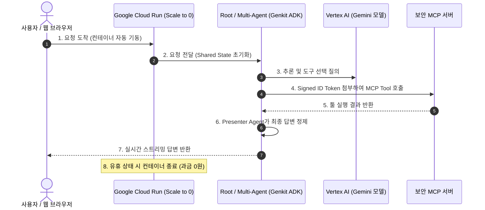

# Google Cloud Run 기반 AI 에이전트 배포 및 MCP 보안 연동 완전가이드

## 📌 아카이빙 필수 메타데이터
- **원본 출처**: https://youtu.be/bjZ2M7ThOBc
- **원본 정보 발행일자**: 2026-07-08
- **내 보관소 등록일자**: 2026-08-16
- **채널명**: Google Cloud Tech

---

## 💡 핵심 요약
1. **Scale-to-Zero 팝업스토어 멘탈 모델**: 로컬에서만 돌던 AI 에이전트를 공용 인터넷 URL로 배포하되, 요청이 없을 때는 0으로 스케일되어 유휴 시간 과금이 전혀 없는(0원) Cloud Run 아키텍처를 활용한다.
2. **다중 에이전트 & MCP 보안 통신**: Root Agent(접수) ➡️ Researcher Agent(MCP 도구 + 외부 검색) ➡️ Presenter Agent(포맷팅)의 순차 파이프라인을 구축하고, Service Account의 OIDC 서명 ID 토큰으로 MCP 서버의 403 인증 에러를 원천 차단한다.
3. **단일 명령 배포(One-Command Deploy)**: `adk deploy` 또는 `gcloud run deploy` 한 줄로 컨테이너 빌드, 아티팩트 레지스트리 푸시, 웹 UI(`--with-ui`) 호스팅까지 자동 완결한다.

---

## 🏗️ Cloud Run AI 에이전트 아키텍처



---

## 🚀 4단계 실전 배포 파이프라인

### 1단계: 프로젝트 및 필수 API 활성화
```bash
# Cloud Shell에서 필수 서비스 일괄 활성화
gcloud services enable \
  run.googleapis.com \
  cloudbuild.googleapis.com \
  artifactregistry.googleapis.com \
  aiplatform.googleapis.com
```

### 2단계: Service Account 생성 및 권한 바인딩 (403 에러 방지)
```bash
# 1. 전용 서비스 계정 생성
gcloud iam service-accounts create agent-runner \
  --display-name="AI Agent Cloud Run Runner"

# 2. Vertex AI 모델 호출 권한 부여
gcloud projects add-iam-policy-binding $PROJECT_ID \
  --member="serviceAccount:agent-runner@$PROJECT_ID.iam.gserviceaccount.com" \
  --role="roles/aiplatform.user"

# 3. MCP 서버 호출 권한 부여 (필수 ⭐)
gcloud projects add-iam-policy-binding $PROJECT_ID \
  --member="serviceAccount:agent-runner@$PROJECT_ID.iam.gserviceaccount.com" \
  --role="roles/run.invoker"
```

### 3단계: 환경 변수(.env) 및 에이전트 코드 구성
- **`.env`**: 모델명(`MODEL_NAME=gemini-2.5-flash`) 및 `MCP_SERVER_URL` 선언 (코드 하드코딩 금지).
- **`agent.py` 다중 에이전트 구성**:
  - `Root Agent`: 최초 프롬프트를 공용 딕셔너리(`shared_state`)에 저장.
  - `Researcher Agent`: MCP 도구 및 위키피디아 도구를 호출해 팩트 수집.
  - `Presenter Agent`: 수집된 원시 데이터를 사용자 친화적 톤으로 가공.
  - `Sequential Workflow`: 순차 실행 파이프라인 래핑.

### 4단계: 단일 명령 배포 (One-Click Deploy)
```bash
# 컨테이너 빌드 + 레지스트리 푸시 + Cloud Run 배포 + 테스트 Web UI 즉시 가동
npx -y @google/adk deploy \
  --project=$PROJECT_ID \
  --region=asia-northeast3 \
  --service-name=zoo-agent \
  --service-account=agent-runner@$PROJECT_ID.iam.gserviceaccount.com \
  --with-ui \
  --allow-unauthenticated
```
- 배포 완료 후 출력되는 `https://zoo-agent-...-du.a.run.app` URL로 즉시 웹 테스트 가능.

---

## 🛠️ AI(Antigravity) 시스템 및 워크플로우 적용점

### 1. GEMINI.md 제5조(원클릭 배포) 표준 템플릿 확립
- 사용자가 부업용 AI 웹 서비스나 에이전트 도구를 외부에 공개하고자 할 때, 서버 비용 걱정 없는 **Cloud Run (Scale-to-Zero)** 아키텍처를 1순위 배포 파이프라인으로 채택.
- 요청이 없을 때 0원으로 대기하므로 1인 개발자에게 최적의 인프라 비용 효율성 제공.

### 2. MCP 보안 토큰 전달 규격화
- Antigravity에서 Cloud SQL이나 외부 원격 MCP 서버를 호출할 때, Service Account의 OIDC ID 토큰을 Bearer 헤더로 전달하는 보안 패턴을 코드 생성 시 기본 적용.
