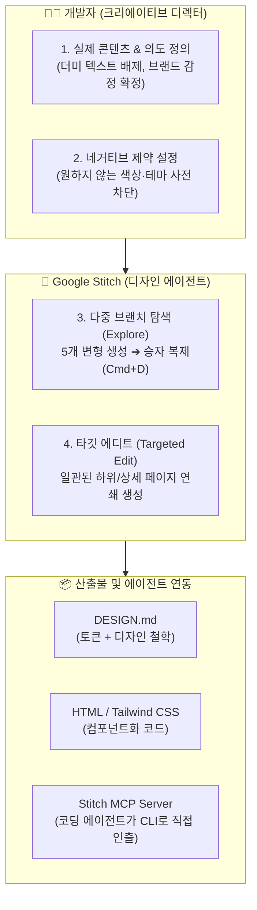

---
title: "Google Stitch AI 디자인 에이전트 — DESIGN.md 아티팩트 및 MCP 연동 완전 분석"
created: 2026-08-22
updated: 2026-08-22
tags:
  - GoogleStitch
  - Stitch
  - DESIGN_md
  - 디자인에이전트
  - 프론트엔드
  - MCP
  - TailwindCSS
  - GoogleCloudTech
  - DavidEast
---

# 🎬 Google Stitch AI 디자인 에이전트 — DESIGN.md 아티팩트 및 MCP 연동 완전 분석

> **📎 정보 아카이빙 3대 필수 메타데이터**
> - **원본 출처**: [Google Cloud Tech - The Agent Factory (hNHE301qF1A)](https://youtu.be/hNHE301qF1A)
> - **원본 정보 발행일자**: 2026-05-11
> - **내 보관소 등록일자**: 2026-08-22

---

## 💡 핵심 3줄 요약

1. **디자인 능력 $0 개발자를 위한 Google 공식 AI 디자이너**: Google Labs가 공개한 **Stitch(stitch.withgoogle.com)**는 개발자가 '크리에이티브 디렉터' 역할을 하고 AI가 '디자인 에이전트'로서 반응형 HTML·Tailwind CSS와 디자인 시스템을 고품질로 즉각 생성합니다.
2. **`DESIGN.md` 혁신 아티팩트 (Design Token + Design Intent)**: `AGENTS.md`가 코딩 에이전트의 헌법이듯, **`DESIGN.md`는 디자인 토큰(색상·폰트·간격)에 '디자인 의도(왜 이 색과 배치를 썼는가)'를 산문으로 결합한 단일 진실 공급원**입니다.
3. **Stitch MCP 서버를 통한 에이전트 100% 무인 연동**: Antigravity/Gemini CLI 등 코딩 에이전트가 Stitch MCP 도구(`get_screen`, `create_project`, `edit_screen`)를 호출하여 웹 UI를 켜지 않고도 터미널에서 프로덕션 수준의 프론트엔드 코드와 화면을 자율 생성·가져옵니다.

---

## 📌 Google Stitch 4단계 디자인 워크플로우

### 1단계: 실제 콘텐츠(Real Content)로 그라운딩
- "아무 웹사이트나 만들어줘" 대신, **실제 서비스명, 핵심 슬로건, 실제 판매/제공할 콘텐츠**를 먼저 주입.
- 콘텐츠의 성격(예: 생생한 게잡이 투어)이 디자인의 폼과 레이아웃(체크무늬 모자이크, 밝은 야외 느낌)을 스스로 결정합니다.

### 2단계: 하지 말아야 할 것(Negative Constraints) 선언
- 원하는 것보다 **"피해야 할 요소"**를 먼저 제거.
- 예: "야간 투어가 아니므로 어두운 다크 테마 배제, 과도한 원색 대비 지양, 따뜻한 크림톤 배경과 채도 조절된 레드 악센트 사용."

### 3단계: `Explore` ➔ `Refine` ➔ `Targeted Edit` 브랜칭
- **Explore (Shift+V)**: 5개 레이아웃/폰트 변형을 한 번에 생성.
- **Winner 복제 (Cmd+D)**: 가장 마음에 드는 디자인을 골라 복제 후 텍스트 다듬기.
- **Targeted Edit**: 메인 페이지의 디자인 문맥을 그대로 유지한 채 하위 상세/목록 페이지를 파생 생성하여 디자인 일관성 100% 확보.

### 4단계: `DESIGN.md` & MCP 연동
- 단순 CSS 값이 아닌 **"디자인 의도"**가 적힌 `DESIGN.md`를 프로젝트 루트에 저장.
- Stitch MCP를 통해 AI 에이전트가 터미널에서 화면 코드를 인출해 React/Vue 컴포넌트로 즉시 조립.

---

## 💎 `DESIGN.md` vs `AGENTS.md` 아키텍처 비교

| 항목 | `AGENTS.md` (코딩 하네스) | `DESIGN.md` (디자인 하네스) |
| :--- | :--- | :--- |
| **목적** | AI 코딩 에이전트의 파일/아키텍처 규칙 정의 | AI 디자인/프론트엔드 에이전트의 미학/스타일 규칙 정의 |
| **구성 요소** | 빌드 명령어, 폴더 구조, 코딩 컨벤션 | **Design Tokens (색상·타이포·간격) + Semantic Intent (디자인 이유)** |
| **핵심 가치** | 임의의 코드 구조 파편화 방지 | **AI 특유의 촌스러운 디자인 냄새(AI Slop) 및 스타일 붕괴 원천 차단** |
| **재사용성** | 다양한 코딩 에이전트 공통 사용 | Stitch, Antigravity, Figma, Tailwind 설정에 그대로 이식 |

---

## 🛠️ David East의 프론트엔드 4대 설계 철학

1. **시맨틱 압축 (Semantic Compression)**: 화려한 미사여구 대신, 디자인 의도와 감정을 가장 압축된 핵심 단어로 프롬프트에 전달.
2. **CSS Grid vs Flexbox 역할 분담**:
   - **CSS Grid**: 전체 페이지의 거시적(Macro) 골격 및 2차원 매크로 레이아웃 배치.
   - **Flexbox**: 개별 컴포넌트 내부에서 컨텐츠 크기에 맞춰 늘어나고 줄어드는(Grow/Shrink) 미시적(Micro) 배치.
3. **공감(Empathy) 중심 디자인**: 무조건 화려한 드리블(Dribbble) 스타일을 흉내 내지 않고, 실제 사용자가 머무를 때 편안한 사용성과 가독성 최우선.
4. **CSS 기본기의 중요성**: 렌더링되는 최종 실체는 CSS이므로, 시맨틱 CSS 구조를 이해해야 AI에게 정밀한 디렉팅이 가능.

---

## 🛠️ AI(나)에게 적용할 점 (Antigravity 시스템 & 웹 개발 워크플로우)

1. **프로젝트마다 `DESIGN.md` 표준 아티팩트 자동 생성 (`frontend-design` 스킬 연계)**  
   - 웹 애플리케이션 개발 시 단순 컴포넌트 코딩에 앞서, 색상/타이포 토큰과 디자인 의도를 담은 `DESIGN.md`를 프로젝트에 먼저 확정하여 일관된 럭셔리 UX를 유지합니다.
2. **Stitch MCP 도구 인터페이스 지원 준비**  
   - 외부 UI 디자인 요청 시 Stitch MCP API 규격(`create_project`, `get_screen`, `edit_screen`)을 활용해 터미널 환경에서 고품질 HTML/Tailwind 스니펫을 자동으로 인출합니다.
3. **매크로 Grid + 마이크로 Flex 레이아웃 표준화**  
   - 프론트엔드 코드 작성 시 페이지 전체는 CSS Grid로 잡고, 카드/버튼 내부는 Flexbox로 구성하는 모범 구조를 기본 템플릿화합니다.
