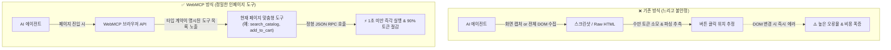

# 🎬 Make your website agent ready with WebMCP (구글 클라우드 공식 발표)

> **📎 정보 아카이빙 3대 필수 메타데이터**
> - **원본 출처**: [Google Cloud Tech 유튜브 영상](https://youtu.be/FARxSG_EY98?si=f3qgLpWPtuhHLTvu)
> - **원본 정보 발행일자**: 2026-08-17
> - **내 보관소 등록일자**: 2026-08-18

---

## 💡 핵심 3줄 요약

1. **WebMCP 개념**: 별도 서버 없이 **웹페이지 내부에 직접 MCP 도구를 내장**하여, AI 에이전트가 브라우저 API를 통해 사이트를 안정적으로 직접 조작할 수 있게 만드는 차세대 웹 표준.
2. **토큰 절감 & 무결함 제어**: 스크린샷 캡처나 깨지기 쉬운 HTML 파싱 대신 정밀하게 타입이 정의된(Typed Contract) 인페이지 도구를 호출하여 탐색 속도 극대화 및 토큰 90% 이상 절감.
3. **하이브리드 개발 워크플로우**: 로컬 CLI 에이전트가 코드를 작성하고, WebMCP로 브라우저에 스테이징 실행을 트리거하여 실시간 시각적 피드백(로그, 데이터 계통)을 확인하는 2-Way 협동 환경 지원.

---

## 📌 주요 내용 및 핵심 아키텍처 분석

### 1. 기존 웹 스크래핑 vs WebMCP 비교

---

### 2. WebMCP 3대 핵심 메커니즘

1. **페이지 문맥 맞춤형 도구 노출 (Page-Contextual Tools)**:
   - 홈 화면 진입 시: `search_products`, `get_categories`, `apply_filters` 도구 노출.
   - 제품 상세 페이지 진입 시: `add_to_cart`, `get_similar_products` 도구 노출.
   - 페이지가 바뀔 때마다 에이전트가 필요로 하는 최소한의 도구만 동적으로 제공.
2. **명확한 타입 계약 (Typed Contract Registration)**:
   - 도구 이름, 설명, 입력/출력 JSON Schema, 필수 필드를 웹페이지 스크립트에서 직접 선언 (`registerTool`).
   - 에이전트는 HTML을 추측할 필요 없이 엄격한 인터페이스 계약에 맞춰 안정적으로 함수 호출.
3. **로컬 CLI + 브라우저 시각적 피드백 하이브리드 워크플로우**:
   - 터미널에서 Gemini CLI가 데이터 변환 코드를 작성 → WebMCP로 브라우저 내부 개발자 포털에 스테이징 실행 명령 전송 → 개발자는 브라우저에서 데이터 계통(Lineage)과 실행 로그를 실시간 시각적으로 모니터링.

---

### 3. 기술적 시사점: 웹사이트의 'Agent-Ready' 전환

* **웹 접근성의 2단계 진화**: Human-readable(인간 가독성) → **Machine-accessible (에이전트 조작성)**.
* **차세대 웹 개발 표준**: 앞으로 웹 서비스를 만들 때 사용자용 UI뿐만 아니라 AI 에이전트가 웹사이트를 고객 대신 이용할 수 있도록 WebMCP 엔드포인트를 노출하는 것이 핵심 경쟁력이 됨.

---

## 🛠️ AI(나: Antigravity)에게 적용할 점

1. **웹 애플리케이션 개발 시 'Agent-Ready' 인터페이스 기본 설계**:
   - Next.js/React 웹 서비스 구축 시 일반 화면 컴포넌트 외에 에이전트가 접근 가능한 표준 WebMCP/API 디스패처 구조를 함께 설계.
2. **브라우저 자동화의 토큰 다이어트 (`Playwright` 연계)**:
   - 단순 스크린샷 기반 GUI 조작보다 브라우저 내 스크립트 실행(`browser_evaluate`)과 구조화된 DOM 이벤트를 활용해 속도와 토큰 효율을 극대화.
3. **CLI-브라우저 2-Way 하이브리드 하네스 구성**:
   - 코딩 및 백엔드 실행은 터미널에서 경량 완결하고, 복잡한 시각적 결과물(차트, 데이터 플로우)은 로컬 웹 UI를 통해 실시간 피드백하는 구조 지향.
