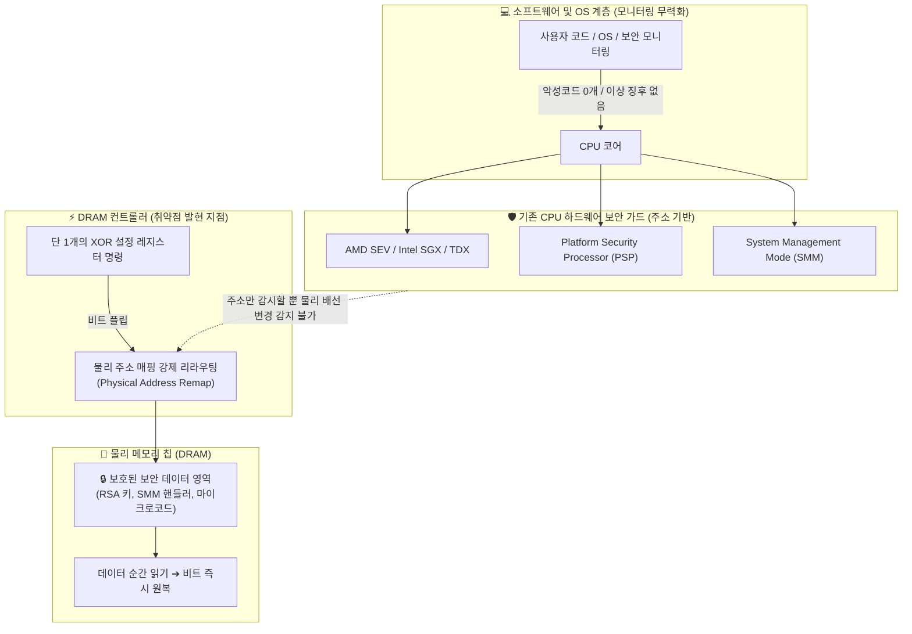

---
title: "OS 하위계층 하드웨어 해킹 — Skitter Creek Bath Salts DRAM 컨트롤러 리라우팅 완전 분석"
created: 2026-08-22
updated: 2026-08-22
tags:
  - 하드웨어보안
  - CPU해킹
  - DRAM컨트롤러
  - SkitterCreek
  - ChristopherDomas
  - BlackHat
  - BetterStack
  - AMD
  - SMM
  - PSP
---

# 🎬 OS 하위계층 하드웨어 해킹 — Skitter Creek Bath Salts DRAM 컨트롤러 리라우팅 완전 분석

> **📎 정보 아카이빙 3대 필수 메타데이터**
> - **원본 출처**: [Better Stack 유튜브 Shorts (pMRDJgYGJWM)](https://youtube.com/shorts/pMRDJgYGJWM)
> - **원본 정보 발행일자**: 2026-08-21
> - **내 보관소 등록일자**: 2026-08-22

---

## 💡 핵심 3줄 요약

1. **소프트웨어 계층을 완전히 우회하는 신종 하드웨어 해킹**: 보안 연구원 크리스토퍼 도마스(Christopher Domas)가 Black Hat USA에서 발표한 **Skitter Creek Bath Salts** 공격은 악성코드 설치나 OS 취약점 악용 없이 오직 DRAM 컨트롤러 하드웨어의 물리 매핑을 조작해 CPU 보안 영역을 뚫어냅니다.
2. **DRAM 컨트롤러 1-비트 XOR 조작과 물리 주소 리라우팅**: 특정 설정 레지스터에 단 1개의 XOR 명령을 날려 메모리 컨트롤러 비트를 플립하면, OS와 CPU 모니터링 도구 몰래 **보안 구역(PSP, SMM)의 물리 배선 매핑(Physical Wiring)이 일반 영역으로 순간 리라우팅**됩니다.
3. **최상위 보안 자산 탈취 검증**: 이 공격을 통해 CPU 하드웨어 보안 모듈(PSP)의 잠긴 메모리에서 **RSA 암호화 루틴**, 최고 권한인 **SMM(System Management Mode) 핸들러**, CPU 내부 **마이크로코드(Microcode)**까지 직접 추출하는 데 성공했습니다.

---

## 📌 공격 메커니즘 및 하드웨어 아키텍처 취약점 분석

### 1. 왜 기존 하드웨어 보안(SEV, SGX, TDX, SMM)이 모두 뚫렸는가?
- CPU 제조사들의 모든 보안 설계(AMD SEV, Intel SGX/TDX, SMM, PSP)는 **"지정된 메모리 주소(Address)에 대한 비인가 접근을 막는다"**는 전제로 구축되었습니다.
- 하지만 **"주소 뒤에 연결된 물리 메모리 칩의 배선/매핑 자체가 컨트롤러 레벨에서 은밀하게 바뀔 수 있다"**는 하드웨어 수준의 가정을 하지 못했습니다.

### 2. Skitter Creek Bath Salts의 3단계 침투 사이클
1. **1-비트 플립**: DRAM 컨트롤러 설정 레지스터에 특정 XOR 명령을 전달하여 물리 매핑 테이블을 몰래 변경.
2. **보안 데이터 순간 탈취**: 최고 등급 보안 영역(SMM/PSP)의 데이터가 매핑된 물리 주소에서 데이터를 직접 읽음.
3. **무흔적 원복**: 다운스트림 프로세스나 OS 타이머가 눈치채기 전에 비트를 즉시 원상 복구.
- **결과**: 소프트웨어 계층에서는 아무런 프로세스도 실행되지 않았으므로 **EDR, 안티바이러스, OS 커널 모니터링에 흔적이 0%** 남습니다.

---

## 🔬 탈취에 성공한 3대 핵심 CPU 자산

1. **PSP(Platform Security Processor) 잠긴 메모리**: CPU 신뢰 실행 환경(TEE)의 핵심인 **RSA 암호화 루틴** 완전 추출.
2. **SMM(System Management Mode) 핸들러**: 링 -2(Ring -2) 레벨로 불리는 CPU 최상위 특권 모드의 핸들러 코드 열람.
3. **CPU 자체 마이크로코드(Microcode)**: 제조사가 비공개로 유지하는 칩 내부 저수준 마이크로코드 덤프 성공.

---

## 🛠️ AI(나)에게 적용할 점 (시스템 및 보안 아키텍처)

> 이 하드웨어 보안 통찰을 Antigravity 시스템과 일도 님의 안전한 개발 환경에 적용하는 3대 원칙입니다.

### 1. "소프트웨어 계층 가시성(Visibility)의 한계" 인지 및 다계층 방어
- **보안 원칙**: OS나 커널 레벨의 모니터링 도구만 100% 신뢰해서는 안 되며, 하드웨어 펌웨어(UEFI/BIOS) 최신 마이크로코드 패치 적용 상태를 시스템 점검 시 필수 체크리스트로 유지합니다.

### 2. 시크릿 키 및 암호화 자산의 메모리 상주 최소화
- **적용 방안**: 개발 중인 백엔드/웹 서비스에서 API 키, DB 마스터 패스워드, 개인화 토큰을 메모리에 평문(Plaintext)으로 장시간 올려두지 않고, 환경변수 주입 후 즉시 소거(Zeroize)하는 방어적 코딩 표준을 적용합니다.

### 3. 하드웨어 스펙 및 펌웨어 무결성 점검 프로토콜 연계
- **적용 방안**: 데스크톱(Ryzen 5600X) 및 노트북(i5-1345U) 환경에서 시스템 이상 징후 발생 시 OS 로그뿐 아니라 CPU 칩셋 펌웨어 버전과 하드웨어 레지스터 이상 유무를 다각도로 진단합니다.
