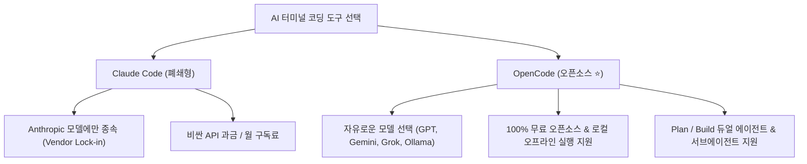

# 🚀 OpenCode 완벽 가이드 (Claude Code 오픈소스 대안)

> **📌 아카이빙 메타데이터**
> - **원본 출처**: [YouTube (https://youtu.be/wOfm7x0i3sw)](https://youtu.be/wOfm7x0i3sw)
> - **출처 정보 발행일자**: `2026-07-07`
> - **내 보관소 등록일자**: `2026-08-14`
> - **개요**: GitHub 18만 스타를 돌파한 최강의 오픈소스 터미널 AI 코딩 에이전트 **OpenCode**의 아키텍처, Claude Code 대비 장점, 듀얼 에이전트(Plan/Build) 및 커스텀 모델 연동 마스터 가이드입니다.

---

## 📊 Claude Code vs OpenCode 핵심 비교

---

## 🔥 OpenCode의 4대 킬러 기능

### 1. 벤더 종속 없는 자유로운 모델 교체 (Bring Your Own Model) ⭐
* Claude Code는 클로드 모델만 써야 하지만, OpenCode는 **`Ctrl + P` 단축키 하나로 Gemini, Grok, GPT, 로컬 Ollama(DeepSeek, Qwen)까지 수백 개 모델을 자유자재로 전환**합니다.
* 초가성비 오픈소스 모델(GLM, DeepSeek)을 활용해 API 비용을 90% 이상 절감할 수 있습니다.

### 2. 터미널 올인원 풀세트 도구 내장
* 터미널 명령어 실행(`bash`), 실시간 파일 수정(`edit`), 코드 검색(`grep`), 웹 크롤링(`fetch`), 실시간 구글 검색(`web search`)이 기본 탑재되어 있습니다.

### 3. Plan / Build 듀얼 에이전트 워크플로우
* **`Plan Agent (설계 에이전트)`**: 대규모 프로젝트에서 코드를 바로 건드리지 않고 안전하게 설계도와 아키텍처 계획만 수립.
* **`Build Agent (구현 에이전트)`**: 수립된 계획을 바탕으로 실제 파일을 수정하고 코드를 빌드.
* `Tab` 키 하나로 설계 모드와 구현 모드를 즉시 전환합니다.

### 4. herdr 멀티플렉서와의 환상적인 궁합
* 우리가 세팅한 `herdr` 터미널 멀티플렉서 안에서 OpenCode를 구동하면, **백그라운드에서 끊김 없이 24시간 자율 코딩**을 수행합니다.

---

## 🛠️ 실전 기본 단축키 요약

| 단축키 / 명령어 | 기능 설명 |
| :--- | :--- |
| **`Ctrl + P`** | **모델 즉시 전환 (`Switch Model`)** (Gemini, Grok, Ollama 등) |
| **`Tab`** | **Plan 모드 ➔ Build 모드 전환** |
| **`@`** | **전문 서브에이전트 호출** |
| **`/models`** | 사용 가능한 전체 모델 목록 조회 |

---

## 🔗 관련 문서 링크
- [[01_AI_시스템_및_도구/herdr_AI에이전트_전용_터미널_멀티플렉서_완벽_가이드|herdr 멀티플렉서 가이드]]
- [[01_AI_시스템_및_도구/Addy_Osmani_미래_엔지니어의_선택과_소프트웨어_팩토리_가이드|Addy Osmani 소프트웨어 팩토리]]
- [[인덱스]]
