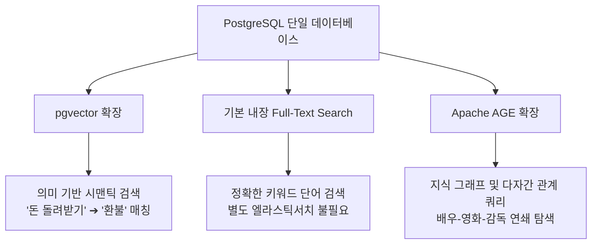

---
title: "PostgreSQL 확장성 혁신 — pgvector, 전문검색, Apache AGE 완전분석"
created: 2026-08-22
updated: 2026-08-22
tags:
  - PostgreSQL
  - pgvector
  - AI검색
  - 벡터DB
  - 전문검색
  - ApacheAGE
  - 그래프DB
  - Solostack
  - 데이터베이스
---

# 🎬 왜 다들 PostgreSQL만 쓸까 — AI 검색·pgvector·Apache AGE 확장 완전분석

> **📎 정보 아카이빙 3대 필수 메타데이터**
> - **원본 출처**: [Solostack 유튜브 Shorts (EQnS__9kQ7Q)](https://youtube.com/shorts/EQnS__9kQ7Q)
> - **원본 정보 발행일자**: 2026-08-21
> - **내 보관소 등록일자**: 2026-08-22

---

## 💡 핵심 3줄 요약

1. **새 도구로 갈아탈 필요 없는 압도적 확장 구조**: PostgreSQL이 개발자들에게 가장 사랑받는 핵심 이유는 새 기술 트렌드가 등장할 때마다 별도 인프라로 이전하지 않고 오픈소스 확장(Extension) 하나만 설치해 즉시 흡수하기 때문입니다.
2. **AI 검색 3대 스택 단일 완결**: ① 의미 기반 시맨틱 검색(`pgvector`), ② 단어 일치 키워드 검색(내장 Full-Text Search), ③ 복잡한 지식 관계망 탐색(`Apache AGE`)을 PostgreSQL 단일 인스턴스에서 모두 실행할 수 있습니다.
3. **인프라 파편화 및 비용 $0 실현**: 유료 벡터 DB(Pinecone 등), 전용 검색 엔진(Elasticsearch), 그래프 DB(Neo4j)를 개별 도입해 데이터 파이프라인을 복잡하게 얽을 필요 없이 무료 오픈소스 단일 DB로 트랜잭션 무결성과 관리 효율을 극대화합니다.

---

## 📌 주요 내용 및 타임스탬프 상세 분석

### 1. [00:00 - 00:15] 왜 개발자들은 PostgreSQL을 떠나지 않는가?
- 데이터베이스 시장에서 PostgreSQL의 점유율과 충성도가 압도적인 비결은 **확장성(Extension Ecosystem)**입니다.
- 새로운 기능이 요구될 때 시스템을 갈아엎거나 다른 분산 도구를 추가하는 대신, 검증된 코어 위에 익스텐션을 얹어 가볍게 문제를 해결합니다.

### 2. [00:15 - 00:25] AI 시대의 시맨틱 벡터 검색: `pgvector`
- **의미 유사도 기반 인출**: 사용자가 *"돈 돌려받기"*라고 검색해도 문맥을 이해하여 *"환불 규정"* 문서를 정확히 찾아냅니다.
- **전용 벡터 DB 대체**: 별도의 관리형 벡터 DB를 비싼 비용으로 구독할 이유가 사라집니다.

### 3. [00:25 - 00:32] 키워드 기반 전문 검색(FTS)의 기본 내장
- 형태소 분석 및 인덱싱을 지원하는 전문 검색 엔진이 코어 기능으로 이미 포함되어 있습니다.
- 특정 단어가 포함된 문서를 즉각 색인 및 조회할 수 있어 복잡한 검색 엔진(Elasticsearch 등)을 따로 붙이지 않아도 충분합니다.

### 4. [00:32 - 00:44] 연관 관계를 타고 들어가는 지식 그래프: `Apache AGE`
- **그래프 쿼리 통합**: "A 배우가 출연한 B 영화 ➔ B 영화의 감독 C ➔ 감독 C의 다른 작품 D"처럼 꼬리를 무는 관계망을 단일 쿼리로 추적합니다.
- **오픈소스 그래프 확장**: Apache AGE(A Graph Extension)를 통해 RDBMS 안에서 오픈사이퍼(openCypher) 그래프 쿼리를 네이티브하게 구동합니다.

### 5. [00:45 - 01:03] 단일 오픈소스 통합의 경제적·기술적 가치
- 벡터 DB, 검색 엔진, 그래프 DB를 각각 분리 운영할 때 발생하는 **데이터 동기화 지연, 분산 트랜잭션 실패, 과도한 클라우드 구독료**를 한 번에 해결합니다.

---

## 🛠️ AI(나)에게 적용할 점 (Antigravity 시스템 & 사용자 워크플로우)

> 이 기술 노하우를 Antigravity 시스템과 사용자 개발/아카이빙 환경에 즉시 적용하는 3대 전략입니다.

### 1. 인프라 단순화 & 서드파티 유료 구독 $0화 (Supabase / Cloud SQL 활용)
- **적용 방안**: 사용자 프로젝트나 AI 에이전트 서비스 개발 시 Pinecone, Milvus 같은 유료 벡터 DB 대신 Supabase(PostgreSQL)의 `pgvector` 확장을 기본 스택으로 고정합니다.
- **기대 효과**: 인프라 복잡도를 낮추고 유료 API 의존 없이 안정적인 RLS 보안과 트랜잭션을 동시에 보장합니다.

### 2. 하이브리드 검색(Hybrid Search) 에이전트 RAG 파이프라인 내장
- **적용 방안**: 에이전트 메모리 및 지식 검색 시 `pgvector`(의미론적 유사도)와 PostgreSQL 내장 `tsvector`(정확한 단어 일치)를 결합한 **RRF(Reciprocal Rank Fusion)** 검색 쿼리를 기본 지원합니다.
- **기대 효과**: 단순 벡터 검색의 고유명사/전문용어 누락 문제를 원천 차단하여 검색 정확도를 대폭 향상합니다.

### 3. 옵시디언 볼트 지식 그래프의 고속 탐색 모델 연계
- **적용 방안**: 옵시디언 볼트 내 수천 개의 양방향 위키링크(`[[Note]]`) 관계망을 PostgreSQL + Apache AGE 또는 SQLite 관계 테이블로 색인하여 에이전트가 "개념 간 연결고리"를 1회 쿼리로 깊이 있게 추론할 수 있도록 아키텍처를 확장합니다.
