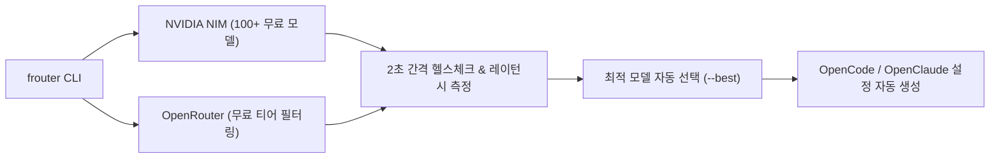

# 🚀 frouter: 무료 AI 모델 실시간 탐색 및 코딩 에이전트 자동 연동 가이드

> **출처**: [제로초TV (ZeroChoTV) - 공짜 AI 찾아주는 서비스 소개합니다](https://youtube.com/shorts/UwaDnupTErQ)  
> **도구**: [jyoung105/frouter (GitHub)](https://github.com/jyoung105/frouter)  
> **발행일**: 2026년 8월  
> **등록일**: 2026-08-23  

---

## 💡 핵심 요약 (3줄)

1. NVIDIA NIM(100여 개 무료 API)과 OpenRouter에서 제공하는 **최신 무료 AI 모델(GLM, Mistral, Kimi, Qwen 등)**을 실시간으로 발굴·필터링하는 CLI 라우터 도구다.
2. **2초 간격 실시간 헬스체크 및 응답 속도(Latency) 추적**을 통해 현재 정상 작동 중인 가장 빠른 모델(`--best`)을 자동 선택한다.
3. 모델 선택 시 **OpenCode, OpenClaude 등 CLI 코딩 에이전트의 설정(Config) 파일을 자동으로 세팅**하여 바이브 코딩 API 비용을 $0으로 최적화한다.

---

## 🛠️ 1. 주요 기능 및 아키텍처



### 1) 주요 지원 프로바이더
- **NVIDIA NIM** (`nvapi-...`): 엔비디아에서 무료 API로 개방한 100여 개 고성능 오픈소스 모델 연동.
- **OpenRouter** (`sk-or-...`): 다양한 AI 모델 중 무료(Free) 티어 필터링 및 호출.

### 2) 핵심 편의 기능
- **터미널 UI (TUI)**: 모델별 티어, 응답 속도, 가동률을 한눈에 파악.
- **자동 컨피그 주입**: 사용자가 복잡한 baseUrl, modelId, 헤더 설정을 일일이 하지 않아도 코딩 에이전트 설정 파일에 1초 만에 자동 반영.

---

## 💻 2. 빠른 실행법 (CLI)

```bash
# 1. npm을 통한 전역 설치
npm install -g frouter

# 2. 대화형 마법사 실행 (API 키 입력 및 모델 선택)
frouter

# 3. 현재 가장 빠르고 안정적인 무료 모델 자동 선택
frouter --best
```

---

## 🛠️ 3. AI(Antigravity) 시스템 및 사용자 워크플로우 적용 전략

1. **바이브 코딩 및 보조 서브에이전트 비용 $0 최적화**:
   - 대규모 텍스트 전처리나 단순 반복 코딩 작업 시, NVIDIA NIM 및 OpenRouter 무료 엔드포인트를 `frouter`로 탐색하여 로컬/클라우드 토큰 비용 절감.
2. **2초 헬스체크 기반 장애 격리 벤치마킹**:
   - 무료 API는 간헐적 다운타임이나 레이트 리밋이 발생할 수 있으므로, 실시간 응답 상태를 감지해 폴백(Fallback)하는 라우팅 메커니즘을 에이전트 하네스에 유지.
