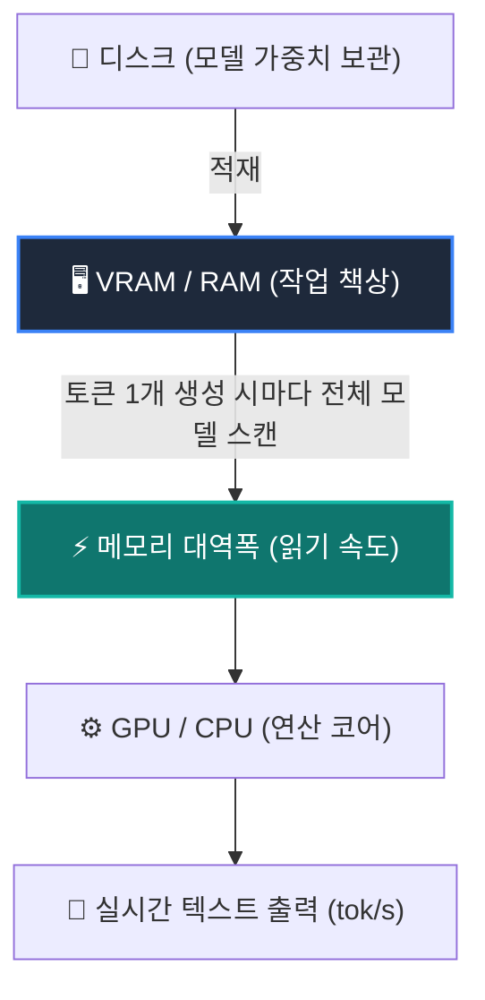

# llmfit 로컬 AI 하드웨어 적합도 진단 및 실행 가이드

## 📎 아카이빙 3대 메타데이터
- **원본 출처**: [YouTube Shorts - 내 컴퓨터로 로컬 AI 뭘 돌릴 수 있나, 한 줄로 (llmfit)](https://youtube.com/shorts/yukk2BNk9fE)
- **원본 정보 발행일자**: 2026-08-20
- **내 보관소 등록일자**: 2026-08-21

---

## 💡 핵심 3줄 요약
1. 로컬 LLM의 추론 속도와 구동 가능 여부는 단순 계산량보다 **RAM/VRAM 용량(책상 크기)**과 **메모리 대역폭(책상 읽는 속도)**에 의해 결정된다.
2. 오픈소스 Rust 기반 도구인 `llmfit`은 원클릭으로 CPU, RAM, GPU VRAM, 메모리 대역폭을 측정하고 수천 개 오픈소스 모델의 실행 적합도를 신호등(🟢초록 / 🟡노랑 / 🟠주황 / 🔴빨강)으로 분류해 준다.
3. 내 PC(Ryzen 5600X, RX 6600 8GB VRAM, 32GB RAM) 실측 결과 **3B~8B 모델(Qwen2.5-Coder-3B Q8, DeepSeek-R1-8B Q5_K_M)**이 24~40 tok/s 속도로 완벽히 구동된다.

---

## 📌 핵심 원리 및 작동 메커니즘



### 1. 왜 메모리 대역폭이 병목인가?
- LLM은 글자(토큰) 하나를 생성할 때마다 메모리에 올려둔 모델 전체 가중치를 한 번씩 읽어야 한다.
- 가중치를 읽는 속도가 곧 토큰 생성 속도(Tokens/s)를 결정한다.
- 복잡한 분기 계산은 CPU가 유리하지만, 수천 개의 단순 행렬 곱셈 반복은 GPU가 압도적으로 빠르다.

### 2. llmfit의 4차원 평가 지표
- **Fit (적합도)**: VRAM 및 시스템 RAM에 컨텍스트 윈도우를 포함해 완전히 적재 가능한지 판별.
- **Speed (예상 속도)**: 실측된 메모리 대역폭과 모델 크기를 대조해 초당 토큰 수(tok/s) 계산.
- **Quality (품질)**: 과도한 양자화(Q2 등)로 인한 지능 손실을 방지하고 Q4_K_M, Q5_K_M, Q8_0 중 최적 타협점 제시.
- **Context Length**: VRAM 한계에 맞춰 KV 캐시가 감당할 수 있는 최대 컨텍스트 길이 계산.

---

## 🖥️ 내 PC 실측 하드웨어 진단 결과 (`llmfit` 실행)

### 시스템 제원 진단
- **CPU**: AMD Ryzen 5 5600X 6-Core Processor (12 Threads)
- **시스템 RAM**: 31.92 GB (DDR4 3200MHz, 실측 대역폭 ~51.2 GB/s)
- **가용 RAM**: 21.6 GB
- **GPU**: AMD Radeon RX 6600 (8.00 GB VRAM, Vulkan 백엔드)

### 모델별 적합도 및 속도 분석표
| 상태 | 모델명 | 파라미터 | 권장 양자화 | 구동 모드 | 점유율 | 예상 속도 (tok/s) | 적합 용도 |
| :--- | :--- | :--- | :--- | :--- | :--- | :--- | :--- |
| 🟢 **Perfect** | `Qwen2.5-Coder-3B-Instruct` | 3.1B | **Q8_0** | GPU (Vulkan) | 50.3% | **39.9 tok/s** | 초고속 로컬 코딩/인라인 자동완성 |
| 🟢 **Perfect** | `Qwen3.8-4B-Distilled` | 3.1B | **Q8_0** | GPU (Vulkan) | 61.3% | **39.4 tok/s** | 범용 가벼운 대화 및 텍스트 정리 |
| 🟢 **Perfect** | `DeepSeek-R1-0528-Qwen3-8B` | 8.2B | **Q5_K_M** | GPU (Vulkan) | 89.9% | **24.1 tok/s** | 로컬 심층 논리/추론 전용 |
| 🟢 **Perfect** | `Qwen3.5-9B-Reasoning-Distilled` | 8.2B | **Q5_K_M** | GPU (Vulkan) | 88.5% | **24.0 tok/s** | 한국어 및 고난도 지시 수행 |
| 🟡 **Good** | `DeepSeek-R1-Distill-Qwen-14B` | 12.6B | **Q2_K** | GPU (Vulkan) | 83.3% | **39.1 tok/s** | 14B 초저용량 양자화 (지능 저하 감수) |
| 🟠 **Marginal** | `Gemma-4-12B-it` | 12.8B | **Q2_K** | GPU (Vulkan) | 84.1% | **38.6 tok/s** | 컨텍스트 7k 제한 필요 |

---

## 🛠️ AI(Antigravity) 및 사용자 워크플로우 적용점

### 1. 로컬 모델 사전 적합도 자동 검증 체계
- 사용자가 새로운 로컬 모델 테스트를 요청할 때, 무작정 대용량 GGUF를 다운로드하지 않고 `llmfit fit --json`을 통해 VRAM 8GB 내 완전 상주(🟢 Perfect) 여부를 먼저 검증.
- 다운로드 중 VRAM 초과로 인한 CPU 오프로딩(속도 급감 2~3 tok/s) 사전 차단.

### 2. 하이브리드 AI 라우팅 픽스
- **클라우드 메인 (일일 드라이버)**: Gemini 3.7 Flash (고속 코딩, 옵시디언 정리, 대용량 분석)
- **로컬 1순위 (코딩 보조)**: `qwen2.5-coder:7b` 또는 `Qwen2.5-Coder-3B (Q8_0)` (오프라인, 초당 40토큰 고속 완성)
- **로컬 2순위 (심층 추론)**: `deepseek-r1:8b (Q5_K_M)` (오프라인 논리 검증)

### 3. 단축 실행 및 관리
- 바이너리 위치: `C:\Users\ildoc\.gemini\antigravity\scratch\bin\llmfit-v1.1.10-x86_64-pc-windows-msvc\llmfit.exe`
- 시스템 재진단 명령어:
  ```powershell
  & "C:\Users\ildoc\.gemini\antigravity\scratch\bin\llmfit-v1.1.10-x86_64-pc-windows-msvc\llmfit.exe" fit -n 10
  ```
