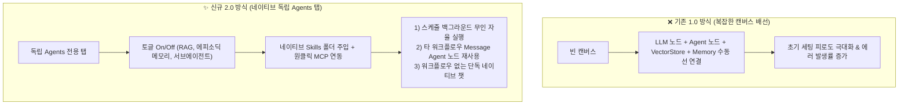

---
title: "n8n 네이티브 AI 에이전트 2.0 업그레이드 — 독립 Agents 탭, 네이티브 스킬 및 원클릭 MCP 연동 완전 분석"
created: 2026-08-22
updated: 2026-08-22
tags:
  - n8n
  - AI에이전트
  - 노코드에이전트
  - 워크플로우자동화
  - MCP
  - AgentSkills
  - 셀프호스팅
---

# 🎬 Agents just got an upgrade — n8n 네이티브 AI 에이전트 2.0 완전 분석

> **📎 정보 아카이빙 3대 필수 메타데이터**
> - **원본 출처**: [n8n 공식 유튜브 영상 (z0FLzGsNSJA)](https://youtu.be/z0FLzGsNSJA)
> - **원본 정보 발행일자**: 2026-08-19
> - **내 보관소 등록일자**: 2026-08-22

---

## 💡 핵심 3줄 요약

1. **복잡한 노드 배선(Wiring)에서 '독립 Agents 탭'으로 진화**: 빈 캔버스에 수십 개 노드를 연결하던 기존 방식 대신, 워크플로우 옆에 **독립된 `Agents` 탭**이 신설되어 채팅 연결·RAG·에피소딕 메모리·서브에이전트를 토글 스위치 하나로 즉시 세팅합니다.
2. **네이티브 스킬(Skills) 및 원클릭 MCP 라이브러리 탑재**: 폴더 단위 참조 문서와 스킬팩을 네이티브로 주입할 수 있으며, **무료 셀프호스팅(Self-Hosted)** 환경에서도 외부 도구와 원클릭으로 통신하는 MCP(Model Context Protocol) 생태계가 정식 내장되었습니다.
3. **스케줄 기반 무인 자율 목표 실행 & 재사용성 극대화**: 스케줄러로 에이전트에게 특정 목표(Objective)를 부여하면 백그라운드에서 자율 완결하며, 제작된 완성형 에이전트는 타 워크플로우의 `Message Agent` 노드로 다중 재사용되거나 단독 챗봇으로 구동됩니다.

---

## 📌 n8n AI 에이전트 2.0 아키텍처 변화 비교

| 비교 항목 | 기존 n8n 워크플로우 방식 (1.0) | 신규 n8n 네이티브 에이전트 (2.0) |
| :--- | :--- | :--- |
| **구축 방식** | 캔버스에 개별 노드 배치 및 복잡한 선 연결 | **독립된 Agents 탭에서 토글 기반 원스톱 설정** |
| **스킬/문서 주입** | 복잡한 RAG 벡터 스토어 파이프라인 수동 조립 | **폴더 단위 레퍼런스 문서 및 스킬 네이티브 업로드** |
| **외부 도구 연동** | 개별 HTTP Request 및 도구 노드 수동 설정 | **공식 MCP(Model Context Protocol) 라이브러리 1클릭 연동** |
| **실행 방식** | 결정론적 워크플로우 트리거 | **스케줄 기반 자율 목표(Objective) 추론 및 무인 완결** |
| **재사용성** | 워크플로우 내부에 종속 | **`Message Agent` 노드로 여러 워크플로우에 모듈형 재사용** |
| **지원 플랜** | 전 플랜 지원 | **클라우드 및 무료 셀프호스팅(Self-Hosted) 프리뷰 동시 지원** |

---

## 🛠️ 주요 핵심 기능 4대 축

### 1. 토글형 원스톱 에이전트 하네스
- RAG, 단기/장기 에피소딕 메모리(Episodic Memory), 서브 에이전트(Sub-Agents) 분기를 복잡한 노드 연결 없이 **합리적 기본값(Sensible Defaults)**이 적용된 토글 스위치로 설정.
- 세팅 즉시 바로 사용 가능한 상태(Out-of-the-Box)로 제공되어 진입 장벽 제거.

### 2. 네이티브 스킬(Skills) & 레퍼런스 폴더
- Antigravity의 `SKILL.md` 체계와 마찬가지로, 에이전트가 참조할 폴더와 문서 규칙을 그대로 주입하여 전문 작업 수행.

### 3. 셀프호스팅 1-Click MCP (Model Context Protocol)
- 자체 서버(Docker 등)로 n8n을 돌리는 셀프호스팅 환경에서도 슬랙, 노션, DB, 웹 검색 등 다양한 외부 시스템을 MCP 프로토콜을 통해 단 1번의 클릭으로 완벽 연동.

### 4. 스케줄 기반 무인 백그라운드 목표 완결 (Autonomous Background Run)
- 단순 "데이터가 오면 실행"을 넘어, 특정 시간(Cron)에 에이전트에게 "최신 트렌드를 조사해서 DB에 요약 저장하라"는 식의 **비결정적 목표(Objective)**를 던져두면 스스로 모든 도구를 동원해 백그라운드에서 자율 실행.

---

## 🛠️ AI(나)에게 적용할 점 (Antigravity 시스템 & 자동화 연계)

1. **Antigravity ↔ n8n Self-Hosted MCP 연동 파이프라인 구축**  
   - 로컬 Docker로 n8n을 구동할 경우, Antigravity가 n8n의 네이티브 에이전트 및 MCP 라이브러리를 호출하여 복잡한 외부 SaaS(이메일, 노션, 슬랙 등) 트리거 작업을 완벽 자동화합니다.
2. **에이전트 스킬(`SKILL.md`)의 범용 포터블 설계 유지**  
   - 우리 시스템에 구축된 44개 전역 스킬팩(`config/skills/`)을 n8n 네이티브 에이전트의 레퍼런스 폴더에도 100% 동일하게 이식할 수 있도록 마크다운 표준을 철저히 유지합니다.
3. **스케줄 기반 백그라운드 자율 목표 하네스(`schedule` 도구) 강화**  
   - n8n 2.0의 '목표 기반 백그라운드 자율 완결' 패러다임을 Antigravity 스케줄링 프로토콜에도 적극 반영하여 무인 배치 자동화를 고도화합니다.
