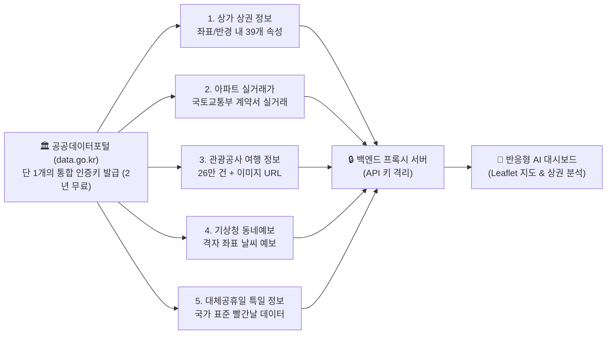

---
title: "정부 공공데이터 11,915개 무료 API 연동 및 AI 상권분석 실전 웹앱 구축 완전 가이드"
created: 2026-08-22
updated: 2026-08-22
tags:
  - 공공데이터
  - OpenAPI
  - data.go.kr
  - AI웹앱
  - 상권분석
  - 바이브코딩
  - 실거래가
  - 방구석컴퍼니
---

# 🎬 정부 공공데이터 11,915개 무료 API 연동 및 AI 상권분석 실전 웹앱 구축 완전 가이드

> **📎 정보 아카이빙 3대 필수 메타데이터**
> - **원본 출처**: [방구석컴퍼니 유튜브 영상 (Ifq0Yt7Thzc)](https://youtu.be/Ifq0Yt7Thzc)
> - **원본 정보 발행일자**: 2026-08-18
> - **내 보관소 등록일자**: 2026-08-22

---

## 💡 핵심 3줄 요약

1. **AI의 로컬 팩트 환각 해결**: LLM은 "강남역 500m 내 카페 개수" 같은 실시간 통계를 학습한 적이 없어 틀리지만, 정부가 무료 개방한 공공데이터 Open API를 물려주면 **5.5초 만에 6,615개 상가 팩트를 100% 정확하게 인출**합니다.
2. **실무 즉시 활용 5대 무료 API 스택**: ① 상가 상권 정보(업종·좌표·층호수 등 39개 속성), ② 아파트 실거래가(부동산 앱 원본), ③ 한국관광공사 여행 정보(26만 건 + 이미지 URL), ④ 기상청 날씨 격자 예보, ⑤ 대체공휴일 자동 계산 특일 정보가 단 1개의 무료 키로 연동됩니다.
3. **5줄 바이브 코딩 & 백엔드 시크릿 보안 표준**: 프론트엔드에 API 키를 절대 노출하지 않는 백엔드 프록시 구조와 무료 오픈소스 지도(Leaflet)를 결합하여, 코딩 0줄로 실시간 반경 스캔 및 상권 시각화 대시보드를 구축합니다.

---

## 📌 5대 핵심 공공데이터 API 상세 스펙



| API 명칭 | 주요 제공 데이터 | 실전 비즈니스 활용처 |
| :--- | :--- | :--- |
| **상가 상권 정보** | 반경/좌표 내 상호명, 세부 업종, 위경도, 층/호수 (39개 속성) | 창업 입지 분석, 동종 업계 경쟁 밀도 조사, 이사 동네 인프라 파악 |
| **아파트 실거래가** | 전용면적, 층수, 실제 계약 체결 금액 (호가 아님) | 부동산 실거래가 시세 추적, 프롭테크(PropTech) 서비스 구축 |
| **한국관광공사 여행** | 관광지, 숙박, 맛집, 축제 일정 + **사진 이미지 주소** | 주말 여행 추천 큐레이션 앱 (이미지 크롤링/구매 비용 $0) |
| **기상청 동네예보** | 단기/중기 기상 예보 (격자 좌표계 변환 필요) | 날씨 기반 외출/의류/배달 수요 예측 서비스 |
| **특일(공휴일) 정보**| 설/추석 연휴 및 3·1절 등 대체공휴일 자동 계산 | 캘린더 서비스, 휴일 근무 자동 계산, 마케팅 프로모션 스케줄러 |

---

## 🛠️ 실전 5줄 바이브 코딩 프롬프트 & 보안 아키텍처

### 1. Claude Code / Antigravity 지시 프롬프트 (검증 완료)
```text
공공 데이터 포털 상가 상권 정보 API를 써서 웹을 하나 만들어 줘.
1. 주소를 넣거나 지도를 클릭하면 그 지점 반경 500m 안에 있는 가게를 불러와서 지도의 점으로 표시해 줘.
2. 업종별로 몇 개인지도 세서 옆에 차트와 리스트로 보여줘.
3. 인증키는 화면(브라우저) 쪽 코드에 넣으면 안 되니까 로컬 백엔드 서버를 하나 두고 거기서만 키를 쓰게 해 줘.
4. 지도는 별도 유료 키가 필요 없는 오픈소스 지도(Leaflet/OpenStreetMap)로 해 줘.
```

### 2. 필수 보안 & 휴먼 에러 방어 3원칙
1. **시크릿 키 백엔드 은닉 (`GEMINI.md` 보안 9대 원칙 제4조)**: 브라우저 JavaScript 코드에 API 키를 박아두면 외부 무단 도용 위험 발생. 반드시 `Node/FastAPI` 프록시 서버에서만 키를 주입.
2. **페이징 루프 데이터 정합성 검증**: 공공데이터 API는 통상 1회 호출 시 1,000건 제한이 있으므로, `TotalCount`와 실제 파싱된 `Sum(Items)`이 일치하는지 자동 검증 루프 필수.
3. **인코딩 vs 디코딩 키 분기**: 백엔드 HTTP 클라이언트가 자동으로 URL 인코딩을 수행하면 **디코딩(Decoding) 키**를 사용해야 401 인증 에러를 방지.

---

## 📊 강남역 vs 방배역 상권 비교 분석 인사이트

- **강남역 500m (6,615개 업소)**: 
  - 경영 컨설팅(842개), 광고 대행(433개), 세무사(344개), 성형외과(139개) ➔ **오피스/전문직/의료 중심 상권**.
  - 생활 밀착형 업종 비율 < 5%.
- **방배역 500m (1,300개 업소, 강남역의 1/5)**:
  - 부동산 중개(66개), 경영 컨설팅(61개), 백반/식당(58개), 미용실(55개), 카페(53개) ➔ **주거 생활 밀착형 상권**.
  - 생활 밀착형 업종 비율 > 10% (강남의 2배 이상).

---

## 🛠️ AI(나)에게 적용할 점 (Antigravity 시스템 & 서비스 개발)

1. **에이전트 툴셋에 공공데이터 MCP / API 파이프라인 탑재**  
   - 사용자가 부동산, 상권, 날씨, 공휴일 조회를 요청할 때 LLM의 추측성 답변을 차단하고, 공공데이터포털 REST API를 호출하여 **100% 팩트 기반 정량 데이터**를 즉시 보고합니다.
2. **풀스택 웹앱 개발 시 무료 OpenAPI + 백엔드 프록시 표준 템플릿화**  
   - 유료 지도(카카오/네이버 맵)나 유료 데이터 API 대신 `OpenStreetMap(Leaflet) + 공공데이터 Open API + Supabase/FastAPI` 조합을 $0 풀스택 표준 스택으로 자동 적용합니다.
3. **페이징 자가 치유(Self-Healing Pagination) 하네스 강제**  
   - 대량 데이터 인출 시 1,000건 단위 페이징과 정합성 합계 검증 루프를 자동으로 코드에 삽입하여 누락 없는 완전한 분석 리포트를 생성합니다.
