# 🚀 구글 7대 무료 AI 생태계 x AI 비즈니스 전략 전환 — 4대 실전 통합 적용점

> **📎 교차 분석 대상**
> 1. [찍봇 (@ZZIKBOT) - 안 쓰면 손해 보는 구글의 7가지 무료 AI](https://youtu.be/eLSsDD4gTDo)
> 2. [티타임즈TV (이현 기자) - 대답할 때마다 돈 나가는 오픈AI·앤스로픽 vs 돈 들어오는 구글](https://youtu.be/vd__njvqkqc)
> - **보관소 등록일자**: 2026-08-24

---

## 💡 한 줄 결론
**"벤치마크 1등 모델에 매달리지 않고, 구글이 깔아둔 '초저원가 Flash 모델 + 무료 도구 체인'을 레버리지하여 비용 0원의 무인 생산·수익화 파이프라인을 구축한다."**

---

## 🧭 4대 실전 통합 적용 로드맵

```mermaid
flowchart TD
    subgraph S1["1. 인프라 & 일일 드라이버 최적화"]
        A["구글의 Flash 초저원가 전략"] --> B["Gemini 3.7 Flash + AI Studio 무료 API 우선"]
        B --> C["데스크톱 & Dell 노트북 배터리/비용 0원 풀가동"]
    end

    subgraph S2["2. 0원 풀스택 바이브 코딩 파이프라인"]
        D["Google Stitch 2.0 (웹 UI 기획)"] --> E["DESIGN.md 디자인 시스템 추출"]
        E --> F["Google Antigravity (코딩/백엔드/배포)"]
    end

    subgraph S3["3. 무환각 세컨드브레인 지식 자산화"]
        G["옵시디언 C:전일도 + PDF"] --> H["Gemini Notebook & chunkless-rag"]
        H --> I["출처 기반 무환각 의사결정 + 오디오 팟캐스트"]
    end

    subgraph S4["4. 토큰 적자 탈피형 수익화 비즈니스"]
        J["오픈AI식 토큰 비용(-) 구조 회피"] --> K["Google 무료 API + 웹 트래픽/광고(+) 결합"]
        K --> L["유지비 0원 자동화 웹서비스 / 블로그 자산 구축"]
    end
```

---

### 1. 인프라 적용: Gemini Flash & AI Studio 무료 API 일일 드라이버 정착
- **배경 Insight (티타임즈)**: 구글은 1위 모델 벤치마크보다 10억 트래픽을 처리하는 'Flash급 초고속·초저원가 모델'과 '추론 전용 TPU'에 올인하고 있습니다.
- **실전 액션**:
  - 유료 구독이나 무거운 프론티어 모델에 매달리지 않고, **Gemini 3.7 Flash(High)**와 **Google AI Studio 무료 API**를 메인 추론 엔진으로 고정합니다.
  - 서브 노트북(Dell Latitude 7440) 환경에서도 발열과 배터리 소모가 큰 로컬 8B 모델 대신 초경량 클라우드 Flash를 활용하여 어디서나 최고 속도로 작업합니다.

---

### 2. 개발 적용: Stitch ➔ Antigravity 무인 개발 파이프라인 가동
- **배경 Insight (찍봇)**: 스티치(Stitch 2.0)는 피그마를 대체할 수준의 UI/디자인 시스템을 뽑고, 안티그래비티(Antigravity)는 4개 환경에서 이를 프로덕트로 완성합니다.
- **실전 액션**:
  - 웹 서비스나 대시보드 제작 시 피그마 작업 없이 **Stitch 2.0**에서 프롬프트로 반응형 UI를 생성하고 `DESIGN.md`를 추출합니다.
  - 추출된 `DESIGN.md`를 **Antigravity IDE/CLI**에 주입하여 프론트엔드-백엔드 연동, DB(Cloud SQL/Supabase), 원클릭 배포까지 단일 루프로 완결합니다.

---

### 3. 지식 관리 적용: Gemini Notebook + 옵시디언 기반 '무환각 제2의 뇌'
- **배경 Insight (찍봇)**: 제미나이 노트북(Gemini Notebook)은 지정한 소스(Ground Truth) 안에서만 답변하므로 환각이 원천 차단됩니다.
- **실전 액션**:
  - 옵시디언(`C:\전일도`)에 축적된 핵심 노트와 PDF 기술서를 Gemini Notebook 및 로컬 `chunkless-rag`에 마운트합니다.
  - 학습/업무 자료를 이동 중 들을 수 있는 오디오 팟캐스트로 자동 변환하고, 제미나이 사이드 탭에서 내 지식 소스를 호출해 팩트 오류 없는 기획서를 작성합니다.

---

### 4. 비즈니스 BM 적용: '토큰 쓸수록 흑자 나는' 서비스 구조 설계
- **배경 Insight (티타임즈)**: 오픈AI는 사용자가 질문할수록 적자(-)지만, 구글은 AI 답변 옆에 검색 광고를 붙여 토큰을 쓸수록 흑자(+)를 냅니다.
- **실전 액션**:
  - 1인 AI 웹서비스/부업 자동화 구축 시 사용자가 호출할 때마다 고가의 API 비용이 빠져나가는 '토큰 적자형 모델'을 철저히 배제합니다.
  - **Google AI Studio 무료 티어(Gemini Flash)** 기반으로 백엔드를 구동하고, 사용자의 체류 시간과 트래픽을 구글 애드센스 및 콘텐츠 수익으로 치환하는 '구글형 흑자 구조'를 복제합니다.

---

## 🔗 연결된 핵심 노트
- [[Google_7가지_무료_AI_생태계_완전정복_찍봇]]
- [[오픈AI_앤스로픽_vs_구글_AI_전략_전환_및_추론원가_분석]]
- [[Google_Stitch_AI_디자인시스템_및_DESIGN_md_MCP연동_완전분석]]
- [[Google_AntiGravity_멀티에이전트_실전_가동_가이드]]
