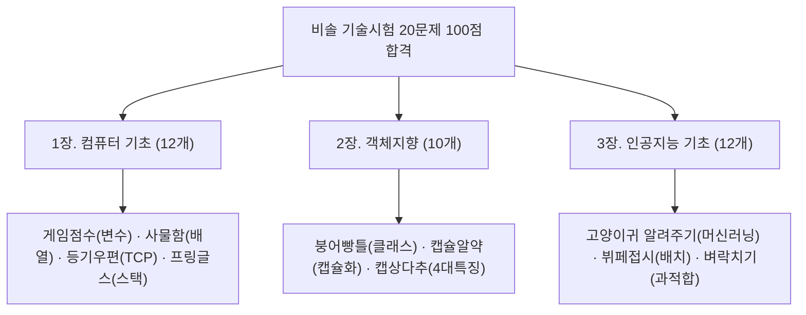

# 🎯 [비솔] Vision AI 선발 기술시험 왕초보 100점 합격노트

> **📌 아카이빙 메타데이터**
> - **시험명**: [비솔] 현장 데이터 기반 Vision AI & 산업분야 Vertical AI 융합 전문가 양성 과정 선발 기술시험
> - **출제 기준**: ㈜비솔 박성수 부장 출제 문항 풀 (총 20문항 / 문항당 5점 / 100점 만점 / 4지선다 객관식)
> - **합격 기준**: **60점 (딱 12문제만 맞히면 합격!)**
> - **정보 확정일자**: `2026-08-14`
> - **내 보관소 등록일자**: `2026-08-14`
> - **PDF 파일 위치**: [[비솔_Vision_AI_선발기술시험_초간단_100점_합격노트.pdf]] (바탕화면 및 본 폴더 저장 완료)

---

## 💡 어려운 영어·전문용어 제로! 일상 비유 34개 출제 족보

---

## 📌 1장. 컴퓨터 & 소프트웨어 기초 (12개 주제)

| 번호 | 출제 주제 | 🏠 일상 생활 비유 | 👉 시험에 나오면 이 글자 찍기! |
| :---: | :--- | :--- | :--- |
| **Q1** | **변수 vs 상수** | **변수**는 게임할 때 계속 바뀌는 **'내 캐릭터 점수'**. **상수**는 태어날 때 정해져서 절대 안 바뀌는 **'내 주민등록번호'**. | **값 바꿀 수 있음 = 변수** **값 절대 못 바꿈 = 상수** |
| **Q2** | **bit vs byte** | **bit**는 스위치 0 또는 1 (컴퓨터 최소 단위 1개). **byte**는 글자 1자를 적기 위해 스위치 8개를 모은 것. | **가장 작은 단위 = bit** **8개 모인 것(글자 1개) = byte** |
| **Q3** | **배열 vs 연결리스트** | **배열**은 번호 붙은 **'사물함'** (7번 칸 바로 열기 빠름). **연결리스트**는 **'보물찾기 쪽지'** (중간에 끼워넣기 쉬움). | **번호로 바로 찾기 빠름 = 배열** **중간에 끼워넣기 쉬움 = 연결리스트** |
| **Q4** | **static vs 일반 변수** | **일반 변수**는 학생들 각자의 **'개인 필통'**. **static 변수**는 교실 앞의 **'칠판'** (모두가 딱 1개 공유). | **각자 따로 가짐 = 일반 변수** **모두가 1개를 공유함 = static** |
| **Q5** | **CPU vs GPU** | **CPU**는 복잡한 수학 문제 푸는 **'천재 교수님 1명'**. **GPU**는 단순 계산을 동시에 해치우는 **'작업자 5,000명'**. | **복잡한 일 하나씩 = CPU** **단순 계산 동시에 우르르 = GPU (AI필수)** |
| **Q6** | **RAM vs 디스크** | **RAM**은 지금 일하는 **'내 책상 위'** (빠르지만 끄면 날아감). **디스크**는 짐을 오래 보관하는 **'창고'** (영구 보관). | **빠르고 끄면 지워짐 = RAM** **영구 저장 = 디스크(SSD)** |
| **Q7** | **CRUD** | 배달앱: 1) 주문서 쓰기(<b>Create</b>), 2) 내역 보기(<b>Read</b>), 3) 주소 바꾸기(<b>Update</b>), 4) 주문 취소(<b>Delete</b>). | **생성=INSERT, 조회=SELECT** **수정=UPDATE, 삭제=DELETE** |
| **Q8** | **TCP vs UDP** | **TCP**는 직접 도장 받는 **'우체국 등기우편'** (안전, 느림). **UDP**는 길에 막 뿌리는 **'전단지'** (잃어버려도 속도가 최고). | **정확·안전 = TCP** **속도 빠름·분실 가능 = UDP** |
| **Q9** | **프로세스 vs 스레드** | **프로세스**는 도로 위의 **'버스 한 대'** (프로그램 덩어리). **스레드**는 버스 안에서 각자 일하는 **'승객들'** (일꾼). | **프로그램 덩어리 = 프로세스** **그 안의 작업 일꾼 = 스레드** |
| **Q10** | **스택 vs 큐 ⭐** | **스택**은 **'프링글스 과자통 / 접시 쌓기'** (맨 위부터 꺼냄). **큐**는 **'놀이공원 줄 서기'** (먼저 온 사람이 먼저 탐). | **나중에 넣은 게 먼저 나옴(LIFO) = 스택** **먼저 온 게 먼저 나옴(FIFO) = 큐** |
| **Q11** | **컴파일러 vs 인터프리터** | **컴파일러**는 소설책 전체를 **'완역본 책으로 출판'** (빠름). **인터프리터**는 옆에서 **'한 줄씩 실시간 통역'** (파이썬). | **한 번에 다 번역 = 컴파일러** **한 줄씩 바로 통역 실행 = 인터프리터** |
| **Q12** | **Call by Value vs Ref** | **Value**는 친구에게 내 노트 **'복사본(종이)'** 주기 (원본 안 바뀜). **Reference**는 내 노트가 든 **'사물함 열쇠'** 주기 (원본도 바뀜). | **복사본이라 원본 불변 = Value** **주소를 줘서 원본도 바뀜 = Reference** |

---

## 🧱 2장. 객체 지향 프로그래밍 (OOP - 10개 주제)

| 번호 | 출제 주제 | 🏠 일상 생활 비유 | 👉 시험에 나오면 이 글자 찍기! |
| :---: | :--- | :--- | :--- |
| **Q1** | **객체지향(OOP)이란?** | 요리 순서대로만 짜지 않고, **'냄비, 가스레인지, 라면'**을 각각 레고 블록(객체)으로 만들어 조립하는 방식. | **데이터+기능을 묶은 '객체' 중심 개발** |
| **Q2** | **클래스 vs 객체** | **클래스**는 붕어빵 찍는 철제 **'붕어빵 틀(설계도)'**. **객체**는 그 틀에서 나온 따끈따끈한 **'실제 붕어빵'**. | **설계도(틀) = 클래스** **만들어진 실제 물건 = 객체(인스턴스)** |
| **Q3** | **캡슐화 (Encapsulation)** | 가루약을 **'알약 캡슐'**에 넣어 보호하듯, 소중한 데이터를 안에 숨기고 정해진 입구로만 안전하게 만지게 함. | **데이터를 숨겨서 보호하고 오입력 방지** |
| **Q4** | **상속 (Inheritance)** | 자식이 부모님 외모를 물려받듯, **부모 프로그램 기능을 그대로 물려받아** 다시 안 짜도 되게 함. | **부모 기능 물려받아 코드 재사용 & 중복 제거** |
| **Q5** | **속성 vs 메서드** | 자동차: **속성**은 '빨간색, 소나타' 같은 **데이터**. **메서드**는 '달리기, 멈추기' 같은 **동작(기능)**. | **정보/데이터 = 속성** **동작/기능 = 메서드** |
| **Q6** | **OOP 4대 특징 ⭐** | 외우기 공식: **'캡·상·다·추'**! 1) 캡슐화, 2) 상속, 3) 다형성(명령마다 다르게 반응), 4) 추상화(핵심만). | **캡슐화 · 상속 · 다형성 · 추상화 4단어 고르기!** |
| **Q7** | **추상클래스 vs 인터페이스** | **추상 클래스**는 집의 **'기둥과 지붕'**은 미리 지어둠. **인터페이스**는 **'계약서'**처럼 규격만 정해줌. | **일부 공통 기능 구현 = 추상 클래스** **기능 이름(규격)만 적어둔 계약서 = 인터페이스** |
| **Q8** | **생성자 (Constructor)** | 아기가 태어나자마자 **'출생신고 하고 이름표'** 달아주듯, 객체가 태어날 때 딱 한 번 자동 실행되는 초기 세팅 함수. | **객체 만들 때 자동 실행되어 초기값 넣는 함수** |
| **Q9** | **절차형 vs 객체지향** | **절차형**은 요리책 **'레시피 순서(1번 물 붓기, 2번 불 켜기)'**. **객체지향**은 **'요리사, 칼, 도마'** 각 부품끼리 협력. | **순서 중심 = 절차형** **객체(부품) 중심 = 객체지향** |
| **Q10** | **객체 간 관계** | 1) 연관(알고 지냄), 2) 집합(따로 존재 가능), 3) 합성(죽으면 같이 끝남), 4) 상속(물려받음). | **연관, 집합, 합성, 상속 중 2가지 고르기** |

---

## 🤖 3장. 인공지능(AI) 기본 지식 (12개 주제)

| 번호 | 출제 주제 | 🏠 일상 생활 비유 | 👉 시험에 나오면 이 글자 찍기! |
| :---: | :--- | :--- | :--- |
| **Q1** | **머신러닝 vs 딥러닝 ⭐** | **머신러닝**은 사람이 '고양이 귀는 뾰족해'라고 **특징을 알려줌**. **딥러닝**은 사진만 주면 **인공신경망이 스스로 특징을 알아냄**. | **사람이 특징 알려줌 = 머신러닝** **컴퓨터가 스스로 특징 알아냄 = 딥러닝** |
| **Q2** | **일반 SW vs AI 차이** | **일반 SW**는 사람이 'A면 B해라'고 **공식을 직접 코딩**. **AI**는 데이터만 주면 **컴퓨터가 스스로 공식을 알아냄**. | **사람이 규칙 직접 작성 = 일반 SW** **데이터로 컴퓨터가 규칙 학습 = AI** |
| **Q3** | **학습 데이터 종류** | 보고 듣는 모든 것: 사진(이미지), 비디오 영상, 사람 목소리(음성), 글자(텍스트), 센서 데이터, 엑셀 표 등. | **이미지, 영상, 음성, 텍스트, 센서 데이터 중 고르기** |
| **Q4** | **머신러닝 3대 공부법 ⭐** | 1) **지도학습**: 문제와 답(라벨) 주기. 2) **비지도학습**: 답 없이 끼리끼리 묶기. 3) **강화학습**: 게임 잘하면 간식(보상) 주기. | **정답 줌 = 지도학습** **정답 없음 = 비지도학습** **보상 받음 = 강화학습** |
| **Q5** | **합성데이터 (Synthetic)** | 실제 공장 화재 사진은 구하기 너무 위험하므로, **3D 게임 그래픽이나 시뮬레이션으로 가짜로 만든 인공 데이터**. | **실제 수집 대신 컴퓨터 시뮬레이션으로 만든 가짜 데이터** |
| **Q6** | **Train / Test 나누는 이유** | 연습문제(Train)로 공부한 뒤, **처음 보는 진짜 수능 시험(Test)**을 쳐봐야 학생의 진짜 실력을 알 수 있기 때문. | **처음 보는 새 문제도 잘 푸는지 실전 검증하기 위해** |
| **Q7** | **Batch Size 나누는 이유** | 뷔페 음식을 100그릇 통째로 먹으면 체하니까(GPU 메모리 터짐), **한 입 크기 접시(배치)로 나눠 먹이는 것**. | **메모리 터짐 방지, GPU 효율·속도 향상** |
| **Q8** | **과적합 (Overfitting) ⭐** | 기출문제 답 번호만 달달 외워서 **연습문제는 100점인데 수능 시험장 가서 폭망하는 학생** 상태. | **학습 데이터만 과하게 외워 새 시험(Test) 점수 폭락** |
| **Q9** | **GPU가 중요한 이유** | 딥러닝은 단순 더하기/곱셈을 수억 번 반복하는데, **GPU는 수천 명의 일꾼이 동시에 계산(병렬 연산)**해서 엄청 빠름. | **단순 계산을 동시에 대량 병렬 처리 (속도 폭증)** |
| **Q10** | **데이터 품질 중요성** | **'쓰레기를 넣으면 쓰레기가 나온다 (GIGO)'**. 오염된 데이터를 먹이면 AI도 엉터리 바보 답을 냄. | **데이터 품질이 곧 AI 성능 결정 (잘못된 데이터 = 바보 AI)** |
| **Q11** | **학습 vs 추론** | **학습**은 학교에서 **'공부하고 공식 외우는 단계'**. **추론**은 시험장에서 **'배운 공식으로 새 문제 정답 맞히는 단계'**. | **공부하고 파라미터 맞춤 = 학습** **완성 모델로 새 데이터 예측 = 추론** |
| **Q12** | **Vision AI 기술 ⭐** | 컴퓨터의 눈: 사진 분류, 물체 찾기(<b>객체 검출</b>), 뼈대 움직임 잡기(<b>자세 추정</b>), 글자 읽기(<b>OCR</b>). | **이미지 분류, 객체 검출, 자세 추정, OCR 중 고르기** |

---

## 🔗 관련 문서 링크
- [[01_AI_시스템_및_도구/Python_AI_초보자_시험대비_핵심교재|Python AI 시험대비 핵심교재]]
- [[01_AI_시스템_및_도구/비솔_Vision_AI_선발기술시험_초간단_100점_합격노트.pdf|초간단 100점 합격노트 PDF 바로보기]]
- [[인덱스]]
