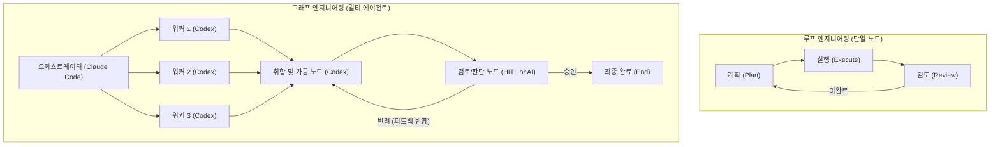
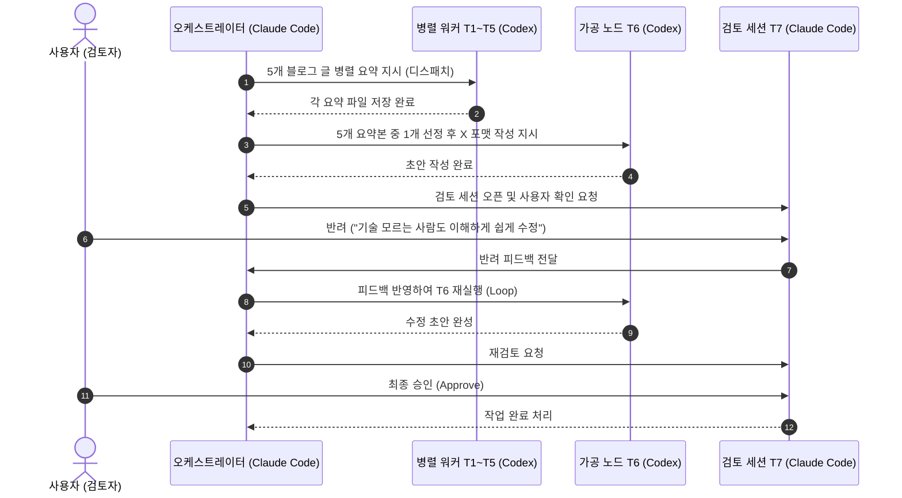

# 🕸️ 오르카(Orca) 기반 그래프 엔지니어링 및 멀티 에이전트 오케스트레이션 가이드

> **출처 및 핵심 영감**: [YouTube 영상 (-pk2umNC-18)](https://youtu.be/-pk2umNC-18)  
> **핵심 주제**: 단일 루프의 한계를 넘는 그래프 엔지니어링(Graph Engineering) 개념과 오르카(Orca) CLI를 활용한 다중 에이전트 병렬 분업 및 검토·반려 루프 실전 구현

---

## 🧭 1. 루프 엔지니어링 vs 그래프 엔지니어링

피터 스타인버거(OpenClaw 개발자)가 화두를 던진 이후 차세대 에이전트 아키텍처의 표준으로 떠오른 개념입니다.



| 구분 | 루프 엔지니어링 (Loop Engineering) | 그래프 엔지니어링 (Graph Engineering) |
| :--- | :--- | :--- |
| **구조** | 단일 에이전트의 자기 완결형 반복 (`/loop`, `/goal`) | 다수의 특화 에이전트(노드) + 상태/라우팅(엣지) |
| **적합한 작업** | 버그 픽스, 단일 스크립트 작성, 테스트 통과 반복 | 데이터 대량 병렬 수집, 가공, 교차 검증, 복합 파이프라인 |
| **확장성** | 한계 명확 (컨텍스트 오염 및 단일 모델 편향) | 워커 병렬화 및 검토자(Reviewer) 독립 분리로 품질 극대화 |

---

## 🛠️ 2. 오르카(Orca) 실전 파이프라인 아키텍처 (7단계)

영상에서 허깅페이스 블로그 글을 수집하여 트위터 포스트로 완성한 실전 흐름입니다.



### 📋 단계별 역할 정의
1. **T1 ~ T5 (병렬 수집 노드)**: 5개의 독립된 코덱스(Codex) 세션이 동시에 떠서 각 블로그 글을 비동기 병렬 요약
2. **T6 (취합 및 변환 노드)**: 수집된 5개 파일을 읽고 대중성이 높은 주제를 골라 X(트위터) 업로드 양식으로 재가공
3. **T7 (검토 및 분기 노드)**: 
   * 사람이 직접 개입(Human-in-the-loop)하여 승인/반려 결정
   * 반려 시 피드백과 함께 T6로 되돌아가 재수정(Loop)
   * 프롬프트 설정에 따라 다른 AI 에이전트에게 검토를 100% 전임시키는 완전 무인화도 가능

---

## 💻 3. 오르카(Orca) 오케스트레이션 핵심 커맨드

* **스킬 확인 및 로드**:
  ```bash
  orca skills get orchestration
  ```
* **프롬프트 명령 패턴 예시**:
  ```text
  /orchestration
  1. 허깅페이스 최신 글 5개를 가져와서 각각 코덱스 세션(T1~T5)에 병렬 요약 지시해.
  2. 완료되면 새 코덱스 세션(T6)을 띄워 가장 흥미로운 주제 1개를 골라 트위터 포스트로 작성해.
  3. T7 단계는 새 클로드 코드 세션으로 열고 내 직접 검토를 받아. 반려되면 피드백 반영해서 T6 재실행해.
  ```

---

## 💡 4. Antigravity 시스템 시사점

* **병렬 분업과 리뷰어 분리의 위력**: 메인 에이전트 혼자 모든 일을 처리하면 컨텍스트가 오염되지만, 워커(Worker)와 리뷰어(Reviewer)를 분리하고 오케스트레이터가 중재하면 결과물의 품질과 속도가 극적으로 올라갑니다.
* **현재 워크스페이스와의 연계**: 사용자님 시스템에 구축된 `ORCA v0.1` 및 `Git Worktree` 병렬 환경과 완벽히 부합하며, 복합 작업 시 적극 활용할 수 있습니다.
