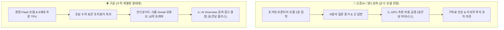
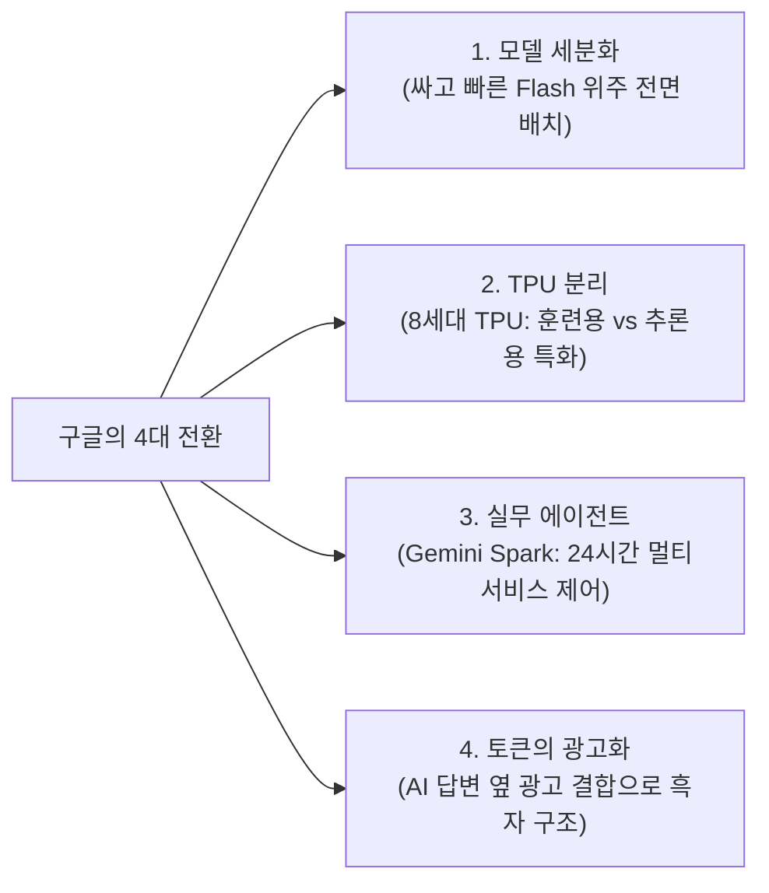

# 🎬 대답할 때마다 돈 나가는 오픈AI·앤스로픽 vs 돈 들어오는 구글 — AI 패러다임 전환 완전분석

> **📎 정보 아카이빙 3대 필수 메타데이터**
> - **원본 출처**: [티타임즈TV (이현 기자) - 대답할 때마다 돈 나가는 오픈AI · 앤스로픽 돈 들어오는 구글](https://youtu.be/vd__njvqkqc)
> - **원본 정보 발행일자**: 2026-08-22
> - **내 보관소 등록일자**: 2026-08-24

---

## 💡 핵심 3줄 요약

1. **'가장 똑똑한 모델'에서 '가장 싸고 일 잘하는 AI'로 룰 전환**: 구글이 LLM 벤치마크 1위 경쟁에서 밀려난 것이 아니라, 1위 유효기간이 수 주 단위로 짧아진 치킨게임을 벗어나 **추론 원가(COGS) 절감과 대규모 실무 에이전트 제품화**로 전략 노선을 전면 수정했습니다.
2. **비즈니스 구조의 본질적 차이 (답변할수록 적자 vs 흑자)**: 오픈AI와 앤스로픽은 사용자가 길게 질문할수록 컴퓨팅 비용(-)만 나가지만, 구글은 월간 10억 사용자 트래픽과 AI Overview 검색 답변에 광고(+)를 결합해 토큰을 쓸수록 수익이 발생하는 독점적 흑자 구조를 구축했습니다.
3. **연구(Science)에서 상용 제품(Product)으로 조직 흡수**: 제프 딘의 창업 퇴사, 데미스 허사비스의 일선 후퇴 및 신약 랩 집중, 상업화 총괄 카북추올루(최고 AI 아키텍트)의 직속 지휘 체계로 전환하며 딥마인드가 구글 본체 실무 제품 조직으로 완전 통합되었습니다.

---

## ⚖️ AI 진영별 비즈니스 모델 및 비용 구조 비교

---

## 🔍 구글의 3대 위기 신호 vs 4대 전략적 행동

### 1. 표면적 위기 신호 (왜 밀린다는 이야기가 나오는가?)
- **코딩 AI 시장 점유율 하락**:
  - VC 지출 조사: 앤스로픽(Claude) 42%, 오픈AI 21%, 구글은 하위권.
  - 오픈라우터 실사용 순위에서 제미나이 계열이 10위권 밖으로 밀림.
  - 코딩 능력은 곧 문제를 쪼개고 자가 수정하는 '에이전트 추론 능력'의 척도이므로 향후 AI 비서 주도권 상실 우려 존재.
- **플래그십 거대 모델(Pro) 출시 지연**: 5월 I/O에서 예고한 고성능 모델 대신 소형·고속 플래시(Flash) 모델 위주 출시.
- **핵심 브레인 유출 & 수뇌부 교체**:
  - 노암 샤지어 ➔ 오픈AI, 존 점퍼(알파폴드 노벨상 수상자) ➔ 앤스로픽 이직.
  - 제프 딘(27년 근속, 텐서플로우/검색 인프라 설계자) 퇴사 ➔ 과학 연구 자동화 스타트업(디스커버리 루프) 창업.
  - 데미스 허사비스 딥마인드 CEO ➔ 구글 딥마인드 회장/알파벳 최고과학자로 승진(운영 일선에서 물러나 신약 개발 집중).
  - 상업화 전문가 코라이 카북추올루(최고 AI 아키텍트)가 피차이에게 직속 보고하며 딥마인드가 구글 본체에 흡수.

---

### 2. 구글의 4대 실질적 전략 행동 (게임의 규칙 변경)

1. **거대 모델 대신 세분화된 초경량 Flash 모델 배치**:
   - 직전 최상위 모델(3.1 Pro)을 능가하면서 속도는 4배 빠르고 단가는 극도로 저렴한 3.5/3.7 Flash를 전면에 배치.
   - 모든 작업에 가장 저렴한 모델을 동적으로 붙이는 라우팅 전략.
2. **8세대 TPU의 훈련/추론 하드웨어 분리**:
   - 학습용과 추론용 칩을 물리적으로 분리하여 앞으로의 승부처가 '추론 단가 낮추기'임을 명확화.
3. **24시간 워크스페이스 에이전트 제품화 (Gemini Spark)**:
   - 단순 챗봇을 넘어 지메일, 구글 드라이브, 캘린더, 유튜브, 크롬을 넘나들며 긴 작업을 처리하는 실무 에이전트 집중.
4. **AI 토큰과 검색 광고의 결합**:
   - AI Overview 답변 옆에 문맥 맞춤형 광고 노출 (구매 의향 키워드 29% 이상, 금융/보험 등 고단가 키워드는 50% 이상 광고 부착).
   - 오픈AI/앤스로픽은 답변이 길어질수록 적자폭이 커지지만, 구글은 답변이 정교할수록 광고 지면이 늘어나는 구조.

---

## ⚖️ 팽팽한 양론 분석

| 구분 | 🟢 긍정론 (전략적 승부수) | 🔴 비판론 (구조적 위기론) |
| :--- | :--- | :--- |
| **판단 기준** | 사용자는 벤치마크 1점보다 "실제 일 처리가 되는지, 비용이 얼마인지"만 봄 | 코딩 AI에서 밀리면 차세대 에이전트 개발자 유통망 전체를 경쟁사에 헌납 |
| **원가 & 인프라** | 10억 트래픽 + 크롬·안드로이드 + 자체 TPU 수직계열화로 타사가 흉내 낼 수 없는 원가 우위 | 원가 우위는 성능이 비슷할 때만 무기이며, 격차가 벌어지면 단순 '저가형 모델'로 전락 |
| **인재 & 생태계** | 연구 과학 중심에서 시장 제품 중심 실전 조직으로 체질 개선 완료 | 2등 모델 기업에는 세계 최고 수준의 AI 연구자가 오지 않는 두뇌 유출 악순환 |

---

## 📌 주요 타임라인 포인트

| 타임라인 | 주요 내용 |
| :--- | :--- |
| **00:00** | 인트로: AI 순위 상위권에서 사라진 제미나이, 구글의 진짜 속내는? |
| **00:20** | 코딩 AI 지출 및 오픈라우터 점유율 급락 현황 (앤스로픽 42% vs 구글 하위권) |
| **01:23** | 내부 취재: 최상위 Pro 모델 연기, 코딩 방향 전환 실기, 핵심 인력 유출 |
| **02:35** | 대형 인사 개편: 제프 딘 퇴사, 허사비스 일선 후퇴, 제품 총괄 카북추올루 부상 |
| **03:57** | 체급의 차이: 월 10억 사용자 및 분당 220억 토큰을 감당해야 하는 구글의 원가 딜레마 |
| **05:17** | 구글의 4대 실질적 전략 전환 (Flash 모델화, TPU 분리, Gemini Spark, 토큰 광고화) |
| **06:40** | 효과적 전략(가성비·인프라 우위) vs 위기론(코딩·연구인재 유출) 팽팽한 논쟁 |
| **07:33** | 결론: '가장 똑똑한 자'에서 '가장 싸게 10억 명에게 제공하는 자'로 바뀐 왕자의 기준 |

---

## 🔗 관련 노트
- [[Google_7가지_무료_AI_생태계_완전정복_찍봇]]
- [[DeepSeek_V4_Pro_무료광고모델_비용분석_및_사일런트_폴백_검증]]
- [[Grok_4.6_초가성비_성능분석_및_요금_한국원화_환산_가이드]]
- [[Google_AntiGravity_멀티에이전트_실전_가동_가이드]]
