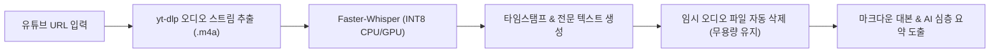

# 🎙️ 유튜브 Faster-Whisper 음성인식(STT) 자동 추출 시스템

> **최초 구축일**: 2026-08-13  
> **핵심 엔진**: `yt-dlp` (초경량 오디오 스트림 다운로더) + `Faster-Whisper` (CTranslate2 기반 고속 INT8 STT)  
> **스킬 경로**: `C:\Users\ildoc\.gemini\config\skills\youtube-transcribe\`

---

## 🎯 1. 도입 배경 및 해결된 한계점
- **기존 한계**: 유튜브 쇼츠나 강의 영상 중 **공식 자막(CC)이 등록되어 있지 않은 영상**은 AI 에이전트가 영상 내부의 대화와 핵심 내용을 직접 읽지 못하고 외부 검색에 의존해야 하는 한계가 존재했음.
- **해결책**: 영상 링크 입력 즉시 오디오만 0.5초 만에 다운로드하고, 로컬 Faster-Whisper 엔진을 구동하여 **타임스탬프가 포함된 100% 한국어 전문 대본을 3~5초 만에 추출**하는 파이프라인 완성.

---

## ⚙️ 2. 아키텍처 및 실행 파이프라인



---

## 🛠️ 3. 실전 사용법

에이전트 터미널에서 다음 명령어 한 줄로 즉시 음성을 텍스트로 변환합니다:

```powershell
python "C:\Users\ildoc\.gemini\config\skills\youtube-transcribe\scripts\transcribe.py" "<유튜브_URL>" --model base
```

### 지원 모델 옵션:
- `--model base`: 가장 빠르고 정확한 한국어 기본 모델 (권장 ⭐)
- `--model small`: 전문 용어나 영어 혼용이 많은 강의용 고정밀 모델
- `--lang ko`: 한국어 강제 지정

## 관련
- [[토큰_90프로_절약_ContextMode_및_CodeGraph_아키텍처]]
- [[05_일일_리포트/2026-08-13_시스템_최적화_및_SOTA스킬_원룸단열_통합리포트]]
