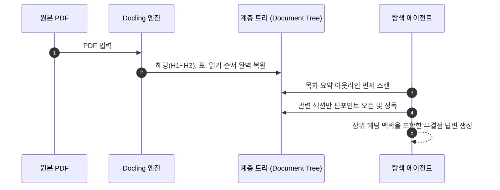

# 🌲 청크리스 RAG (Chunkless RAG) 및 Docling 트리 탐색 가이드

> **출처 및 핵심 영감**: [YouTube 영상 (vRZNJWw78BQ)](https://youtu.be/vRZNJWw78BQ)  
> **핵심 주제**: 텍스트를 무작정 조각내는 기존 벡터 RAG의 한계를 극복하고, 문서 고유의 목차·헤딩 계층 구조(Tree)를 보존하여 에이전트가 사람처럼 탐색하는 **청크리스 RAG(Chunkless RAG)** 및 **Docling** 실전 아키텍처

---

## 💥 1. 기존 RAG(청킹)의 치명적 한계

200페이지 분량의 사업보고서나 기술 매뉴얼을 기존 RAG로 처리하면 심각한 구조 파괴가 일어납니다.

### ❌ 기존 방식의 문제점
* **문맥 단절**: 헤딩(제목)과 그 아래 본문이 서로 다른 청크로 쪼개져 소속 정보를 잃어버림
* **표(Table) 파괴**: 표의 행·열 구조와 설명 문장이 잘려나가 의미 해석 불가
* **다중 섹션 횡단 실패**: 1장에서 정의된 정책과 5장의 예외 조항을 연결해서 답해야 할 때, 단순 유사도 매칭은 두 조각의 관계를 파악하지 못함

---

## 🗺️ 2. 청크리스 RAG: 사람은 문서를 어떻게 읽는가?

사람은 200페이지 문서를 처음부터 끝까지 다 읽지도 않고, 찢어서 무작위로 뽑아 읽지도 않습니다.

1. **목차(Outline) 확인**: 전체 구조 지도를 보고 정답이 있을 법한 대단원/소단원을 파악
2. **해당 섹션으로 직행**: 좁혀진 챕터를 펼쳐 헤딩과 본문의 맥락을 유지한 채 정독
3. **각주 및 참조 추적**: 필요하면 다른 챕터로 건너갔다가 다시 돌아오는 탐색 수행

> **청크리스 RAG의 핵심**: 문서를 납작하게 으깨지 않고 **트리(Tree) 구조를 보존한 뒤 에이전트에게 지도를 쥐여주고 스스로 찾아가게 만드는 방식**입니다.

---

## 🛠️ 3. 핵심 도구: Docling (IBM 오픈소스)

PDF는 본래 인쇄용 포맷이라 텍스트의 상하 관계나 표 구조 정보가 완전히 묻혀 있습니다. 이를 해결하는 핵심 엔진이 **Docling**입니다.

* **Docling의 역할**: 비정형 PDF를 읽어 제목, 단락, 표, 캡션 간의 위계 질서를 완벽한 트리 객체로 재구성
* **Docling Agent**: 복원된 트리를 기반으로 요약, 특정 필드 추출, 계층 탐색 Q&A를 수행

---

## ⚖️ 4. 기존 RAG vs 청크리스 RAG 실전 비교 및 하이브리드 전략

| 비교 항목 | 기존 플랫 RAG (Chunk-based) | 청크리스 RAG (Chunkless / Docling) |
| :--- | :--- | :--- |
| **적합한 환경** | 수만~수백만 개 문서 대상 대규모 검색 | 수십~수백 페이지의 복합 구조 문서 정밀 분석 |
| **검색 방식** | 벡터 유사도 매칭 (단일 조회) | 에이전트 트리 항해 (다단계 추론) |
| **속도 / 비용** | 매우 빠르고 저렴함 | 단계별 LLM 호출로 지연시간/비용 다소 발생 |
| **정확도 / 맥락** | 파편화로 인한 오답/환각 위험 | 상하위 헤딩 맥락 완벽 유지로 압도적 정확도 |

### 💡 실무 최적 하이브리드 파이프라인
* **1단계 (광역 탐색)**: 수많은 문서 중 질문과 관련된 문서를 찾을 때는 **기존 벡터 검색**으로 빠르게 1~2개 문서 선별
* **2단계 (정밀 분석)**: 선별된 문서 내부에서 정확한 인과관계를 뽑아낼 때는 **Docling 기반 청크리스 트리 탐색**으로 핀포인트 추출

## 관련
- [[AI_에이전트_및_도구_통합_마스터_가이드]]
