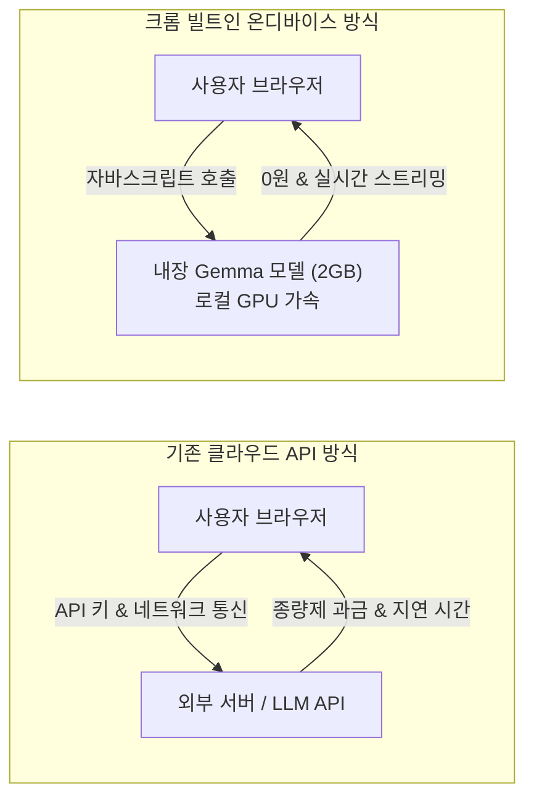

# 🎬 크롬이 자동으로 설치하는 2GB짜리 파일 (코딩애플)

> **📎 정보 아카이빙 3대 필수 메타데이터**
> - **원본 출처**: [코딩애플 유튜브 영상](https://youtu.be/FLJ2JTSPV1Y)
> - **원본 정보 발행일자**: 2026-09-02
> - **내 보관소 등록일자**: 2026-09-03

---

## 💡 핵심 3줄 요약

1. **크롬 빌트인 로컬 AI 탑재**: 크롬 카나리(Chrome Canary)에 자바스크립트로 직접 제어 가능한 2GB 온디바이스 LLM(Gemma 기반)이 추가되어 외부 API 통신 없이 브라우저 단독으로 AI 추론 가능.
2. **서버 비용 0원 & 비즈니스 로직 클라이언트 전가**: 악플 사전 검증, 번역, 이미지 alt 태그 추천, 웹 에이전트 등을 유저 GPU로 직접 연산시켜 서버 API 호출 비용을 획기적으로 절감.
3. **웹 에이전트 오버헤드 해소 & 잠재적 한계**: 네트워크 왕복 없는 초고속 자바스크립트 루프 구동이 가능해진 반면, 클라이언트 변조 취약점과 유저 사전 동의 없는 용량 점유 및 브라우저 파편화 이슈 상존.

---

## 📌 주요 내용 및 타임스탬프 분석

### 1. 크롬 온디바이스 AI의 변화 흐름 [00:00 ~ 01:02]
- 크롬은 과거 보안/악성 사이트 탐지용 4GB 모델에 이어, 웹 개발자가 직접 자바스크립트로 호출할 수 있는 로컬 AI 모델을 브라우저에 내장.
- 초기 Gemini Nano 버전의 한국어 및 성능 한계를 보완해 이번에 한국어를 지원하는 Gemma 기반 모델로 업데이트 진행.
- 별도 파이썬 환경이나 Ollama 설치 없이 브라우저 자체에서 로컬 LLM을 즉시 소환.

### 2. 구동 방식 및 개발자 API (`LanguageModel`) [01:04 ~ 02:10]
- **활성화**: 크롬 카나리 `chrome://flags`에서 온디바이스 AI 플래그 활성화 후 구동.
- **호출 인터페이스**:
  - `LanguageModel.create()`를 호출하면 백그라운드에서 모델(약 2GB) 자동 다운로드 및 GPU 로딩.
  - `.prompt()` 메서드에 텍스트를 전달하여 질의응답 및 스트리밍 답변 수신.
- 외부 API 키 발급이나 종량제 과금 없이 방문자의 로컬 GPU 자원을 활용해 구동되는 구조.

### 3. 실전 웹 개발 활용 패턴 [02:14 ~ 04:38]
- **서버비 절감형 사전 필터링**: 댓글 입력창에서 서버로 전송하기 전, 브라우저 로컬 AI가 악성 여부를 JSON 형식으로 판별하여 악플이면 서버 전송을 선제 차단.
- **멀티모달 확장 (이미지/음성/비디오)**: 브라우저 내 DOM 이미지로부터 alt 속성을 자동 추천해 SEO 최적화 지원. 자극적인 유튜브 썸네일/제목을 중화하는 확장 프로그램 구현 가능.
- **온디바이스 프라이빗 챗봇 & 번역**: 로컬 Translator API와 결합해 서버 비용 및 데이터 유출 걱정 없는 100% 브라우저 기반 다국어 챗봇 제작.

### 4. 웹 에이전트(Web Agent) 가속과 딜레마 [04:40 ~ 05:35]
- **에이전트 오버헤드 제거**: 기존 웹 자동화 에이전트는 [페이지 수집 ➔ LLM API 전송 ➔ 툴 호출 응답 ➔ 브라우저 실행]의 긴 네트워크 지연이 발생했으나, 브라우저 내부에서 JS 루프로 툴을 직접 연결하면 오버헤드 없이 초고속 자율 실행 가능.
- **현실적 한계 및 보안 문제**:
  - 클라이언트 사이드 검증은 자바스크립트 조작으로 위변조가 가능하므로 백엔드 최종 검증을 완전히 대체할 수는 없음.
  - 유저 명시적 동의 없는 2GB 스토리지 점유 및 악의적 사이트의 사용자 하드웨어 자원 무단 사용(크립토재킹 유사 형태) 우려.
  - 파이어폭스 등 비크로미움 진영과의 웹 표준 갈등 및 브라우저 파편화.

---

## 🛠️ AI(나: Antigravity)에게 적용할 점

1. **웹 애플리케이션 개발 시 '온디바이스 하이브리드 폴백' 설계**:
   - 사용자와 Next.js / Vite 웹 서비스를 만들 때 단순 텍스트 분류, 입력값 전처리, 감성 분석, 다국어 번역 기능에 대해 유료 API를 무조건 붙이지 않고 브라우저의 `window.ai` / `LanguageModel` 지원 여부를 먼저 감지하는 Progressive Enhancement 구조 기본 적용.
2. **브라우저 웹 에이전트(WebMCP / Playwright) 오버헤드 다이어트**:
   - 브라우저 DOM 요약이나 단순 인터랙션 판단을 매번 외부 거대 모델로 넘기지 않고, 인페이지 로컬 모델이 1차 필터링을 수행한 뒤 복잡한 다단계 판단만 Gemini 본체로 넘기는 경량 계층형 파이프라인 수립.
3. **프라이버시 완결형 로컬 도구 템플릿화**:
   - 민감한 개인정보나 사적 텍스트를 외부 서버로 1바이트도 전송하지 않고 브라우저 단독으로 요약·정리할 수 있는 로컬 웹 대시보드 템플릿 확보.
