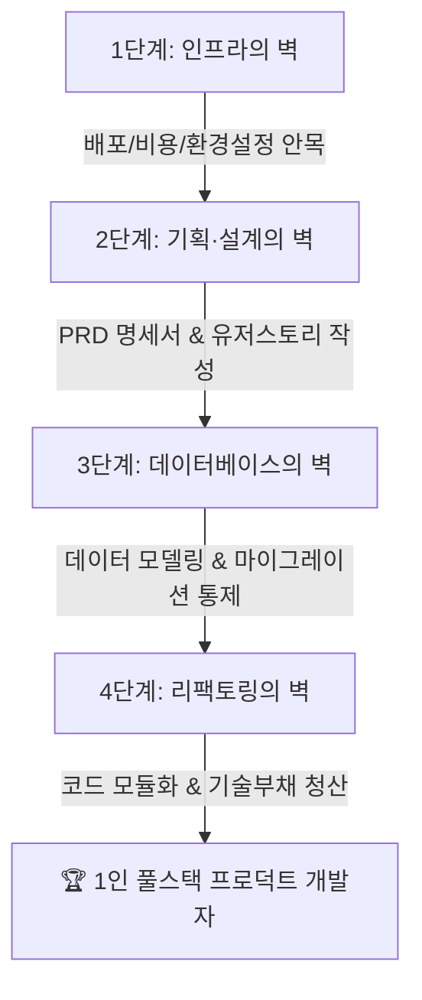

# 🚀 토스 출신 엔지니어의 바이브코딩(Vibe Coding) 실전 로드맵

> **📌 아카이빙 메타데이터**
> - **원본 출처**: [토스 출신 엔지니어 YouTube (https://youtu.be/4YV8GniscUY)](https://youtu.be/4YV8GniscUY)
> - **출처 정보 발행일자**: `2026-08-11`
> - **내 보관소 등록일자**: `2026-08-14`
> - **핵심 주제**: AI와 대화하며 코딩하는 입문자가 '토이 프로젝트'를 넘어 **'실제 작동하고 유지보수 가능한 서비스'**를 만드는 개발자로 도약하기 위한 4단계 돌파 전략

---

## 🧭 바이브코딩(Vibe Coding)이란?
- 복잡한 문법을 밑바닥부터 암기해서 치는 대신, **AI(Antigravity / Cursor / Claude)와 페어 프로그래밍하며 큰 그림과 아키텍처를 주도하는 현대적 개발 방식**.
- 단순히 "알아서 짜줘" 수준에 머무르면 반드시 벽에 부딪히며, **인간이 4가지 핵심 통제권(인프라, 기획, DB, 리팩토링)**을 쥐고 있어야 진정한 1인 풀스택 개발자가 됩니다.

---

## 🧱 바이브코딩 4단계의 벽과 극복 전략

---

### 1단계: 인프라의 벽 (배포, 클라우드 비용, 런타임)
- **부딪히는 문제**: 로컬(내 컴퓨터)에서는 잘 돌아가는데 실제 배포(Vercel, Supabase, Cloudflare, AWS)만 하려고 하면 환경변수 오류, 빌드 에러, 예상치 못한 클라우드 비용 폭탄이 발생함.
- **돌파 역량**:
  - 클라우드 호스팅 서비스의 큰 그림 이해 (Frontend 호스팅 vs Serverless API vs Managed DB)
  - 환경변수(`.env`), CORS, 도메인 연결, DNS 기본 개념 탑재
  - 불필요한 과금을 막는 인프라 비용 모니터링 안목

---

### 2단계: 기획 및 디자인의 벽 (PRD와 설계도)
- **부딪히는 문제**: "멋진 SNS 만들어줘"처럼 모호하게 프롬프트를 넣으면 AI가 매번 다른 방향으로 엉뚱한 코드를 짬.
- **돌파 역량**:
  - **PRD(Product Requirement Document, 제품 요구사항 명세서)** 작성 능력
  - **유저 스토리** 기반 기능 세분화 (예: "사용자는 구글 계정으로 로그인 후 3초 내에 대시보드를 본다")
  - 화면 UI 흐름도와 컴포넌트 단위의 구조화된 지시 설계

---

### 3단계: 데이터베이스의 벽 (데이터 모델링 & 마이그레이션)
- **부딪히는 문제**: 초보자가 가장 많이 좌절하는 구간. 데이터 구조가 꼬여서 유저 정보가 날아가거나, 테이블 컬럼 하나 바꿨다가 전체 서비스가 먹통이 됨.
- **돌파 역량**:
  - 관계형 데이터베이스(PostgreSQL / Supabase) 기본 모델링 (1:1, 1:N, N:M 관계 설계)
  - **DB 마이그레이션(Migration)** 개념 습득 (서비스 중단 없이 안전하게 테이블 구조를 변경하는 법)
  - ORM(Prisma, Drizzle 등)을 활용한 안전한 쿼리 처리

---

### 4단계: 리팩토링과 코드 관리의 벽 (기술 부채 해결)
- **부딪히는 문제**: 코드가 수천 줄로 늘어나면 AI도 앞뒤 맥락을 놓치고 기존 코드를 망가뜨리는 환각(스파게티 코드)을 일으킴.
- **돌파 역량**:
  - **관심사 분리(Separation of Concerns)**: 비즈니스 로직, UI 컴포넌트, API 통신 레이어를 명확히 분리
  - 한 함수가 한 가지 일만 하도록 작게 쪼개는 리팩토링 주도권
  - Git 커밋 단위를 잘게 쪼개어 언제든 이전 정상 상태로 롤백할 수 있는 형상 관리

---

## 🛠️ Antigravity 페어 프로그래밍 실전 적용 팁
1. **기획 단계**: `implementation_plan.md`를 통해 요구사항과 DB 스키마를 먼저 확정 짓고 코딩에 진입한다.
2. **개발 단계**: 한 번에 수백 줄을 생성하지 않고, 컴포넌트 및 기능 단위로 점진적 생성과 검증을 반복한다.
3. **유지보수 단계**: 코드베이스가 커지면 `failures.md`와 `agent-memory`를 활용해 프로젝트 설계 규칙을 AI에게 각인시킨다.

## 관련
- [[바이브코딩_필수_백엔드_3요소_API_WAS_배포_완전정복]]
- [[Addy_Osmani_미래_엔지니어의_선택과_소프트웨어_팩토리_가이드]]
