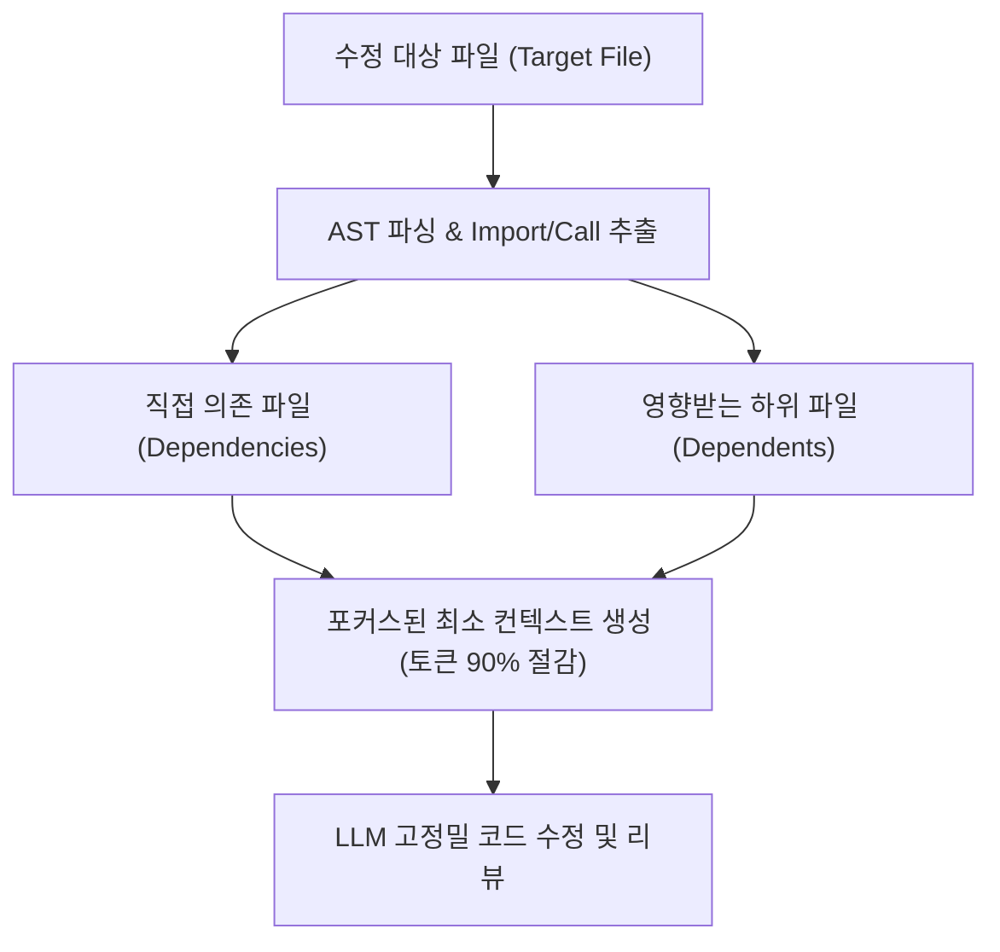

# 🕸️ 토큰 90% 절약 Context-Mode 및 Code-Review-Graph 아키텍처

> **최초 구축일**: 2026-08-13  
> **핵심 개념**: AST 기반 코드 호출 그래프(Call Graph) 및 의존성 가지치기(Context Pruning)  
> **스킬 경로**: `C:\Users\ildoc\.gemini\config\skills\code-graph-context\`

---

## 💡 1. 핵심 개념: 왜 전체 코드를 컨텍스트에 넣으면 안 되는가?
1. **토큰 낭비와 비용 폭증**: 수십 개 파일이 있는 프로젝트 전체를 LLM 프롬프트에 넣으면 수만~수십만 토큰이 소모됨.
2. **환각(Hallucination) 및 퀄리티 저하**: 불필요한 코드가 컨텍스트에 섞이면 AI가 엉뚱한 변수나 구식 코드를 참조해 수정 실수를 유발함.
3. **해결책 (Code-Review-Graph & Context-Mode)**:
   - 코드를 LLM에 넣기 전에 **의존성 그래프(AST Dependency Graph)**를 먼저 빌드.
   - 수정할 대상 파일과 **직접적으로 연결된 Import, 함수 시그니처, 상위 호출자만 선별 주입**하여 **토큰을 80~90% 절약**하고 코딩 정밀도를 극대화.

---

## 📊 2. 전체 의존성 분석 구조



---

## 🛠️ 3. 실전 사용법

### 특정 파일 수정 전 영향 범위 및 압축 컨텍스트 확인:
```powershell
python "C:\Users\ildoc\.gemini\config\skills\code-graph-context\scripts\build_graph.py" --root "<프로젝트_경로>" --target "<수정할_파일>"
```

### 전체 프로젝트 의존성 JSON 추출:
```powershell
python "C:\Users\ildoc\.gemini\config\skills\code-graph-context\scripts\build_graph.py" --root "<프로젝트_경로>" --export-json "dependency_graph.json"
```

## 관련
- [[유튜브_FasterWhisper_음성인식_STT_자동추출_시스템]]
- [[그래프_엔지니어링_차세대_AI에이전트_오케스트레이션_완전정복]]
