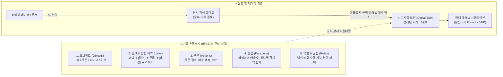

---
title: "팔란티어 핵심 기술 온톨로지(Ontology) 개념 및 Neo4j 지식그래프 구축 완전 분석"
created: 2026-08-22
updated: 2026-08-22
tags:
  - 팔란티어
  - Palantir
  - 온톨로지
  - Ontology
  - 지식그래프
  - KnowledgeGraph
  - Neo4j
  - Graphiti
  - 디지털트윈
  - ZeroChoTV
---

# 🎬 팔란티어의 핵심 기술, 온톨로지(Ontology) 5분 간단 정리 + 실습 완전 분석

> **📎 정보 아카이빙 3대 필수 메타데이터**
> - **원본 출처**: [ZeroCho TV 유튜브 영상 (165vVglFnps)](https://youtu.be/165vVglFnps)
> - **원본 정보 발행일자**: 2026-08-20
> - **내 보관소 등록일자**: 2026-08-22

---

## 💡 핵심 3줄 요약

1. **지식 그래프 vs 온톨로지의 결정적 차이**: 단순 지식 그래프(Knowledge Graph)는 AI가 비정형 문서에서 뽑아낸 중복투성이 원시 데이터(Raw Facts)에 불과하며, 온톨로지(Ontology)는 여기에 **오브젝트, 허용 관계, 액션, 펑션, 권한을 강제하는 '비즈니스 업무 규칙표'**입니다.
2. **팔란티어(Palantir) 초격차의 비밀 — 디지털 트윈**: 기업 전체의 자원과 흐름을 온톨로지로 정밀 모델링하여 가상 세계에 디지털 트윈을 구축하고, 실제 주문 쇄도나 전장 타격 상황을 사전 시뮬레이션하여 미래 결과를 완벽하게 예측합니다.
3. **온톨로지 구축 3대 핵심 공정 (실습 검증)**: ① AI 나이브 추출(노드 폭증) ➔ ② 온톨로지 타입/허용 엣지 제약(관계명 15개 ➔ 4개로 통일) ➔ ③ 고유 식별자(PK/ID) 기반 엔티티 해소(Entity Resolution)를 거쳐야만 실제 업무에 쓸 수 있는 지식 인프라가 완성됩니다.

---

## 📌 온톨로지(Ontology) 5대 구성 요소 아키텍처



### 1. 족보 비유로 이해하는 직관적 개념
- **온톨로지 (규칙)**: "아버지의 형은 큰아버지라 부른다", "이모의 남편은 이모부라 부른다."
- **지식 그래프 (실제 팩트 데이터)**: "철수의 큰아버지는 영수다."
- **실행 로직 (검증 하네스)**: 현재 그래프가 온톨로지 규칙을 어기지 않는지 감시하고 이상 데이터는 반려/수정.

---

## 🔬 실습 파이프라인 (Neo4j + Graphiti + Python) 상세 단계

### 단계 1: 나이브 AI 추출의 한계 (Naïve Extraction)
- 배송 회사 문서를 LLM(Graphiti)으로 무차별 추출하면 **노드 34개, 엣지 32개** 생성.
- **문제점**: 동일 인물(`김철수`, `김철수 라이더`, `철수`)이 3번 중복 등장하고, `has_customer`와 `is_customer_order_for`처럼 동일 관계가 제각각 명명되어 쿼리 불가능.

### 단계 2: 온톨로지 타입 및 허용 엣지 정의 (Typed Mode)
- **오브젝트 라벨링**: `Rider`, `Customer`, `Order`, `Hub`
- **허용 엣지 4종 통일**:
  1. `PLACED` (Customer ➔ Order)
  2. `ASSIGNED_TO` (Order ➔ Rider)
  3. `BELONGS_TO` (Rider ➔ Hub)
  4. `ORIGIN_HUB` (Order ➔ Hub)
- **결과**: 관계 종류가 15개에서 4개로 대폭 압축되고, "라이더가 고객을 주문하는" 엉뚱한 환각 엣지 원천 차단.

### 단계 3: 식별자(ID) 기반 개체 해소 (Entity Resolution)
- 주민등록번호/사번 같은 **고유 식별자(Unique ID)**를 매핑하여 동명 텍스트 노드를 하나로 병합(`Merge`).
- 불필요한 노드 80% 제거 및 단일 진실 공급원(Single Source of Truth) 확립.

### 단계 4: 네오4j Cypher 쿼리 검증
```cypher
// 김철수 라이더와 같은 허브에 소속된 동료 기사 조회
MATCH (r:Rider {name: '김철수'})-[:BELONGS_TO]->(h:Hub)<-[:BELONGS_TO]-(peer:Rider)
RETURN peer.name AS 동료기사;
```
- 온톨로지로 정제된 상태이므로 복잡한 AI 추론 없이 **결정론적 쿼리 1회로 정확한 결과(최민수)** 인출 성공.

---

## ⛔ 온톨로지 구축 시 4대 치명적 위험 요소 (Anti-Patterns)

1. **식별자(ID) 부재**: 고유 키가 없으면 동명인 분별 및 개체 병합 불가.
2. **관계명 증식(Edge Bloat)**: 통제되지 않은 동사/연결어가 난립하여 검색 쿼리 파편화.
3. **규칙 평가 하네스 부재**: 데이터가 온톨로지 제약을 위반했는지 검사하는 자동 루프 누락.
4. **필수 경로 누락**: 비즈니스 핵심 액션 사이의 연결 고리를 빠뜨려 단절 발생.

---

## 🛠️ AI(나)에게 적용할 점 (Antigravity 시스템 & 워크플로우)

> 팔란티어 온톨로지 설계 원칙을 Antigravity 시스템 및 사용자 세컨드 브레인에 즉시 이식하는 3대 전략입니다.

### 1. 옵시디언 지식 볼트의 '온톨로지 스키마 가드' 구축
- **적용 방안**: 볼트 내 위키링크(`[[노트]]`)와 태그가 무분별하게 증식하지 않도록, `_templates`와 메타데이터 규칙(type, title, category, created)을 프론트매터에 강제.
- **효과**: 노트 간 연결이 난잡해지는 '그래프 스파게티'를 방지하고, 에이전트가 단일 패스로 명확한 인과관계를 추론할 수 있는 클린 지식망 유지.

### 2. 에이전트 메모리(Agent Memory)의 개체 해소(Entity Resolution) 고도화
- **적용 방안**: `memory.db`에 의사결정 및 실패 로그를 저장할 때 단순 문자열 대신 `task_id`, `file_path`, `tool_name` 등 고유 식별자를 PK로 강제 바인딩.
- **효과**: 유사 작업 시 과거의 같은 실패/성공 이력을 중복 없이 정확히 1:1 매칭하여 학습 효과 극대화.

### 3. 멀티 에이전트 하네스의 역할(Role) & 액션(Action) 온톨로지화
- **적용 방안**: 서브에이전트 구동 시 단순 프롬프트 지시를 넘어, 에이전트별 [허용 오브젝트, 읽기/쓰기 액션 권한, 사용 가능한 도구 펑션]을 인터페이스로 사전 규정.
- **효과**: 서브에이전트가 권한 외의 파일 수정이나 환각적 도구 호출을 수행하지 못하도록 구조적 안전 가드레일 확립.
