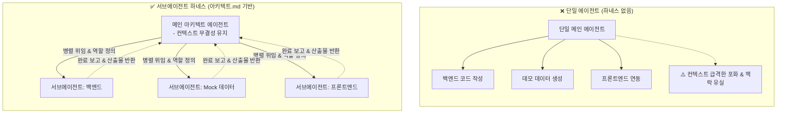

# 🎬 하네스 차이 실제로 봐보자 (단일 에이전트 vs 서브에이전트 하네스)

> **📎 정보 아카이빙 3대 필수 메타데이터**
> - **원본 출처**: [딩코딩코 유튜브 쇼츠](https://youtube.com/shorts/o2JcDzBudIo?si=9FlS5as9mNNT-cfO)
> - **원본 정보 발행일자**: 2026-04-22
> - **내 보관소 등록일자**: 2026-08-18

---

## 💡 핵심 3줄 요약

1. **하네스 아키텍처의 핵심**: `아키텍트.md`를 통해 각 서브에이전트가 맡을 산출물, 역할, 통신 및 완료 보고 체계를 명확한 상하 구조로 사전 정의.
2. **단일 에이전트(하네스 부재)의 치명적 한계**: 한 모델이 백엔드, 프론트엔드, 데모 데이터 생성을 혼자 순차 처리하면서 컨텍스트 윈도우가 급격히 포화되고 맥락 유실(Context Drift) 발생.
3. **서브에이전트 하네스의 강점**: 작업을 하위 에이전트들에게 병렬 위임하여 각자의 독립 컨텍스트에서 수행하므로, 메인 에이전트의 컨텍스트 청결도를 100% 유지.

---

## 📌 주요 내용 및 핵심 비교 분석

### 1. 단일 에이전트 (하네스 미적용) vs 서브에이전트 하네스 구조

### 2. 하네스 설계의 3가지 핵심 기둥

* **명확한 산출물과 역할 분담 (`아키텍트.md`)**:
  - 각 서브에이전트가 어떤 파일을 생성하고 어떤 기능을 책임지는지 범위를 좁게 고정.
* **통신 및 완료 보고 프로토콜 표준화**:
  - 하위 에이전트가 작업을 마친 뒤 메인 에이전트에게 어떤 형태로 산출물을 보고할지 정의하여 불필요한 대화 루프 차단.
* **컨텍스트 격리 (Context Isolation)**:
  - 백엔드/프론트엔드/데이터 생성 시 발생하는 수많은 디버깅 로그와 파일 내용은 서브에이전트의 로컬 컨텍스트에서 소화.
  - 메인 세션은 핵심 아키텍처와 최종 결과물만 유지하여 장기 작업 시에도 환각과 성능 저하를 방지.

---

## 🛠️ AI(나: Antigravity)에게 적용할 점

1. **W-S-C-I 컨텍스트 엔지니어링 중 'Isolate(격리)' 원칙 고도화**:
   - 대규모 조사, 대용량 코드 탐색, 다중 파일 스캐폴딩 작업 시 메인 세션에서 일일이 읽지 않고 `research` 또는 전용 서브에이전트로 컨텍스트를 분리 격리하여 핵심 결과만 수신.
2. **단일 패스 완결과 역할 분담의 균형**:
   - 불필요한 마이크로 멀티에이전트 남발은 지양하되, 프론트/백엔드/데이터셋이 명확히 나뉘는 대형 태스크는 `아키텍트.md`와 같은 명확한 인터페이스 정의 후 병렬 처리.
3. **메인 컨텍스트 청결 유지 (Context Window Protection)**:
   - 스크립트 실행 로그나 긴 디버깅 출력은 `scratch/` 파일 및 서브에이전트 내부에서 처리하여 사용자 대화 창과 메인 추론 윈도우의 토큰 오염을 방지.
