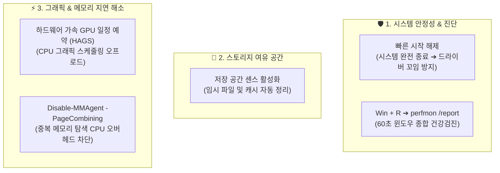

# 🎬 컴퓨터 느려졌다고 돈 쓰지 마세요 (Windows 11 5대 핵심 최적화)

> **📎 정보 아카이빙 3대 필수 메타데이터**
> - **원본 출처**: [짤컷 유튜브 영상 (-u10odyTqTA)](https://youtu.be/-u10odyTqTA)
> - **원본 정보 발행일자**: 2026-09-03
> - **내 보관소 등록일자**: 2026-09-05

---

## 💡 핵심 3줄 요약

1. **하드웨어 교체 전 윈도우 내장 병목 제거**: 부품을 바꾸기 전 드라이버 꼬임 방지, 내장 정밀 진단, 임시 파일 자동 정리만으로 시스템 지연과 용량 문제를 상당 부분 해결할 수 있습니다.
2. **GPU 일정 예약으로 CPU 부하 분산**: 하드웨어 가속 GPU 일정 예약(HAGS)을 켜 고부하 그래픽 작업 시 CPU 병목을 줄이고 화면 반응성을 끌어올립니다.
3. **충분한 RAM 환경(16~32GB+)에서 페이지 콤바이닝 비활성화**: 윈도우가 백그라운드에서 중복 메모리를 탐색·압축하느라 소모하는 불필요한 CPU 사이클을 차단하여 미세 끊김(스터터링)을 완화합니다.

---

## 📌 Windows 11 5대 최적화 상세 가이드



### 1. 빠른 시작(Fast Startup) 끄기 — 시스템 완전 종료 및 드라이버 꼬임 방지
- **배경**: 작업 관리자(`Ctrl + Shift + Esc`) ➔ `성능` ➔ `CPU`의 '작동 시간'을 확인했을 때 매일 껐음에도 며칠~몇 주 동안 켜져 있는 것으로 표시되는 현상. 윈도우가 완전 종료되지 않고 절전(최대 절전 모드 기반) 상태를 유지하기 때문이며, 시간이 지날수록 메모리 누수와 드라이버 충돌을 유발함.
- **설정 경로**:
  1. `Win + R` ➔ `control` 입력(또는 윈도우 검색창에 `전원 관리 옵션 선택`).
  2. 좌측 `전원 단추 작동 설정` 클릭.
  3. `현재 사용할 수 없는 설정 변경` 클릭.
  4. 하단 종료 설정에서 **'빠른 시작 켜기(권장)' 체크 해제** ➔ `변경 내용 저장`.
- **효과**: PC 종료 시 세션이 완전히 리셋되어 드라이버 오작동 및 누적된 잔여 프로세스 문제를 원천 차단. NVMe SSD 환경에서는 부팅 속도 저하 체감이 거의 없음.

---

### 2. `perfmon /report` — 윈도우 내장 시스템 종합 진단 도구
- **배경**: 컴퓨터가 이유 없이 버벅거리거나 응답이 지연될 때 타사 유료 진단 툴 없이 윈도우 내장 리포트로 원인 분석.
- **실행법**: `Win + R` ➔ `perfmon /report` 입력 후 엔터.
- **효과**: 약 60초간 CPU, 메모리, 디스크, 네트워크, 백그라운드 서비스의 상태를 종합 수집하여 문제 유발 프로세스와 리소스 병목을 일목요연한 보고서로 출력.

---

### 3. 저장 공간 센스(Storage Sense) 활성화 — 불필요한 임시 파일 자동 청소
- **배경**: 디스크 공간 부족 시 프로그램을 무작정 지우기 전, 수십 GB에 달하는 윈도우 업데이트 임시 파일과 캐시를 자동 정리.
- **설정 경로**: `설정(Win + I)` ➔ `시스템` ➔ `저장소` ➔ **'저장 공간 센스' 켬(On)**.
- **효과**: 임시 시스템 파일, 다운로드 폴더의 미사용 파일, 오래된 휴지통 파일을 주기적으로 자동 정리하여 C: 드라이브 여유 공간 유지.

---

### 4. 하드웨어 가속 GPU 일정 예약 (HAGS) — 그래픽 스케줄링 오프로드
- **배경**: 기존에는 CPU가 그래픽 작업 스케줄링을 전담하여 고부하 작업 시 CPU 오버헤드와 인풋랙이 발생함.
- **설정 경로**: `설정(Win + I)` ➔ `시스템` ➔ `디스플레이` ➔ `그래픽` ➔ `고급 그래픽 설정(기본 그래픽 설정 변경)` ➔ **'하드웨어 가속 GPU 일정 예약' 켬(On)** ➔ PC 재부팅.
- **효과**: 프레임 생성 및 그래픽 파이프라인 관리를 GPU가 직접 제어하여 고부하 그래픽/영상 렌더링 시 CPU 부담 경감 및 반응 속도 향상.

---

### 5. 페이지 콤바이닝(Page Combining) 비활성화 — 램 32GB 환경 최적화
- **배경**: 윈도우가 RAM 안의 동일한 내용(중복 메모리 페이지)을 주기적으로 검색하고 하나로 합쳐 램 사용량을 아끼는 기능.
- **문제점**: RAM이 8GB 이하로 부족한 시스템에서는 메모리 절약이 중요하지만, 중복 데이터를 지속적으로 탐색·비교·병합하는 과정에서 CPU 자원을 계속 소모하여 미세 끊김(마이크로 스터터링)을 유발함.
- **추천 대상**: 16GB, 32GB 이상 대용량 RAM을 탑재한 시스템. 메모리 여유가 충분하므로 CPU 사이클 낭비를 없애는 것이 성능에 더 유리함.
- **PowerShell(관리자 권한) 명령어**:
  ```powershell
  # 1. 페이지 콤바이닝 끄기 (CPU 백그라운드 탐색 차단)
  Disable-MMAgent -PageCombining

  # 2. 상태 점검 (PageCombining : False 확인)
  Get-MMAgent

  # 3. 원복(필요 시 다시 켜기)
  Enable-MMAgent -PageCombining
  ```

---

## 🖥️ 전일도 사용자 시스템(Ildo 데스크톱 vs Dell 노트북) 적용성 검토

| 최적화 항목 | 메인 데스크톱 (Ildo 본체)<br/>(5600X / RX 6600 8GB / 32GB RAM) | 서브 노트북 (Dell Latitude 7440)<br/>(i5-1345U / Iris Xe / 32GB RAM) | 권장 조치 |
| :--- | :--- | :--- | :--- |
| **빠른 시작 해제** | **적극 권장** (Crucial P3 Plus 1TB NVMe로 부팅 차이 없음, 드라이버 무결성 확보) | **적극 권장** (절전 모드 깨어남 시 배터리 누수 및 백그라운드 슬립 버그 방지) | 양 기기 모두 적용 권장 |
| **perfmon /report** | 리소스 이상 감지 시 즉각 단독 실행 활용 | 원격 코딩/배터리 소모 급증 시 백그라운드 진단 활용 | 필요 시 1회성 진단 |
| **저장 공간 센스** | **적극 권장** (C: NVMe 1TB 수명 및 정크 파일 방지) | **적극 권장** (제한된 내장 SSD 용량 보호) | 기본 활성화 유지 |
| **HAGS (GPU 일정 예약)** | **적극 권장** (RX 6600 외장 GPU 가속 활성화로 그래픽 연산 오프로드 효과 탁월) | **상태 확인 후 결정** (Intel Iris Xe 내장 그래픽 드라이버 옵션 노출 여부에 따라 선택) | 본체 적극 권장, 노트북 선택 |
| **페이지 콤바이닝 끄기** | **적극 권장** (32GB DDR4 대용량 메모리로 가용 여유 충분, 5600X CPU 오버헤드 제거) | **적극 권장** (32GB LPDDR5 대용량 메모리로 저전력 U시리즈 CPU 불필요 백그라운드 탐색 방지) | 양 기기 모두 적용 (`Disable-MMAgent -PageCombining`) |
