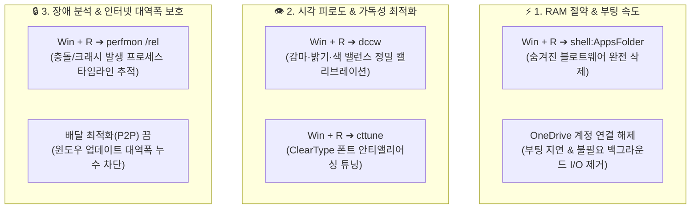

---
title: "Windows 11 숨겨진 6대 최적화 명령어 및 안정성·네트워크 튜닝 가이드"
created: 2026-08-22
updated: 2026-08-22
tags:
  - Windows11
  - 윈도우최적화
  - 시스템튜닝
  - RAM절약
  - 폰트가독성
  - 네트워크최적화
  - 안정성모니터
  - 짤컷
---

# 🎬 이거 몰라서 전부 손해 보고 있습니다ㄷㄷ (Windows 11 6대 핵심 최적화)

> **📎 정보 아카이빙 3대 필수 메타데이터**
> - **원본 출처**: [짤컷 유튜브 영상 (cH7URdMxB38)](https://youtu.be/cH7URdMxB38)
> - **원본 정보 발행일자**: 2026-08-20
> - **내 보관소 등록일자**: 2026-08-22

---

## 💡 핵심 3줄 요약

1. **숨겨진 실행 명령어 5종으로 시스템 정밀 제어**: `shell:AppsFolder`(제어판에 안 뜨는 블로트웨어 제거), `dccw`(모니터 색감 보정), `cttune`(ClearType 폰트 가독성 튜닝), `perfmon /rel`(튕김 오류 원인 추적).
2. **백그라운드 자원 낭비 원천 차단**: 램 1GB 이상 잡아먹는 미사용 기본 앱 및 불필요한 OneDrive 동기화를 안전하게 해제하여 부팅 속도와 가용 RAM 대폭 확보.
3. **인터넷 대역폭 좀도둑 차단**: 윈도우 업데이트 '배달 최적화(다른 PC로 다운로드 허용)'를 꺼서 내 네트워크가 외부 P2P 시딩에 쓰여 속도/핑이 저하되는 것을 원천 방어.

---

## 📌 Windows 11 숨겨진 6대 최적화 상세 가이드

### 1. `shell:AppsFolder` — 제어판에 안 나오는 기본 앱 완전 제거
- **실행법**: `Win + R` ➔ `shell:AppsFolder` 입력 후 엔터.
- **효과**: 일반 제어판이나 설정 창에 잡히지 않는 Windows 내장 스토어 앱 목록이 모두 노출됨.
- **제거 권장 대상**: 피드백 허브, Family, 사용하지 않는 날씨 위젯(백그라운드 RAM 1GB 이상 누수 방지).

### 2. OneDrive 동기화 해제 및 부팅 부하 경감
- **실행법**: 작업 표시줄 트레이 구름 아이콘 우클릭 ➔ `설정` ➔ `계정` ➔ `이 PC 연결 해제`.
- **효과**: 원드라이브 미사용 시 부팅 프로세스 및 파일 탐색기 백그라운드 디스크 I/O 병목 해소.

### 3. `dccw` — 디스플레이 색 보정 마법사
- **실행법**: `Win + R` ➔ `dccw` 입력 후 엔터.
- **효과**: 감마 곡선, 모니터 밝기/대비, RGB 3색 밸런스를 단계별로 직접 육안 확인하며 최적 색감으로 캘리브레이션.

### 4. `cttune` — ClearType 텍스트 가독성 튜너
- **실행법**: `Win + R` ➔ `cttune` 입력 후 엔터.
- **효과**: 모니터 서브픽셀 렌더링에 맞춰 가장 선명하고 눈이 편안한 글꼴 렌더링 단계를 선택. 장시간 코딩 및 문서 작업 시 눈의 피로도 대폭 경감.

### 5. `perfmon /rel` — 신뢰성 및 안정성 모니터 (오류 추적기)
- **실행법**: `Win + R` ➔ `perfmon /rel` 입력 후 엔터.
- **효과**: 프로그램이 갑자기 튕기거나 오류가 날 때, 날짜별 타임라인에 빨간색 `X` 표시를 눌러 충돌을 일으킨 정확한 실행 파일(`.exe`, `.dll`)과 에러 코드를 확인.

### 6. Windows 업데이트 '배달 최적화(P2P)' 끄기
- **설정 경로**: `설정(Win + I)` ➔ `Windows 업데이트` ➔ `고급 옵션` ➔ `배달 최적화` ➔ **'다른 PC에서 다운로드 허용' 끔 (Off)**.
- **효과**: 내 PC가 토렌트 시더(Seeder)처럼 다른 컴퓨터에 윈도우 업데이트 파일을 전송하느라 인터넷 대역폭을 낭비하는 것을 막아 네트워크 속도와 핑 안정화.

---

## 🛠️ AI(나)에게 적용할 점 (Antigravity 시스템 & 기기 관리 워크플로우)

1. **PC 진단 및 장애 분석 시 `perfmon /rel` 로그 파싱 활용**  
   - 사용자가 "프로그램이 자꾸 꺼진다"거나 오류를 호소할 때, 윈도우 신뢰성 로그를 분석하여 충돌 모듈을 즉시 핀셋 진단합니다.
2. **배달 최적화 및 P2P 대역폭 점검 자동화 스크립트화**  
   - 윈도우 최적화 및 셋업 스크립트(`setup_dell7440_laptop.ps1` 등)에 배달 최적화 레지스트리 비활성화(`DODownloadMode = 0`)를 기본 포함하여 노트북 배터리와 네트워크를 보호합니다.
3. **가독성 및 디스플레이 튜닝 권장 프로토콜 유지**  
   - 장시간 코딩 및 Second Brain 지식 뷰어 사용 환경을 위해 모니터 폰트 안티앨리어싱 가이드를 워크플로우에 통합합니다.
