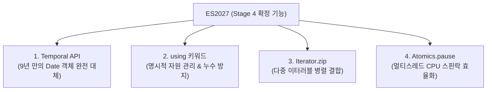

# ⚡ JavaScript ES2027 최대 업데이트: Temporal, using 자원관리, Signals 완전분석

> **출처**: [Better Stack - JavaScript's Biggest Update in Years (ES2027)](https://youtu.be/DLT6n3wCkuc)  
> **발행일**: 2026년 8월  
> **등록일**: 2026-08-23  

---

## 💡 핵심 요약 (3줄)

1. 자바스크립트의 고질적인 `Date` 버그와 서드파티 라이브러리(Moment, date-fns) 의존성을 9년 만에 끝내는 **Temporal API**와 메모리/커넥션 누수를 방지하는 **명시적 자원 관리(`using` 키워드)**가 ES2027 Stage 4로 공식 확정되었다.
2. 다중 배열을 병렬 결합하는 **`Iterator.zip`**과 멀티스레딩 CPU 낭비를 막는 **`Atomics.pause`**가 Stage 4에 합류하며 Lodash 없는 네이티브 표준화가 완성되었다.
3. 앱 초기 실행 속도를 혁신하는 **`import defer` (지연 실행)**와 모든 프레임워크(Vue/Svelte/Solid/Angular)의 반응형 상태를 통합할 표준 원시 타입 **`Signals`** 제안이 자바스크립트 생태계를 재편한다.

---

## 🗓️ 1. Stage 4 확정 4대 기능



### 1) Temporal API — 9년 만의 Date 객체 공식 교체
- **기존 Date의 치명적 혼돈**:
  - `new Date("0")` ➔ 2000년으로 파싱.
  - `new Date(0)` ➔ 1970년 1월 1일 (Unix Epoch).
  - `Date.parse(0)` ➔ 숫자 0을 문자열 "0"으로 자동 변환해 다시 2000년으로 반환.
  - 월(Month)이 0부터 시작(0-index)하여 수많은 오프바이원 버그 양산.
- **Temporal의 구조적 혁신**:
  - **전용 타입 분리**: `Temporal.PlainDate`(날짜 전용), `Temporal.PlainTime`(시간 전용), `Temporal.Instant`(나노초 정밀 타임스탬프), `Temporal.ZonedDateTime`(타임존 및 서머타임 자동 계산), `Temporal.Duration`(정밀 날짜 산술 연산).
  - **100% 불변(Immutable)**: 모든 연산이 새로운 객체를 반환해 원본 변조 위험 차단.
  - **서머타임 자동 보정**: 비행 중 시차 변경(`getTimeZoneTransition`)이나 익일 미팅 일정 자동 유지.

```javascript
// Temporal 예시: 비행 시간 및 시차 자동 계산
const departure = Temporal.ZonedDateTime.from('2026-10-24T20:00:00[America/New_York]');
const flightDuration = Temporal.Duration.from({ hours: 7 });
const arrival = departure.add(flightDuration).withTimeZone('Europe/London');
// 서머타임 해제 시간을 자동으로 인식하여 정확한 현지 도착 시간 산출
```

---

### 2) Explicit Resource Management — `using` 키워드
- **문제점**: 파일 핸들, DB 커넥션, 스트림 등을 사용 후 닫지 않아 리소스 누수 발생. 수많은 `try...finally` 블록으로 코드 가독성 저하.
- **해결책**:
  - `using` 키워드로 선언된 변수는 스코프를 벗어나는 즉시(블록 끝, 조기 return, 에러 발생 시) 자동으로 `Symbol.dispose()` 호출.
  - 비동기 해제를 위한 `await using` (`Symbol.asyncDispose`) 및 다중 리소스 스택(`DisposableStack`) 지원.

```javascript
// using 키워드를 통한 파일 핸들 자율 해제
function processFile(path) {
  using file = openFile(path); // 스코프 탈출 시 즉시 file[Symbol.dispose]() 자동 호출
  // 파일 작업 수행...
} // try-finally 없이도 완벽한 리소스 해제 보장
```

---

### 3) Joint Iteration — `Iterator.zip`
- 여러 이터러블(배열, 셋 등)을 병렬로 묶어 동시에 순회.
- **모드 분기**:
  - `shortest` (기본값): 가장 짧은 이터러블이 끝나면 순회 종료.
  - `longest`: 가장 긴 이터러블까지 순회하며 빈자리는 패딩(Padding) 값으로 채움.
  - `strict`: 길이가 다르면 즉시 TypeError 발생.
- 객체 키-값 쌍으로 매핑하는 `Iterator.zipKeyed` 동시 제공 ➔ Lodash 의존성 제거.

---

### 4) Atomics.pause — 멀티스레드 CPU 최적화
- `SharedArrayBuffer` 환경에서 스레드 간 락을 획득하기 위한 스핀 루프(Busy-waiting) 실행 시, CPU에 스핀 중임을 알려 불필요한 전력 소모와 CPU 과부하를 방지하는 저수준 하드웨어 최적화.

---

## 🔮 2. 차세대 제안 (Stage 3 & Stage 1)

1. **`import defer` (Stage 3)**:
   - 모듈을 다운로드해 두되, 최초로 실제 참조/사용되는 순간까지 실행을 지연(Lazy Execution).
   - 초기 번들링 로딩 및 대규모 의존성 그래프 앱의 기동 속도 대폭 단축.
2. **`Promise.allSettled` 객체형 / `Promise.allKeyed` (Stage 3)**:
   - 배열 인덱스 기반 구조분해 대신 객체 키(`{ user: fetchUser(), posts: fetchPosts() }`) 형태로 직관적인 비동기 결과 수신.
3. **`Signals` (Stage 1)**:
   - Vue, Svelte, Solid, Angular 등이 각자 다르게 구현하던 반응형 상태(Reactivity)를 자바스크립트 표준 원시 타입으로 내장.
   - 프레임워크 간 상태 공유 및 런타임 표준화의 결정적 열쇠.

---

## 🛠️ 3. AI(Antigravity) 시스템 및 사용자 워크플로우 적용 전략

1. **날짜/시간 로직의 Temporal 표준 우선화**:
   - 웹/백엔드 코드 생성 시 무거운 서드파티(`moment`, `dayjs`) 설치를 지양하고 `Temporal` 및 최신 타입스크립트 스키마를 1순위로 권장.
2. **리소스 누수 방지 `using` 패턴 탑재**:
   - Node.js/타입스크립트 DB 커넥션, 파일 입출력, MCP 스트림 통신 코드 작성 시 `using` 및 `DisposableStack`을 적용하여 보일러플레이트 제거와 무결성 확보.
3. **Lodash 종속성 다이어트**:
   - 배열/이터러블 병렬 처리 시 `Iterator.zip`, `take`, `drop` 등 최신 내장 메서드를 우선 활용해 번들 용량 최소화.
4. **`import defer` 기반 번들 최적화 설계**:
   - 대규모 Next.js/Vite 웹 애플리케이션 아키텍처 기획 시 지연 실행(Lazy Execution) 전략을 코드 스플리팅에 선제 반영.
