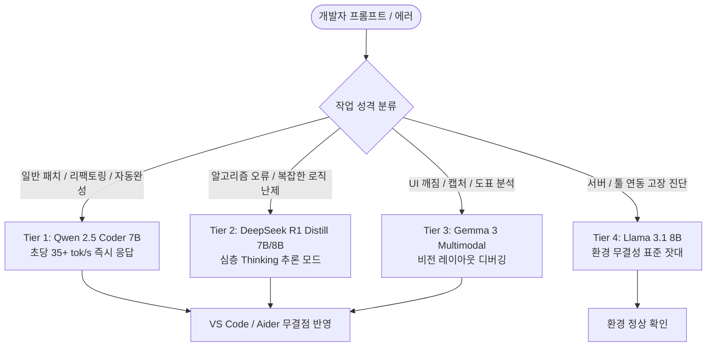

# 8GB GPU 로컬 코딩 워크벤치 4대 툴 체계 및 리듬 보존(Rhythm Preservation) 원칙

## 1. 리듬 보존 원칙 (Rhythm Preservation Principle)
소프트웨어 엔지니어링의 본질은 **상호작용의 케이던스(Cadence)**에 있다.

$$	ext{Productivity} = rac{	ext{Task Value}}{	ext{Turnaround Latency} + 	ext{Context Friction}}$$

- **Wet Cement 현상**: 아무리 벤치마크가 뛰어난 20B~30B 모델이라도, 8GB GPU에서 문맥이 늘어나며 토큰 속도가 3~5 tok/s로 떨어지는 순간 개발자는 대기 시간 동안 집중력을 상실하고 다른 창을 열게 된다.
- **최소 낭비 모델(Minimum Waste Model)**:
  1. *메모리 낭비 제로*: 7B 모델은 4-bit 기준 약 4.5GB VRAM을 점유하여, 8GB 카드에서 약 3.5GB의 거대한 KV 캐시 및 에디터 버퍼 마진을 제공한다.
  2. *추론 낭비 제로*: 3줄짜리 버그 픽스에 15K 토큰의 내부 독백(CoT)을 생성하지 않고, 즉시 간결한 diff를 출력한다.
  3. *코드 낭비 제로*: 요구하지 않은 파일이나 레이아웃을 임의로 건드리지 않고 지정된 블록만 외과수술적으로 치환한다.

---

## 2. 8GB VRAM 4-Tier 워크벤치 아키텍처

---

## 3. 지식 연결
- 실측 분석: [[01_AI_시스템_및_도구/8GB_VRAM_실전_로컬_코딩_AI_최종_선정_가이드_CodingHorizon]]
- 5종 벤치마크: [[01_AI_시스템_및_도구/8GB_VRAM_최고의_로컬_코딩_AI_5종_실측_벤치마크_RedStapler]]
- 헌법: [[GEMINI.md]]
