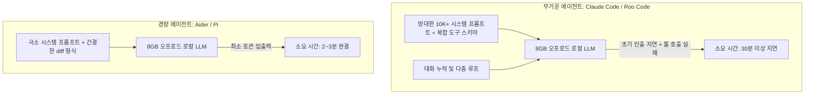

# 8GB VRAM 로컬 코딩 모델 선정 기준 및 경량 에이전트 하네스(Aider) 아키텍처

## 1. 8GB VRAM 환경의 모델 선정 3대 필터링 기준
VRAM 8GB는 7B/8B 모델은 100% 수용 가능하지만 프로젝트 단위 추론 능력이 떨어지고, 70B 이상은 구동이 불가능한 전형적인 '타협 체급'이다.

1. **MoE 아키텍처 우선**:
   - Dense 24B~30B 모델(Devstral 등)은 모든 가중치가 상시 활성화되어 CPU-RAM 왕복 대역폭을 극심하게 소모(3~5 tok/s).
   - MoE 모델(Qwen 3 Coder 30B A3B 등)은 256개 전문가 중 극히 일부만 발화하므로, CPU 오프로드 환경에서도 **체감 2~3분 내 작업 완결** 가능.
2. **도구 호출(Tool Calling) 무결성**:
   - GLM 4.7 Flash, Nemotron 3 Nano 등은 일반 대화 벤치마크 점수는 높으나, 로컬 에이전트의 JSON/함수 호출 인터페이스에서 파싱 오류나 무한 루프를 유발.
   - Qwen Coder 시리즈가 실전 도구 호출 파싱에서 가장 견고한 내성을 보임.
3. **외과수술적 수정 능력(Surgical Edit Precision)**:
   - 환각으로 기존 layout 파일이나 CSS를 통째로 지워버리는 모델은 자동화 파이프라인에서 치명적 위험 요소.

---

## 2. 하네스 프롬프트 비대화(Prompt Bloat)와 지연 시간의 관계

### 아키텍처적 교훈
- **로컬 자원이 타이트할수록 하네스는 극도로 얇아야 한다**.
- 에이전트 프레임워크가 프롬프트 앞단에 10K 이상의 장황한 헌법과 수십 개 도구 명세를 때려박으면, 8GB 로컬 모델은 프롬프트 처리(Prefill) 단계에서 이미 지치고 컨텍스트 한계에 도달해 환각을 일으킨다.
- Aider와 같이 파일 diff 중심의 간결한 I/O 계약을 유지하는 것이 8GB 로컬 AI의 유일한 생존 전략이다.

---

## 3. 지식 연결
- 실측 벤치마크: [[01_AI_시스템_및_도구/8GB_VRAM_최고의_로컬_코딩_AI_5종_실측_벤치마크_RedStapler]]
- 6GB 35B 구동 원리: [[01_AI_시스템_및_도구/Qwen_35B_MoE_6GB_VRAM_초고속_17toks_256K_튜닝_Codacus]]
- 시스템 헌법: [[GEMINI.md]]
